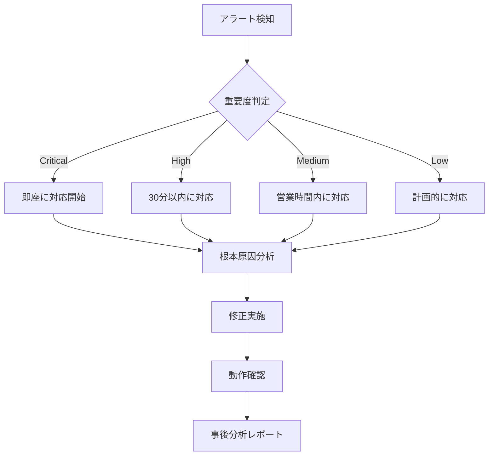

# PoppoBuilder Suite Best Practices

This document provides recommendations, security guidelines, scaling strategies, and maintenance/operation guidelines for effectively operating PoppoBuilder Suite.

## 📋 Table of Contents

1. [Recommended Configuration](#recommended-configuration)
2. [Security Guidelines](#security-guidelines)
3. [Scaling Strategies](#scaling-strategies)
4. [Maintenance & Operations](#maintenance--operations)
5. [Performance Optimization](#performance-optimization)
6. [Development Workflow](#development-workflow)

## 🔧 Recommended Configuration

### Basic Configuration Templates

#### Development Environment Configuration

```javascript
// config/config.development.json
{
  "environment": "development",
  "logLevel": "debug",
  "github": {
    "owner": "your-username",
    "repo": "your-repo",
    "checkInterval": 60000  // 1 minute (longer for development)
  },
  "claude": {
    "maxConcurrent": 1,     // One at a time for development
    "timeout": 300000,      // 5 minutes (shorter setting)
    "retryAttempts": 1
  },
  "performance": {
    "maxConcurrentTasks": 2,
    "memoryOptimization": {
      "enabled": false    // Disabled for development
    }
  },
  "monitoring": {
    "alerts": {
      "enabled": false    // No alerts needed for development
    }
  }
}
```

#### Production Environment Configuration

```javascript
// config/config.production.json
{
  "environment": "production",
  "logLevel": "info",
  "github": {
    "owner": "organization",
    "repo": "production-repo",
    "checkInterval": 30000  // 30 seconds
  },
  "claude": {
    "maxConcurrent": 3,
    "timeout": 86400000,    // 24 hours
    "retryAttempts": 3,
    "retryDelay": 60000
  },
  "performance": {
    "maxConcurrentTasks": 5,
    "memoryOptimization": {
      "enabled": true,
      "gcInterval": 300000,
      "maxOldSpaceSize": 2048
    }
  },
  "monitoring": {
    "alerts": {
      "enabled": true,
      "channels": ["email", "slack"],
      "conditions": {
        "errorRate": { "threshold": 5, "window": 300000 },
        "memoryUsage": { "threshold": 80 },
        "responseTime": { "threshold": 30000 }
      }
    }
  },
  "backup": {
    "enabled": true,
    "schedule": "0 2 * * *",  // Daily at 2 AM
    "retention": 30
  }
}
```

### Environment-Specific Startup Methods

```bash
# Development environment
NODE_ENV=development npm start

# Staging environment
NODE_ENV=staging npm start

# Production environment
NODE_ENV=production npm start

# Custom configuration file
CONFIG_PATH=./config/custom.json npm start
```

## 🔐 Security Guidelines

### 1. Authentication & Authorization

#### API Key Management

```bash
# Manage with environment variables (add .env file to .gitignore)
GITHUB_TOKEN=ghp_xxxxxxxxxxxx
CLAUDE_API_KEY=your-claude-api-key

# Encrypt environment variables in production
# AWS Systems Manager Parameter Store
aws ssm put-parameter \
  --name "/poppo/github_token" \
  --value "ghp_xxxxxxxxxxxx" \
  --type "SecureString"

# Kubernetes Secrets
kubectl create secret generic poppo-secrets \
  --from-literal=github-token=ghp_xxxxxxxxxxxx \
  --from-literal=claude-api-key=your-claude-api-key
```

#### Dashboard Security

```javascript
// config/security.json
{
  "dashboard": {
    "auth": {
      "enabled": true,
      "sessionTimeout": 3600000,  // 1時間
      "maxLoginAttempts": 5,
      "lockoutDuration": 900000,   // 15分
      "passwordPolicy": {
        "minLength": 12,
        "requireUppercase": true,
        "requireLowercase": true,
        "requireNumbers": true,
        "requireSpecialChars": true
      }
    },
    "https": {
      "enabled": true,
      "cert": "/path/to/cert.pem",
      "key": "/path/to/key.pem"
    },
    "cors": {
      "enabled": true,
      "origins": ["https://trusted-domain.com"]
    }
  }
}
```

### 2. Data Protection

#### Sensitive Information Masking

```javascript
// ログ出力時の機密情報マスキング
{
  "logging": {
    "maskSecrets": true,
    "secretPatterns": [
      "ghp_[a-zA-Z0-9]{36}",  // GitHub token
      "sk-ant-[a-zA-Z0-9]+",   // Claude API key
      "password.*=.*",
      "token.*=.*"
    ]
  }
}
```

#### バックアップの暗号化

```bash
# バックアップ作成時に暗号化
npm run backup:create -- --encrypt --password-file=/secure/location/password

# 暗号化されたバックアップの復元
npm run backup:restore backup-id -- --decrypt --password-file=/secure/location/password
```

### 3. ネットワークセキュリティ

#### ファイアウォール設定

```bash
# 必要なポートのみ開放
sudo ufw allow 22/tcp    # SSH
sudo ufw allow 3001/tcp  # Dashboard (内部ネットワークのみ)
sudo ufw default deny incoming
sudo ufw enable

# IPアドレス制限
sudo ufw allow from 192.168.1.0/24 to any port 3001
```

#### リバースプロキシ設定（nginx）

```nginx
server {
    listen 443 ssl http2;
    server_name poppo.example.com;

    ssl_certificate /etc/ssl/certs/poppo.crt;
    ssl_certificate_key /etc/ssl/private/poppo.key;
    
    # セキュリティヘッダー
    add_header X-Frame-Options "SAMEORIGIN" always;
    add_header X-Content-Type-Options "nosniff" always;
    add_header X-XSS-Protection "1; mode=block" always;
    add_header Referrer-Policy "strict-origin-when-cross-origin" always;
    add_header Content-Security-Policy "default-src 'self';" always;

    location / {
        proxy_pass http://localhost:3001;
        proxy_set_header Host $host;
        proxy_set_header X-Real-IP $remote_addr;
        proxy_set_header X-Forwarded-For $proxy_add_x_forwarded_for;
        proxy_set_header X-Forwarded-Proto $scheme;
        
        # WebSocket対応
        proxy_http_version 1.1;
        proxy_set_header Upgrade $http_upgrade;
        proxy_set_header Connection "upgrade";
    }
}
```

### 4. 監査とコンプライアンス

```javascript
// 監査ログの設定
{
  "audit": {
    "enabled": true,
    "events": [
      "login", "logout", "configChange", 
      "processStart", "processStop", 
      "dataExport", "backup", "restore"
    ],
    "retention": 365,  // 1年間保持
    "immutable": true  // 変更不可
  }
}
```

## 📈 Scaling Strategies

### 1. 垂直スケーリング（スケールアップ）

#### リソース最適化

```javascript
// 大規模環境向け設定
{
  "performance": {
    "maxConcurrentTasks": 10,
    "workerThreads": {
      "enabled": true,
      "count": 4
    },
    "clustering": {
      "enabled": true,
      "workers": "auto"  // CPUコア数に基づいて自動設定
    }
  }
}
```

#### システムリソースの調整

```bash
# Node.jsのメモリ制限を増やす
NODE_OPTIONS="--max-old-space-size=8192" npm start

# ファイルディスクリプタの上限を増やす
ulimit -n 65536

# システム全体の設定（/etc/sysctl.conf）
fs.file-max = 65536
net.core.somaxconn = 65536
net.ipv4.tcp_max_syn_backlog = 65536
```

### 2. 水平スケーリング（スケールアウト）

#### マルチインスタンス構成

```yaml
# docker-compose.yml
version: '3.8'

services:
  poppo-1:
    image: poppo-builder:latest
    environment:
      - INSTANCE_ID=1
      - REDIS_URL=redis://redis:6379
    volumes:
      - ./config:/app/config
      - shared-data:/app/data

  poppo-2:
    image: poppo-builder:latest
    environment:
      - INSTANCE_ID=2
      - REDIS_URL=redis://redis:6379
    volumes:
      - ./config:/app/config
      - shared-data:/app/data

  redis:
    image: redis:alpine
    volumes:
      - redis-data:/data

  nginx:
    image: nginx:alpine
    ports:
      - "80:80"
      - "443:443"
    volumes:
      - ./nginx.conf:/etc/nginx/nginx.conf

volumes:
  shared-data:
  redis-data:
```

#### Kubernetes デプロイメント

```yaml
# k8s/deployment.yaml
apiVersion: apps/v1
kind: Deployment
metadata:
  name: poppo-builder
spec:
  replicas: 3
  selector:
    matchLabels:
      app: poppo-builder
  template:
    metadata:
      labels:
        app: poppo-builder
    spec:
      containers:
      - name: poppo
        image: poppo-builder:latest
        resources:
          requests:
            memory: "1Gi"
            cpu: "500m"
          limits:
            memory: "2Gi"
            cpu: "1000m"
        env:
        - name: REDIS_URL
          value: "redis://redis-service:6379"
        volumeMounts:
        - name: config
          mountPath: /app/config
      volumes:
      - name: config
        configMap:
          name: poppo-config
```

### 3. 負荷分散戦略

```javascript
// ロードバランサー設定
{
  "loadBalancing": {
    "algorithm": "weighted-round-robin",
    "healthCheck": {
      "interval": 5000,
      "timeout": 3000,
      "unhealthyThreshold": 3
    },
    "sticky": {
      "enabled": true,
      "ttl": 3600000
    }
  }
}
```

## 🛠️ Maintenance & Operations

### 1. 定期メンテナンス

#### 日次タスク

```bash
#!/bin/bash
# daily-maintenance.sh

echo "=== 日次メンテナンス開始 ==="

# ヘルスチェック
npm run health:check

# ログローテーション
npm run log:rotate

# 一時ファイルのクリーンアップ
find ./temp -type f -mtime +1 -delete

# メトリクス収集
npm run analytics:collect daily

echo "=== 日次メンテナンス完了 ==="
```

#### 週次タスク

```bash
#!/bin/bash
# weekly-maintenance.sh

echo "=== 週次メンテナンス開始 ==="

# バックアップ
npm run backup:create -- --name "weekly-$(date +%Y%m%d)"

# ログアーカイブ
npm run log:archive --days 7

# パフォーマンス分析
npm run analytics:report performance --period week

# セキュリティスキャン
npm audit
npm run security:scan

echo "=== 週次メンテナンス完了 ==="
```

#### 月次タスク

```bash
#!/bin/bash
# monthly-maintenance.sh

echo "=== 月次メンテナンス開始 ==="

# 古いバックアップの削除
npm run backup:cleanup --keep 12

# データベース最適化
npm run database:optimize

# 依存関係の更新
npm update
npm audit fix

# 包括的なシステムレポート
npm run report:comprehensive --output monthly-report.pdf

echo "=== 月次メンテナンス完了 ==="
```

### 2. 監視設定

#### Prometheus メトリクス

```yaml
# prometheus.yml
global:
  scrape_interval: 15s

scrape_configs:
  - job_name: 'poppo-builder'
    static_configs:
      - targets: ['localhost:3001']
    metrics_path: '/api/health/metrics'
```

#### Grafana ダッシュボード

```json
{
  "dashboard": {
    "title": "PoppoBuilder Monitoring",
    "panels": [
      {
        "title": "Task Processing Rate",
        "targets": [{
          "expr": "rate(poppo_tasks_processed_total[5m])"
        }]
      },
      {
        "title": "Memory Usage",
        "targets": [{
          "expr": "poppo_memory_usage_bytes / 1024 / 1024"
        }]
      },
      {
        "title": "Error Rate",
        "targets": [{
          "expr": "rate(poppo_errors_total[5m])"
        }]
      }
    ]
  }
}
```

### 3. 障害対応

#### インシデント対応フロー



#### 障害時の初動対応

```bash
#!/bin/bash
# incident-response.sh

# 1. 現状把握
echo "=== システム状態確認 ==="
npm run health:check --detailed
npm run poppo:status

# 2. ログ収集
echo "=== エラーログ収集 ==="
grep -E "(ERROR|CRITICAL)" logs/*.log | tail -100 > incident-logs.txt

# 3. 一時的な対処
echo "=== 緊急対処 ==="
# 問題のあるプロセスを停止
npm run poppo:stop --force

# セーフモードで再起動
SAFE_MODE=true npm start
```

### 4. キャパシティプランニング

```javascript
// リソース使用状況の追跡
{
  "metrics": {
    "collection": {
      "enabled": true,
      "interval": 60000,
      "retention": 90  // 90日間保持
    },
    "thresholds": {
      "cpu": {
        "warning": 70,
        "critical": 90
      },
      "memory": {
        "warning": 80,
        "critical": 95
      },
      "disk": {
        "warning": 85,
        "critical": 95
      }
    }
  }
}
```

## ⚡ Performance Optimization

### 1. コード最適化

#### 非同期処理の活用

```javascript
// 悪い例: 同期的な処理
const results = [];
for (const issue of issues) {
  const result = await processIssue(issue);
  results.push(result);
}

// 良い例: 並行処理
const results = await Promise.all(
  issues.map(issue => processIssue(issue))
);

// より良い例: 制限付き並行処理
const pLimit = require('p-limit');
const limit = pLimit(5); // 最大5つまで並行実行

const results = await Promise.all(
  issues.map(issue => 
    limit(() => processIssue(issue))
  )
);
```

#### キャッシングの活用

```javascript
// インメモリキャッシュ
const NodeCache = require('node-cache');
const cache = new NodeCache({ 
  stdTTL: 600,      // 10分
  checkperiod: 120  // 2分ごとにチェック
});

async function getCachedData(key, fetchFunction) {
  const cached = cache.get(key);
  if (cached) return cached;
  
  const data = await fetchFunction();
  cache.set(key, data);
  return data;
}

// Redis キャッシュ
const redis = require('redis');
const client = redis.createClient();

async function getCachedDataRedis(key, fetchFunction, ttl = 600) {
  const cached = await client.get(key);
  if (cached) return JSON.parse(cached);
  
  const data = await fetchFunction();
  await client.setex(key, ttl, JSON.stringify(data));
  return data;
}
```

### 2. データベース最適化

```javascript
// インデックスの作成
await db.run(`
  CREATE INDEX IF NOT EXISTS idx_task_status 
  ON tasks(status, created_at);
  
  CREATE INDEX IF NOT EXISTS idx_process_history 
  ON process_history(task_id, timestamp);
`);

// バッチ挿入
const insertMany = async (records) => {
  const stmt = db.prepare(`
    INSERT INTO tasks (id, type, status, data) 
    VALUES (?, ?, ?, ?)
  `);
  
  const insertPromises = records.map(record =>
    stmt.run(record.id, record.type, record.status, record.data)
  );
  
  await Promise.all(insertPromises);
  await stmt.finalize();
};
```

### 3. ネットワーク最適化

```javascript
// HTTP Keep-Alive
const https = require('https');
const keepAliveAgent = new https.Agent({
  keepAlive: true,
  keepAliveMsecs: 1000,
  maxSockets: 50
});

// API呼び出しの最適化
const apiClient = axios.create({
  httpsAgent: keepAliveAgent,
  timeout: 30000,
  maxRedirects: 5,
  validateStatus: (status) => status < 500
});
```

## 🔄 Development Workflow

### 1. ブランチ戦略

```bash
# 機能開発
git checkout -b feature/issue-123-new-feature

# バグ修正
git checkout -b fix/issue-456-bug-description

# ホットフィックス
git checkout -b hotfix/critical-issue

# リリース準備
git checkout -b release/v1.2.0
```

### 2. コミットメッセージ規約

```bash
# 形式: <type>(<scope>): <subject>

# 例：
git commit -m "feat(api): add batch processing endpoint"
git commit -m "fix(auth): resolve token expiration issue"
git commit -m "docs(readme): update installation instructions"
git commit -m "perf(cache): optimize Redis query performance"
git commit -m "test(cli): add unit tests for new commands"
```

### 3. コードレビューチェックリスト

- [ ] コードは読みやすく、自己文書化されているか
- [ ] 適切なエラーハンドリングが実装されているか
- [ ] テストが追加/更新されているか
- [ ] パフォーマンスへの影響を考慮したか
- [ ] セキュリティ上の懸念はないか
- [ ] ドキュメントは更新されているか
- [ ] 後方互換性は保たれているか

### 4. リリースプロセス

```bash
#!/bin/bash
# release.sh

VERSION=$1

# 1. テスト実行
npm test
npm run test:e2e

# 2. ビルド
npm run build

# 3. バージョン更新
npm version $VERSION

# 4. タグ作成
git tag -a "v$VERSION" -m "Release version $VERSION"

# 5. プッシュ
git push origin main --tags

# 6. リリースノート作成
gh release create "v$VERSION" \
  --title "Release v$VERSION" \
  --notes-file CHANGELOG.md
```

## 🎯 Summary

Effective PoppoBuilder Suite operation requires:

1. **Appropriate Configuration for Each Environment** - Use different settings for development/production
2. **Thorough Security** - Implementation of authentication, encryption, and audit logs
3. **Ensuring Scalability** - Configuration that allows expansion according to load
4. **Continuous Maintenance** - Automation of regular maintenance tasks
5. **Performance Optimization** - Identification and improvement of bottlenecks
6. **Standardized Development Process** - Consistent workflow

By implementing these best practices, stable and efficient system operation becomes possible.