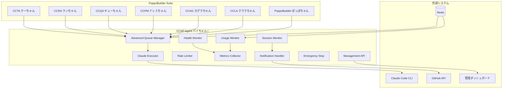
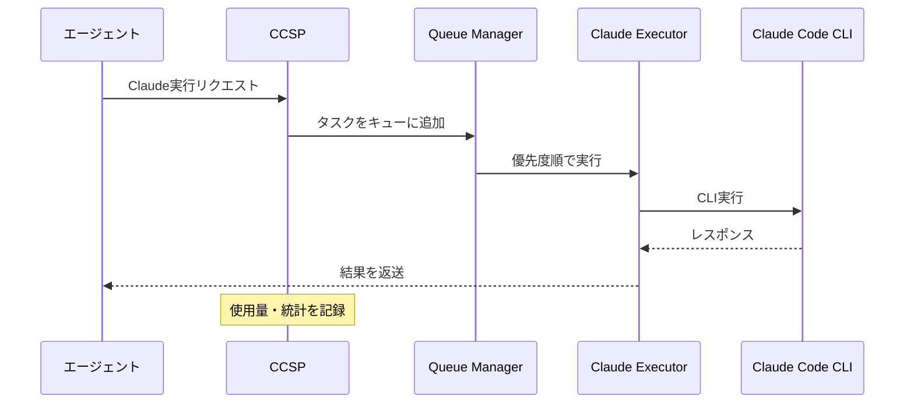
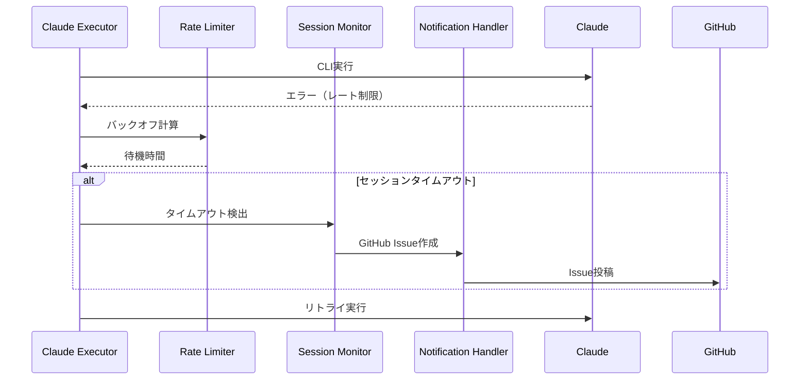
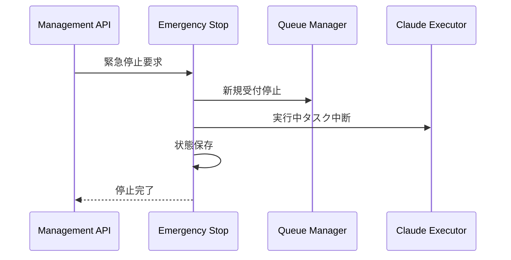

# CCSP（Claude Code Spawner）アーキテクチャドキュメント

## 📋 目次

1. [概要](#概要)
2. [アーキテクチャ全体図](#アーキテクチャ全体図)
3. [コンポーネント詳細](#コンポーネント詳細)
4. [責任境界](#責任境界)
5. [統合フロー](#統合フロー)
6. [セキュリティモデル](#セキュリティモデル)
7. [運用ガイド](#運用ガイド)
8. [拡張性と今後の展望](#拡張性と今後の展望)

---

## 概要

### CCSPとは

CCSP（Claude Code Spawner）は、PoppoBuilder Suite内でClaude Code API呼び出しを一元管理するための専用エージェントです。愛称は「パイちゃん🥧」です。

### 設計思想

- **一元化**: すべてのClaude Code API呼び出しをCCSPに集約
- **信頼性**: レート制限、エラー処理、セッション管理の統合
- **可視性**: リアルタイム監視とダッシュボード
- **拡張性**: 高度なキュー管理と動的スケーリング

### 主要機能

- 🚀 **Claude Code API呼び出しの集約管理**
- 📊 **使用量モニタリングと予測**
- ⚡ **高度なキューイング・優先度制御**
- 🛡️ **レート制限・エラーハンドリング**
- 📋 **管理API・ダッシュボード**
- 🔧 **緊急停止・セッション復旧**

---

## アーキテクチャ全体図



---

## コンポーネント詳細

### 1. Claude Executor（claude-executor.js）
**責任**: Claude Code CLI呼び出しの実行

- **機能**:
  - Claude Code CLIプロセスの起動・管理
  - セッションタイムアウトの検出
  - エラーハンドリングとリトライ
- **入力**: リクエストオブジェクト（prompt、timeout等）
- **出力**: Claude APIレスポンス

### 2. Advanced Queue Manager（advanced-queue-manager.js）
**責任**: 高度なタスクキューイング

- **機能**:
  - 優先度付きキューイング（urgent > high > normal > low）
  - スケジュール実行（遅延実行）
  - キューの一時停止・再開
  - デッドレターキュー管理
- **キュー種別**: urgent, high, normal, low, scheduled
- **統計**: 処理時間、成功率、キュー深度

### 3. Usage Monitor（usage-monitor.js）
**責任**: API使用量の監視と予測

- **機能**:
  - リクエスト数・応答時間の記録
  - エージェント別統計の管理
  - レート制限情報の追跡
  - 使用量予測（線形回帰）
- **メトリクス**: requests/min, 成功率, 平均応答時間, エラー率

### 4. Rate Limiter（rate-limiter.js）
**責任**: レート制限の制御

- **機能**:
  - トークンバケット・スライディングウィンドウ制御
  - 指数バックオフ
  - 優先度に基づくリクエスト調整
- **アルゴリズム**: Token Bucket + Exponential Backoff

### 5. Metrics Collector（metrics-collector.js）
**責任**: システムメトリクスの収集

- **機能**:
  - システムリソース監視（CPU、メモリ）
  - パフォーマンス統計の集約
  - 時系列データの管理
- **出力**: Prometheus形式メトリクス

### 6. Health Monitor（health-monitor.js）
**責任**: システム健全性の監視

- **機能**:
  - ヘルスチェック実行
  - 異常検知・アラート
  - 自動復旧処理
- **チェック項目**: プロセス生存、応答性、リソース使用量

### 7. Session Monitor（session-monitor.js）
**責任**: Claude Codeセッションの監視

- **機能**:
  - セッションタイムアウトの検出
  - GitHub Issue自動作成
  - セッション復旧の確認
- **検出パターン**: "Invalid API key", "Please run /login"

### 8. Notification Handler（notification-handler.js）
**責任**: 通知の送信

- **機能**:
  - GitHub Issue作成・更新
  - アラート送信
  - 緊急時通知
- **通知チャネル**: GitHub Issues, ログ出力

### 9. Emergency Stop（emergency-stop.js）
**責任**: 緊急停止処理

- **機能**:
  - システム全体の即座停止
  - 処理中タスクの安全な中断
  - 状態の保存
- **トリガー**: 管理API、異常検知

### 10. Management API（management-api.js）
**責任**: 管理インターフェース

- **エンドポイント**:
  - `/api/ccsp/queue/*` - キュー管理
  - `/api/ccsp/stats/*` - 統計情報
  - `/api/ccsp/control/*` - 制御操作
  - `/api/ccsp/health` - ヘルスチェック

---

## 責任境界

### CCSPの責任範囲

✅ **CCSP が責任を持つ**:
- Claude Code API呼び出しの実行
- レート制限・エラーハンドリング
- セッション管理・タイムアウト検出
- 使用量監視・統計収集
- キューイング・優先度制御
- システム監視・アラート

❌ **CCSP が責任を持たない**:
- リクエスト内容の生成・検証
- ビジネスロジック
- GitHub Issue/PRの作成（通知のみ）
- ファイル操作・コード生成

### 他エージェントとの境界

| エージェント | CCSP依存 | 独自責任 |
|-------------|---------|---------|
| PoppoBuilder | Claude実行 | Issue処理、GitHub操作 |
| CCLA | Claude実行 | エラーログ分析、修復 |
| CCAG | Claude実行 | ドキュメント生成 |
| CCPM | Claude実行 | コードレビュー |
| CCQA | Claude実行 | 品質保証、テスト |
| CCRA | Claude実行 | レビュー自動化 |
| CCTA | Claude実行 | テスト実行 |

---

## 統合フロー

### 1. 標準的なリクエスト処理フロー



### 2. エラー処理・リトライフロー



### 3. 緊急停止フロー



---

## セキュリティモデル

### 認証・認可

- **内部通信**: Redis接続認証
- **管理API**: Basic認証（Dashboard）
- **Claude CLI**: システム認証に依存

### データ保護

- **機密情報**: Claude APIキー、GitHub トークン
- **ログ**: 機密情報のマスキング
- **通信**: 内部通信（暗号化なし）、外部API（HTTPS）

### アクセス制御

- **読み取り専用**: 統計情報、ヘルスチェック
- **管理操作**: キュー制御、緊急停止
- **システム操作**: プロセス再起動、設定変更

---

## 運用ガイド

### 起動・停止

```bash
# 起動
node agents/ccsp/index.js

# 停止（グレースフル）
curl -X POST http://localhost:3001/api/ccsp/control/shutdown

# 緊急停止
curl -X POST http://localhost:3001/api/ccsp/control/emergency-stop
```

### 監視・メトリクス

```bash
# ヘルスチェック
curl http://localhost:3001/api/ccsp/health

# キュー状態
curl http://localhost:3001/api/ccsp/queue/status

# 使用量統計
curl http://localhost:3001/api/ccsp/stats/usage
```

### トラブルシューティング

| 症状 | 原因 | 対処法 |
|------|------|--------|
| リクエスト失敗 | セッションタイムアウト | `claude login` 実行 |
| キュー詰まり | レート制限到達 | 待機、または優先度調整 |
| メモリ不足 | 大量キューイング | キュークリア、設定調整 |
| 応答遅延 | Claude API遅延 | タイムアウト設定調整 |

### ログ解析

```bash
# エラーログ確認
grep ERROR logs/ccsp.log | tail -20

# セッション問題
grep "session-timeout" logs/ccsp.log

# パフォーマンス分析
grep "response_time" logs/ccsp.log | awk '{print $NF}' | sort -n
```

---

## 拡張性と今後の展望

### 技術的拡張性

1. **水平スケーリング**
   - 複数CCSPインスタンス
   - Redisクラスター
   - ロードバランサー

2. **機能拡張**
   - A/Bテスト機能
   - キャッシュ機構
   - 多言語対応

3. **統合強化**
   - Webhook連携
   - 外部監視システム
   - CI/CD統合

### 運用面の展望

1. **監視・アラート強化**
   - Prometheus/Grafana連携
   - Slack/Discord通知
   - SLA/SLO定義

2. **自動化推進**
   - 自動復旧
   - 動的スケーリング
   - 予測的保守

3. **ユーザビリティ向上**
   - Web UI拡充
   - API文書化
   - 運用手順書

---

## 付録

### 設定例

```json
{
  "ccsp": {
    "enabled": true,
    "maxConcurrent": 2,
    "queueConfig": {
      "maxSize": 1000,
      "priorityLevels": {
        "urgent": 100,
        "high": 75,
        "normal": 50,
        "low": 25
      }
    },
    "monitoring": {
      "metricsInterval": 60000,
      "healthCheckInterval": 30000
    }
  }
}
```

### API仕様

詳細なAPI仕様は [Management API文書](./ccsp-management-api.md) を参照。

### テスト

```bash
# 統合テスト実行
npm run test:ccsp

# バリデーション実行
node test/ccsp/validation/final-validation-runner.js
```

---

**文書バージョン**: 1.0  
**最終更新**: 2025年6月21日  
**作成者**: PoppoBuilder Suite 開発チーム