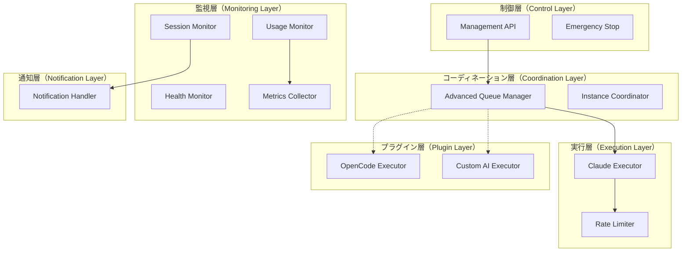
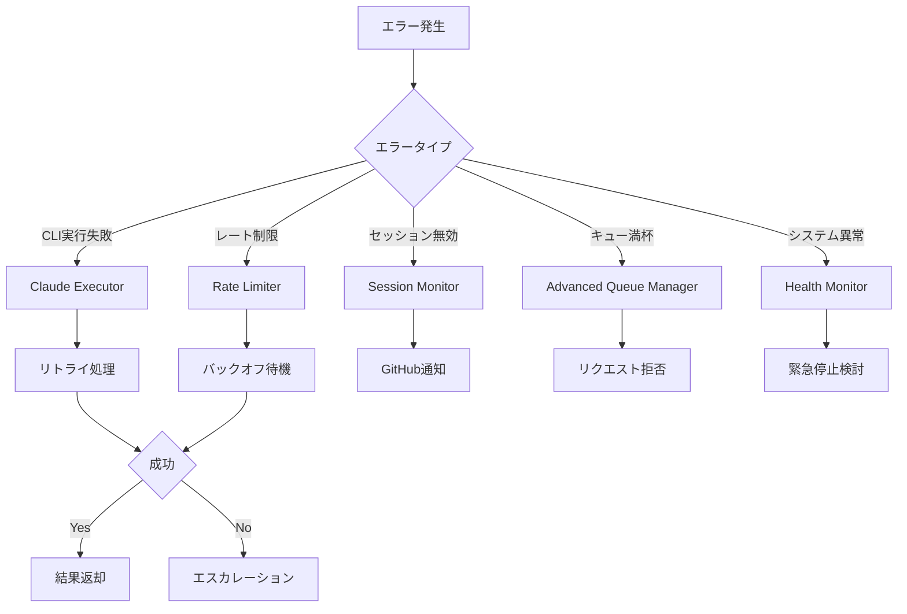
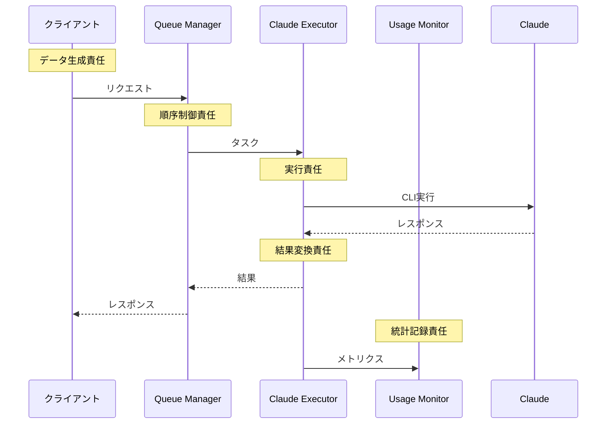
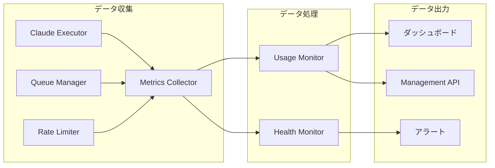

# CCSPコンポーネント責任境界詳細

## 📋 目次

1. [責任境界の原則](#責任境界の原則)
2. [コンポーネント階層](#コンポーネント階層)
3. [詳細責任マトリックス](#詳細責任マトリックス)
4. [インターフェース境界](#インターフェース境界)
5. [エラー責任](#エラー責任)
6. [データフロー責任](#データフロー責任)
7. [将来の拡張性](#将来の拡張性)

---

## 責任境界の原則

### 単一責任の原則（SRP）
各コンポーネントは**1つの明確な責任**のみを持つ：

- ✅ **良い例**: `ClaudeExecutor` → Claude Code CLI実行のみ
- ❌ **悪い例**: `ClaudeExecutor` → CLI実行 + キューイング + 統計収集

### 開放閉鎖の原則（OCP）
既存コードを変更せずに新機能を追加可能：

- ✅ **拡張可能**: 新しいAI CLIツール（OpenCode等）のExecutor追加
- ✅ **変更不要**: 既存の`ClaudeExecutor`は影響なし

### インターフェース分離の原則（ISP）
コンポーネントは必要なインターフェースのみに依存：

- ✅ **良い例**: `UsageMonitor` → 統計収集インターフェースのみ使用
- ❌ **悪い例**: `UsageMonitor` → キュー制御インターフェースも使用

---

## コンポーネント階層



---

## 詳細責任マトリックス

### 1. データ管理責任

| コンポーネント | 管理データ | 読み取り専用 | 書き込み専用 | 削除権限 |
|----------------|------------|--------------|--------------|----------|
| **Advanced Queue Manager** | タスクキュー | ❌ | ✅ | ✅ |
| **Claude Executor** | 実行状態 | ✅ | ✅ | ❌ |
| **Usage Monitor** | 使用統計 | ❌ | ✅ | ✅（古いデータ） |
| **Rate Limiter** | レート制限状態 | ❌ | ✅ | ❌ |
| **Session Monitor** | セッション状態 | ✅ | ✅ | ❌ |
| **Metrics Collector** | システムメトリクス | ❌ | ✅ | ✅（古いデータ） |
| **Health Monitor** | ヘルス状態 | ❌ | ✅ | ❌ |
| **Notification Handler** | 通知履歴 | ✅ | ✅ | ✅ |

### 2. 外部システム接続責任

| コンポーネント | Claude Code CLI | GitHub API | Redis | ダッシュボード |
|----------------|-----------------|-------------|-------|----------------|
| **Claude Executor** | ✅ 実行 | ❌ | ❌ | ❌ |
| **Session Monitor** | ✅ 状態確認 | ❌ | ❌ | ❌ |
| **Notification Handler** | ❌ | ✅ Issue作成 | ❌ | ❌ |
| **Advanced Queue Manager** | ❌ | ❌ | ✅ 永続化 | ❌ |
| **Usage Monitor** | ❌ | ❌ | ✅ 統計保存 | ❌ |
| **Management API** | ❌ | ❌ | ❌ | ✅ データ提供 |

### 3. エラーハンドリング責任

| エラータイプ | 第一責任者 | 第二責任者 | エスカレーション先 |
|--------------|------------|------------|-------------------|
| **CLI実行エラー** | Claude Executor | Rate Limiter | Session Monitor |
| **セッションタイムアウト** | Session Monitor | Notification Handler | Management API |
| **キューオーバーフロー** | Advanced Queue Manager | Health Monitor | Emergency Stop |
| **レート制限エラー** | Rate Limiter | Usage Monitor | Advanced Queue Manager |
| **システムリソース不足** | Health Monitor | Metrics Collector | Emergency Stop |
| **Redis接続エラー** | 各コンポーネント | Health Monitor | Emergency Stop |

---

## インターフェース境界

### 1. 内部インターフェース

```javascript
// キューイングインターフェース
interface QueueInterface {
  enqueue(task: Task, priority: Priority): Promise<string>
  dequeue(): Promise<Task | null>
  pause(): void
  resume(): void
  getStatus(): QueueStatus
}

// 実行インターフェース
interface ExecutorInterface {
  execute(request: ExecuteRequest): Promise<ExecuteResponse>
  isHealthy(): boolean
  getStats(): ExecutorStats
}

// 監視インターフェース
interface MonitorInterface {
  start(): void
  stop(): void
  getMetrics(): Metrics
  subscribe(callback: MetricsCallback): void
}
```

### 2. 外部インターフェース

```javascript
// PoppoBuilderファミリー向けインターフェース
interface CCSPClientInterface {
  // 基本実行
  executeClaude(prompt: string, options?: ExecuteOptions): Promise<string>
  
  // 高度な制御
  executeWithPriority(request: PriorityRequest): Promise<string>
  scheduleExecution(request: ScheduledRequest): Promise<string>
  
  // 監視
  getUsageStats(): Promise<UsageStats>
  subscribeToEvents(callback: EventCallback): void
}
```

---

## エラー責任

### エラー分類と責任者



### エラー伝播ルール

1. **即座に伝播すべきエラー**:
   - 設定エラー
   - 権限エラー
   - 致命的システムエラー

2. **内部処理すべきエラー**:
   - 一時的なネットワークエラー
   - レート制限エラー
   - リトライ可能エラー

3. **ログのみ記録すべきエラー**:
   - 期待される制御フローエラー
   - 統計的に正常範囲内のエラー

---

## データフロー責任

### 1. リクエストデータフロー



### 2. 監視データフロー



---

## 将来の拡張性

### 1. 新しいAI CLIツールの統合

CCSPアーキテクチャは新しいAI CLIツール（OpenCode、Cursor、Windsurf等）の統合を想定した設計です：

```javascript
// 将来の拡張例：OpenCode Executor
class OpenCodeExecutor implements ExecutorInterface {
  async execute(request: ExecuteRequest): Promise<ExecuteResponse> {
    // OpenCode CLI呼び出し
    return await this.runOpenCodeCLI(request);
  }
}

// 統合方法
const executorFactory = {
  'claude': () => new ClaudeExecutor(),
  'opencode': () => new OpenCodeExecutor(),
  'cursor': () => new CursorExecutor()
};
```

### 2. プラグインアーキテクチャ

```javascript
// プラグインインターフェース
interface AIExecutorPlugin {
  name: string;
  version: string;
  supportedOperations: string[];
  
  execute(request: ExecuteRequest): Promise<ExecuteResponse>;
  configure(config: PluginConfig): void;
  getCapabilities(): Capabilities;
}

// プラグイン登録
class PluginManager {
  registerPlugin(plugin: AIExecutorPlugin): void;
  getExecutor(type: string): AIExecutorPlugin;
  listAvailableExecutors(): string[];
}
```

### 3. 負荷分散とルーティング

```javascript
// 実行エンジン選択戦略
interface ExecutorSelectionStrategy {
  selectExecutor(request: ExecuteRequest): string;
}

class LoadBalancedStrategy implements ExecutorSelectionStrategy {
  selectExecutor(request: ExecuteRequest): string {
    // 負荷状況に基づいて最適なExecutorを選択
    const loads = this.getExecutorLoads();
    return this.selectLeastLoaded(loads);
  }
}

class CapabilityBasedStrategy implements ExecutorSelectionStrategy {
  selectExecutor(request: ExecuteRequest): string {
    // リクエストタイプに基づいて最適なExecutorを選択
    if (request.type === 'code-generation') return 'claude';
    if (request.type === 'code-review') return 'opencode';
    return 'claude'; // デフォルト
  }
}
```

### 4. 統一インターフェース

```javascript
// 統一されたAI実行インターフェース
interface UnifiedAIInterface {
  // 基本実行
  execute(prompt: string, options?: AIExecuteOptions): Promise<string>;
  
  // エンジン指定実行
  executeWith(engine: string, prompt: string): Promise<string>;
  
  // ベストエフォート実行（複数エンジンでフォールバック）
  executeBestEffort(prompt: string, engines: string[]): Promise<string>;
  
  // 比較実行（複数エンジンで同じタスクを実行し比較）
  executeComparison(prompt: string, engines: string[]): Promise<ComparisonResult>;
}
```

---

## まとめ

CCSPアーキテクチャの責任境界は以下の特徴を持ちます：

### ✅ 明確な責任分離
- 各コンポーネントが単一の明確な責任を持つ
- インターフェースベースの疎結合設計
- エラーハンドリングの責任階層化

### ✅ 拡張性
- 新しいAI CLIツールの容易な統合
- プラグインアーキテクチャによる柔軟性
- 負荷分散・ルーティング戦略の選択可能

### ✅ 保守性
- 責任境界の明文化
- インターフェース契約の明確化
- テスタビリティの確保

この設計により、CCSPは将来的にClaude Code以外のAIコーディングツールとも統合可能な、拡張性の高いアーキテクチャを実現しています。

---

**文書バージョン**: 1.0  
**最終更新**: 2025年6月21日  
**関連文書**: [CCSPアーキテクチャ概要](./ccsp-architecture.md)