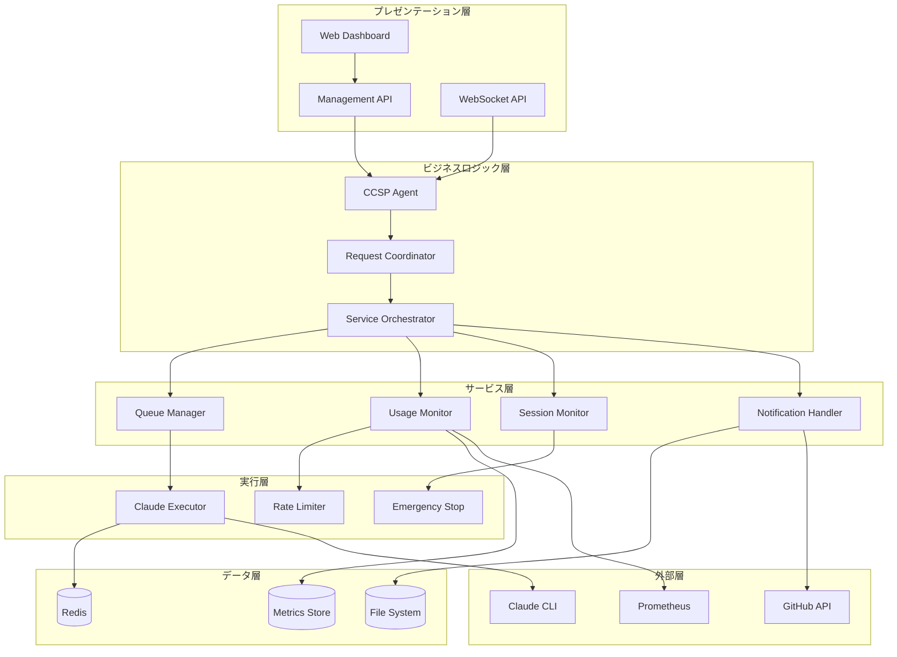
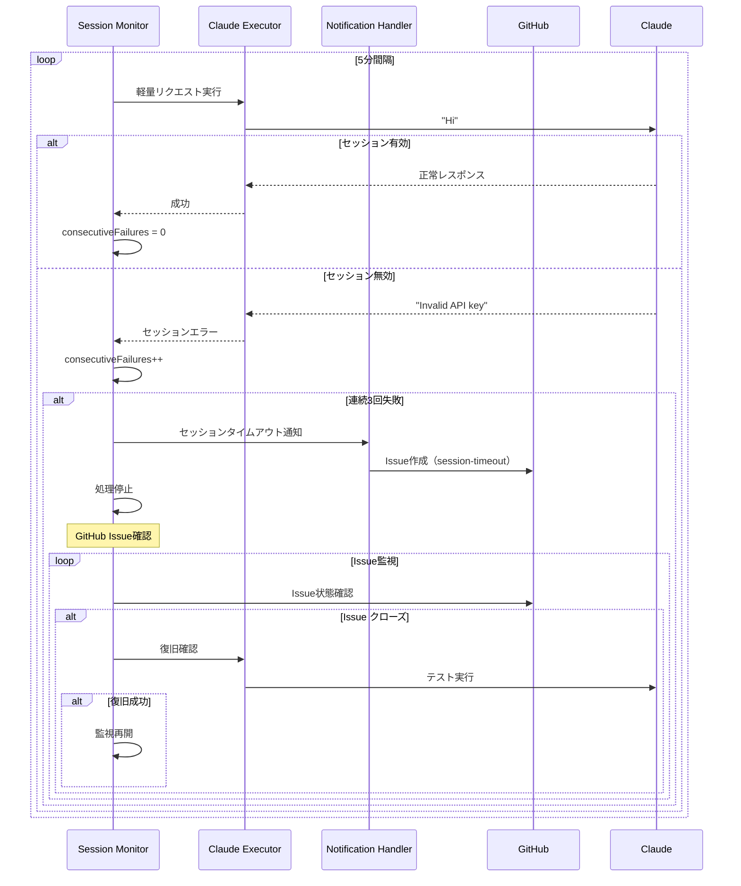
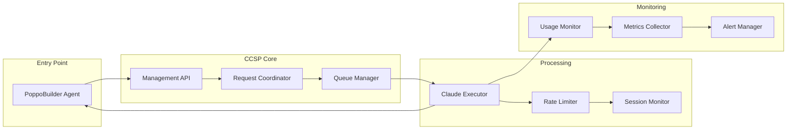
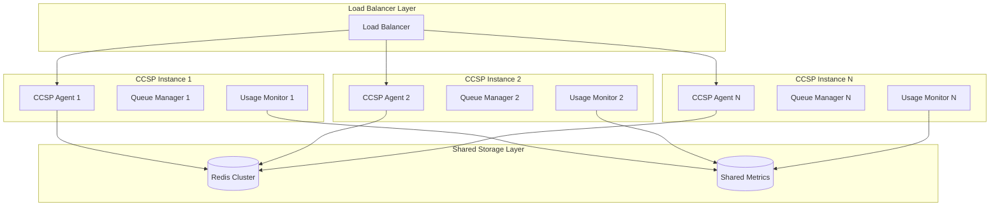
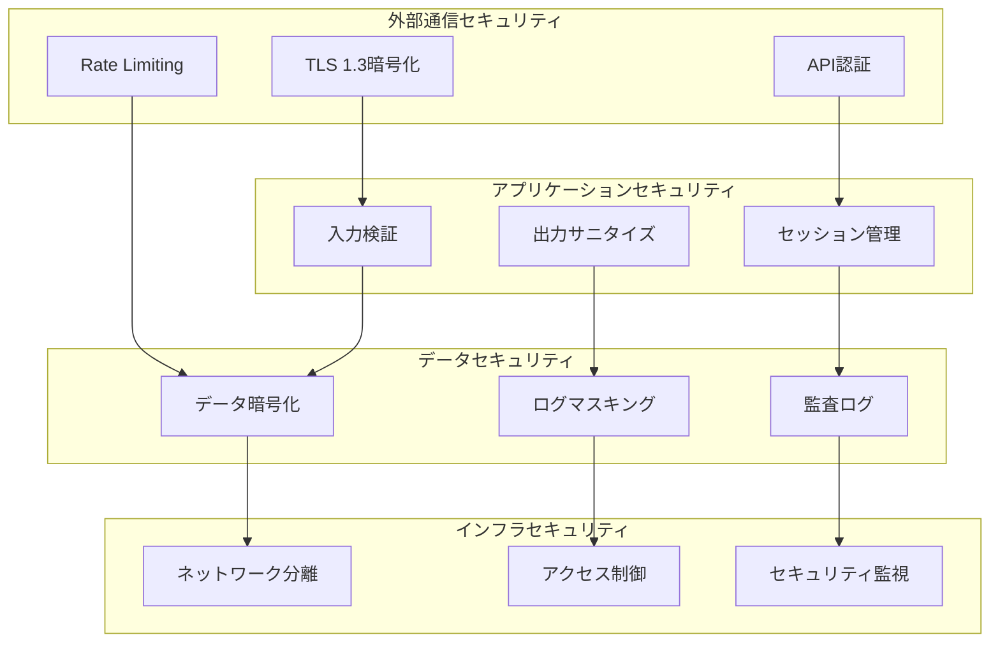

# CCSP（Claude Code Spawner）詳細アーキテクチャ仕様書

## 📋 目次

1. [システム概要](#システム概要)
2. [アーキテクチャ原則](#アーキテクチャ原則)
3. [システム階層設計](#システム階層設計)
4. [コンポーネント詳細仕様](#コンポーネント詳細仕様)
5. [データフローアーキテクチャ](#データフローアーキテクチャ)
6. [分散システム設計](#分散システム設計)
7. [パフォーマンス設計](#パフォーマンス設計)
8. [セキュリティアーキテクチャ](#セキュリティアーキテクチャ)
9. [拡張性設計](#拡張性設計)
10. [運用アーキテクチャ](#運用アーキテクチャ)

---

## システム概要

### CCSPの位置付け

CCSP（Claude Code Spawner）は、PoppoBuilder Suite内で**Claude Code APIのゲートウェイ**として機能する中核システムです。すべてのClaude API呼び出しを一元化し、レート制限、監視、セッション管理を統合的に提供します。

### システムアーキテクチャの特徴

- **マイクロサービス設計**: 各機能が独立したモジュールとして実装
- **イベント駆動**: コンポーネント間の疎結合を実現
- **水平スケーラブル**: Redis活用による分散対応
- **監視ファースト**: 包括的なメトリクス収集と可視化
- **フォルトトレラント**: 障害に対する自動回復機能

### 技術スタック

```
┌─────────────────────────────────────────────────────────────┐
│                     Tech Stack                             │
├─────────────────────────────────────────────────────────────┤
│ Application Layer:  Node.js 18+, Express.js              │
│ Messaging:          Redis (Pub/Sub, Queue)                │
│ Monitoring:         Prometheus, custom metrics            │
│ API:                RESTful API, WebSocket                │
│ Storage:            Redis (state), File System (logs)     │
│ External APIs:      Claude CLI, GitHub API                │
│ Deployment:         Docker, systemd                       │
└─────────────────────────────────────────────────────────────┘
```

---

## アーキテクチャ原則

### 1. 単一責任原則（Single Responsibility Principle）

各コンポーネントは**1つの明確な責任**のみを持ちます：

```javascript
// ✅ 良い例：単一責任
class ClaudeExecutor {
  // Claude CLI実行のみに特化
  async execute(request) { /* ... */ }
  validateRequest(request) { /* ... */ }
  handleCliError(error) { /* ... */ }
}

// ❌ 悪い例：複数責任
class ClaudeManager {
  execute() { /* CLI実行 */ }
  queue() { /* キューイング */ }
  monitor() { /* 監視 */ }
  notify() { /* 通知 */ }
}
```

### 2. オープン・クローズド原則（Open-Closed Principle）

既存コードを変更せずに新機能を追加可能：

```javascript
// ベースインターフェース
interface AIExecutor {
  execute(request: ExecuteRequest): Promise<ExecuteResponse>;
}

// 拡張例：新しいAIツール
class OpenCodeExecutor implements AIExecutor {
  async execute(request: ExecuteRequest): Promise<ExecuteResponse> {
    // OpenCode CLI実行
  }
}

// 既存のClaudeExecutorは変更不要
```

### 3. インターフェース分離原則（Interface Segregation Principle）

大きなインターフェースを小さな特化インターフェースに分割：

```javascript
// ❌ 大きすぎるインターフェース
interface CCSPInterface {
  execute(), queue(), monitor(), notify(), control()
}

// ✅ 分離されたインターフェース
interface Executable { execute() }
interface Queueable { enqueue(), dequeue() }
interface Monitorable { getMetrics() }
interface Controllable { start(), stop() }
```

### 4. 依存性逆転原則（Dependency Inversion Principle）

具象クラスではなく抽象に依存：

```javascript
class CCSPAgent {
  constructor(
    executor: AIExecutor,      // 抽象に依存
    monitor: MetricsCollector, // 抽象に依存
    queue: QueueManager       // 抽象に依存
  ) {
    this.executor = executor;
    this.monitor = monitor;
    this.queue = queue;
  }
}
```

---

## システム階層設計

### 階層アーキテクチャ



### 責任分離マトリックス

| 層 | 責任 | コンポーネント例 | 外部依存 |
|---|-----|----------------|----------|
| **プレゼンテーション** | UI/API | Management API, WebSocket | なし |
| **ビジネスロジック** | コーディネーション | CCSP Agent, Coordinator | なし |
| **サービス** | 専門機能 | Queue Manager, Usage Monitor | Redis |
| **実行** | 外部API実行 | Claude Executor, Rate Limiter | Claude CLI |
| **データ** | 永続化 | Redis, File System | OS |
| **外部** | 外部システム | Claude CLI, GitHub API | ネットワーク |

---

## コンポーネント詳細仕様

### 1. CCSP Agent（中核制御コンポーネント）

```javascript
/**
 * CCSPエージェント - システム全体のコーディネーター
 * 
 * 責任:
 * - コンポーネント間の統合
 * - ライフサイクル管理
 * - イベント管理
 * - 設定管理
 */
class CCSPAgent extends EventEmitter {
  // 主要機能
  async start()           // システム開始
  async shutdown()        // グレースフルシャットダウン
  async healthCheck()     // ヘルスチェック
  
  // イベント管理
  setupEventListeners()   // イベントリスナー設定
  handleEvent(event)      // イベント処理
  
  // 統合機能
  initializeComponents()  // コンポーネント初期化
  coordinateServices()    // サービス間調整
}
```

**アーキテクチャ特性**:
- **単一進入点**: すべてのリクエストの統一受付
- **イベント駆動**: 非同期イベント処理による疎結合
- **ライフサイクル管理**: コンポーネントの開始・停止制御
- **設定一元化**: システム全体の設定管理

### 2. Advanced Queue Manager（高度キュー管理）

```javascript
/**
 * 高度キューマネージャー - 優先度ベース処理制御
 * 
 * 責任:
 * - 優先度ベースキューイング
 * - スケジュール実行
 * - キュー監視
 * - バックプレッシャー制御
 */
class AdvancedQueueManager extends EventEmitter {
  // キュー構造
  queues = {
    urgent: [],      // 緊急: 即座実行
    high: [],        // 高: 5秒以内
    normal: [],      // 通常: 30秒以内
    low: [],         // 低: 5分以内
    scheduled: []    // スケジュール: 指定時刻
  };
  
  // 主要メソッド
  async enqueue(task, priority, scheduleAt)  // タスク追加
  async dequeue()                           // タスク取得
  pause() / resume()                        // 一時停止/再開
  getStatus()                              // 状態取得
  clearQueue(priority)                     // キュー削除
}
```

**設計パターン**:
- **Priority Queue**: 優先度順処理
- **Producer-Consumer**: 非同期処理
- **Circuit Breaker**: 過負荷時の制御
- **Observer**: 状態変化通知

**キューイングアルゴリズム**:
```javascript
// 優先度ベースデキュー
async dequeue() {
  // 1. 緊急タスク（即座実行）
  if (this.queues.urgent.length > 0) {
    return this.queues.urgent.shift();
  }
  
  // 2. スケジュールタスク（時間チェック）
  const readyScheduled = this.getReadyScheduledTasks();
  if (readyScheduled.length > 0) {
    return readyScheduled.shift();
  }
  
  // 3. 通常優先度（high > normal > low）
  const priorities = ['high', 'normal', 'low'];
  for (const priority of priorities) {
    if (this.queues[priority].length > 0) {
      return this.queues[priority].shift();
    }
  }
  
  return null; // キューが空
}
```

### 3. Usage Monitor（使用量監視システム）

```javascript
/**
 * 使用量モニター - API使用量の包括的監視
 * 
 * 責任:
 * - リアルタイム使用量追跡
 * - 使用量予測（機械学習）
 * - アラート生成
 * - エージェント別統計
 */
class UsageMonitor extends EventEmitter {
  // データ構造
  timeWindows = new Map();     // 時間窓別統計
  agentStats = new Map();      // エージェント別統計
  alertRules = new Map();      // アラートルール
  
  // 主要機能
  recordUsage(usage)          // 使用量記録
  predictUsage(minutes)       // 使用量予測
  checkAlerts()              // アラート監視
  getAgentStats(agent)       // エージェント統計
  getTimeSeriesStats(hours)  // 時系列統計
}
```

**予測アルゴリズム**:
```javascript
// 線形回帰による使用量予測
predictUsage(minutesAhead = 30) {
  const timeSeriesData = this.getTimeSeriesStats(120); // 2時間分
  
  // 線形回帰計算
  const { slope, intercept } = this.linearRegression(timeSeriesData);
  
  // 将来使用量の予測
  const currentTime = Date.now();
  const futureTime = currentTime + (minutesAhead * 60 * 1000);
  const predictedUsage = slope * futureTime + intercept;
  
  // 信頼度計算
  const confidence = this.calculateConfidence(timeSeriesData, slope, intercept);
  
  return {
    predictedRequestsPerMinute: Math.max(0, predictedUsage),
    confidence: confidence,
    trend: slope > 0 ? 'increasing' : 'decreasing',
    forecastUntil: new Date(futureTime).toISOString()
  };
}
```

### 4. Claude Executor（Claude CLI実行エンジン）

```javascript
/**
 * Claude実行エンジン - Claude CLI実行の専門コンポーネント
 * 
 * 責任:
 * - Claude CLI プロセス管理
 * - エラー分析と分類
 * - リトライ制御
 * - 一時ファイル管理
 */
class ClaudeExecutor {
  // 実行制御
  async execute(request)     // メイン実行
  validateRequest(request)   // リクエスト検証
  createTempFile(content)   // 一時ファイル作成
  cleanupTempFiles()        // ファイルクリーンアップ
  
  // エラー処理
  analyzeError(error)       // エラー分析
  shouldRetry(error, attempt) // リトライ判定
  calculateBackoff(attempt)   // バックオフ計算
}
```

**エラー分類システム**:
```javascript
// エラー分析と分類
analyzeError(errorMessage) {
  const patterns = {
    SESSION_TIMEOUT: [
      /invalid api key/i,
      /please run \/login/i,
      /authentication failed/i
    ],
    RATE_LIMIT: [
      /rate limit/i,
      /usage limit/i,
      /quota exceeded/i
    ],
    NETWORK_ERROR: [
      /connection refused/i,
      /timeout/i,
      /network unreachable/i
    ],
    INVALID_REQUEST: [
      /invalid prompt/i,
      /malformed request/i,
      /syntax error/i
    ]
  };
  
  for (const [category, regexList] of Object.entries(patterns)) {
    if (regexList.some(regex => regex.test(errorMessage))) {
      return {
        category,
        recoverable: this.isRecoverable(category),
        retryDelay: this.getRetryDelay(category),
        severity: this.getSeverity(category)
      };
    }
  }
  
  return { category: 'UNKNOWN_ERROR', recoverable: false };
}
```

### 5. Session Monitor（セッション監視システム）

```javascript
/**
 * セッションモニター - Claude セッション状態監視
 * 
 * 責任:
 * - セッション有効性監視
 * - タイムアウト検出
 * - 自動復旧トリガー
 * - GitHub通知連携
 */
class SessionMonitor extends EventEmitter {
  sessionState = {
    isValid: true,
    lastCheck: null,
    consecutiveFailures: 0,
    lastValidResponse: null
  };
  
  // 監視機能
  startMonitoring()         // 監視開始
  checkSessionValidity()    // 有効性チェック
  handleSessionTimeout()    // タイムアウト処理
  attemptRecovery()        // 復旧試行
}
```

**セッション監視フロー**:


---

## データフローアーキテクチャ

### 1. リクエスト処理フロー



### 2. データ永続化設計

```javascript
// データ階層設計
const DataLayers = {
  // L1: メモリキャッシュ（最高速アクセス）
  L1_CACHE: {
    activeRequests: new Map(),
    recentMetrics: new Map(),
    sessionState: new Map()
  },
  
  // L2: Redisキャッシュ（高速永続化）
  L2_REDIS: {
    queueData: 'ccsp:queue:*',
    usageStats: 'ccsp:usage:*',
    agentMetrics: 'ccsp:agents:*'
  },
  
  // L3: ファイルシステム（長期保存）
  L3_FILESYSTEM: {
    logs: 'logs/ccsp/',
    metrics: 'data/metrics/',
    backups: 'backups/ccsp/'
  }
};
```

### 3. イベント駆動データフロー

```javascript
// イベント駆動アーキテクチャ
class EventBus extends EventEmitter {
  // システムイベント定義
  static EVENTS = {
    TASK_ENQUEUED: 'task.enqueued',
    TASK_STARTED: 'task.started',
    TASK_COMPLETED: 'task.completed',
    TASK_FAILED: 'task.failed',
    
    USAGE_RECORDED: 'usage.recorded',
    USAGE_THRESHOLD: 'usage.threshold',
    
    SESSION_VALID: 'session.valid',
    SESSION_TIMEOUT: 'session.timeout',
    SESSION_RECOVERED: 'session.recovered',
    
    EMERGENCY_STOP: 'emergency.stop',
    SYSTEM_HEALTH: 'system.health'
  };
  
  // イベント処理パイプライン
  processEvent(eventType, data) {
    // 1. イベント検証
    this.validateEvent(eventType, data);
    
    // 2. 前処理フィルター
    const processedData = this.applyFilters(eventType, data);
    
    // 3. イベント発行
    this.emit(eventType, processedData);
    
    // 4. メトリクス記録
    this.recordEventMetrics(eventType);
    
    // 5. 永続化（必要に応じて）
    if (this.isPersistable(eventType)) {
      this.persistEvent(eventType, processedData);
    }
  }
}
```

---

## 分散システム設計

### 1. 水平スケーリングアーキテクチャ



### 2. 分散キュー管理

```javascript
/**
 * 分散キューマネージャー - Redis Cluster活用
 */
class DistributedQueueManager {
  constructor(redisCluster) {
    this.redis = redisCluster;
    this.instanceId = this.generateInstanceId();
    this.heartbeatInterval = 30000; // 30秒
  }
  
  // 分散キューイング
  async enqueue(task, priority) {
    const queueKey = `ccsp:queue:${priority}`;
    const taskData = {
      ...task,
      id: this.generateTaskId(),
      enqueuedAt: Date.now(),
      instanceId: this.instanceId
    };
    
    // Redis List への追加（原子的操作）
    await this.redis.lpush(queueKey, JSON.stringify(taskData));
    
    // 統計更新
    await this.updateQueueStats(priority, 'enqueue');
    
    return taskData.id;
  }
  
  // 分散デキュー（競合制御）
  async dequeue() {
    const priorities = ['urgent', 'high', 'normal', 'low'];
    
    for (const priority of priorities) {
      const queueKey = `ccsp:queue:${priority}`;
      
      // ブロッキング pop（他インスタンスとの競合を自動制御）
      const result = await this.redis.brpop(queueKey, 1);
      
      if (result) {
        const taskData = JSON.parse(result[1]);
        
        // 処理インスタンスを記録
        await this.claimTask(taskData.id, this.instanceId);
        
        return taskData;
      }
    }
    
    return null;
  }
  
  // タスク所有権管理
  async claimTask(taskId, instanceId) {
    const claimKey = `ccsp:task:${taskId}:claim`;
    const success = await this.redis.set(
      claimKey, 
      instanceId, 
      'EX', 3600, // 1時間TTL
      'NX'        // 存在しない場合のみ設定
    );
    
    return success === 'OK';
  }
}
```

### 3. 分散監視システム

```javascript
/**
 * 分散メトリクス収集システム
 */
class DistributedMetricsCollector {
  // インスタンス固有メトリクス
  collectLocalMetrics() {
    return {
      instanceId: this.instanceId,
      timestamp: Date.now(),
      cpu: this.getCpuUsage(),
      memory: this.getMemoryUsage(),
      activeRequests: this.getActiveRequestCount(),
      queueSize: this.getLocalQueueSize(),
      uptime: process.uptime()
    };
  }
  
  // 分散集約メトリクス
  async collectGlobalMetrics() {
    const instances = await this.getActiveInstances();
    const globalMetrics = {
      totalInstances: instances.length,
      totalActiveRequests: 0,
      totalQueueSize: 0,
      averageCpuUsage: 0,
      averageMemoryUsage: 0
    };
    
    for (const instanceId of instances) {
      const instanceMetrics = await this.getInstanceMetrics(instanceId);
      if (instanceMetrics) {
        globalMetrics.totalActiveRequests += instanceMetrics.activeRequests;
        globalMetrics.totalQueueSize += instanceMetrics.queueSize;
        globalMetrics.averageCpuUsage += instanceMetrics.cpu;
        globalMetrics.averageMemoryUsage += instanceMetrics.memory;
      }
    }
    
    // 平均値計算
    globalMetrics.averageCpuUsage /= instances.length;
    globalMetrics.averageMemoryUsage /= instances.length;
    
    return globalMetrics;
  }
}
```

---

## パフォーマンス設計

### 1. パフォーマンス目標

| メトリクス | 目標値 | 測定方法 |
|-----------|--------|----------|
| **レスポンス時間** | P95 < 200ms | API応答時間 |
| **スループット** | 1000 req/hour | 時間あたり処理数 |
| **可用性** | 99.9% | 月間ダウンタイム |
| **CPU使用率** | 平均 < 30% | システム監視 |
| **メモリ使用量** | < 500MB | プロセス監視 |
| **キュー遅延** | 平均 < 5秒 | キュー監視 |

### 2. パフォーマンス最適化戦略

```javascript
/**
 * パフォーマンス最適化エンジン
 */
class PerformanceOptimizer {
  // 動的最適化
  async optimizePerformance() {
    const metrics = await this.getCurrentMetrics();
    
    // CPU最適化
    if (metrics.cpu > 80) {
      await this.reduceConcurrency();
      await this.enableThrottling();
    }
    
    // メモリ最適化
    if (metrics.memory > 400) {
      await this.triggerGarbageCollection();
      await this.clearOldCache();
    }
    
    // キュー最適化
    if (metrics.queueSize > 100) {
      await this.increaseConcurrency();
      await this.prioritizeUrgentTasks();
    }
    
    // レスポンス時間最適化
    if (metrics.avgResponseTime > 150) {
      await this.optimizeAlgorithms();
      await this.preloadFrequentData();
    }
  }
  
  // アダプティブ・スロットリング
  async adaptiveThrottling() {
    const usageRate = await this.getCurrentUsageRate();
    const predictedUsage = await this.predictNextHourUsage();
    
    if (predictedUsage > this.rateLimit * 0.9) {
      // 90%到達予測時にスロットリング開始
      const throttleRate = this.calculateOptimalThrottleRate(predictedUsage);
      await this.setThrottleRate(throttleRate);
    }
  }
}
```

### 3. キャッシュ戦略

```javascript
/**
 * 多層キャッシュシステム
 */
class MultiLayerCache {
  constructor() {
    // L1: インメモリキャッシュ（最高速）
    this.l1Cache = new Map();
    this.l1TTL = 60 * 1000; // 1分
    
    // L2: Redisキャッシュ（高速）
    this.l2TTL = 10 * 60 * 1000; // 10分
    
    // L3: 永続キャッシュ（最長）
    this.l3TTL = 60 * 60 * 1000; // 1時間
  }
  
  async get(key) {
    // L1キャッシュ確認
    const l1Value = this.l1Cache.get(key);
    if (l1Value && !this.isExpired(l1Value)) {
      return l1Value.data;
    }
    
    // L2キャッシュ確認
    const l2Value = await this.redis.get(`l2:${key}`);
    if (l2Value) {
      // L1に昇格
      this.l1Cache.set(key, {
        data: JSON.parse(l2Value),
        timestamp: Date.now()
      });
      return JSON.parse(l2Value);
    }
    
    // L3キャッシュ確認
    const l3Value = await this.getFromPersistentStore(key);
    if (l3Value) {
      // L2, L1に昇格
      await this.redis.set(`l2:${key}`, JSON.stringify(l3Value), 'EX', this.l2TTL / 1000);
      this.l1Cache.set(key, { data: l3Value, timestamp: Date.now() });
      return l3Value;
    }
    
    return null;
  }
}
```

---

## セキュリティアーキテクチャ

### 1. セキュリティ層設計



### 2. 認証・認可システム

```javascript
/**
 * セキュリティマネージャー
 */
class SecurityManager {
  // API認証
  async authenticateRequest(request) {
    const token = this.extractToken(request);
    
    if (!token) {
      throw new UnauthorizedError('Missing authentication token');
    }
    
    const decodedToken = await this.verifyToken(token);
    const permissions = await this.getPermissions(decodedToken.userId);
    
    return {
      userId: decodedToken.userId,
      permissions: permissions,
      tokenExpiry: decodedToken.exp
    };
  }
  
  // 認可チェック
  async authorize(auth, requiredPermission) {
    if (!auth.permissions.includes(requiredPermission)) {
      throw new ForbiddenError(`Permission required: ${requiredPermission}`);
    }
    
    // 権限の有効期限チェック
    if (Date.now() > auth.tokenExpiry * 1000) {
      throw new UnauthorizedError('Token expired');
    }
    
    return true;
  }
  
  // 機密データマスキング
  maskSensitiveData(data) {
    const sensitiveFields = ['apiKey', 'token', 'password', 'secret'];
    const masked = { ...data };
    
    for (const field of sensitiveFields) {
      if (masked[field]) {
        masked[field] = this.maskString(masked[field]);
      }
    }
    
    return masked;
  }
  
  maskString(str) {
    if (str.length <= 8) return '*'.repeat(str.length);
    return str.substring(0, 4) + '*'.repeat(str.length - 8) + str.substring(str.length - 4);
  }
}
```

### 3. 監査システム

```javascript
/**
 * 監査ログシステム
 */
class AuditLogger {
  async logEvent(eventType, details) {
    const auditEntry = {
      timestamp: new Date().toISOString(),
      eventType: eventType,
      userId: details.userId,
      sessionId: details.sessionId,
      action: details.action,
      resource: details.resource,
      result: details.result,
      ipAddress: details.ipAddress,
      userAgent: details.userAgent,
      requestId: details.requestId,
      severity: this.calculateSeverity(eventType),
      checksum: this.calculateChecksum(details)
    };
    
    // 複数の出力先に記録
    await Promise.all([
      this.writeToSecureLog(auditEntry),
      this.sendToSIEM(auditEntry),
      this.updateMetrics(auditEntry)
    ]);
  }
  
  // セキュリティイベント検出
  detectSecurityEvent(auditEntry) {
    const patterns = {
      BRUTE_FORCE: this.detectBruteForce(auditEntry),
      PRIVILEGE_ESCALATION: this.detectPrivilegeEscalation(auditEntry),
      SUSPICIOUS_ACTIVITY: this.detectSuspiciousActivity(auditEntry),
      DATA_EXFILTRATION: this.detectDataExfiltration(auditEntry)
    };
    
    const detectedPatterns = Object.entries(patterns)
      .filter(([pattern, detected]) => detected)
      .map(([pattern]) => pattern);
    
    if (detectedPatterns.length > 0) {
      this.triggerSecurityAlert(detectedPatterns, auditEntry);
    }
  }
}
```

---

## 拡張性設計

### 1. プラグインアーキテクチャ

```javascript
/**
 * プラグインマネージャー - 拡張可能なアーキテクチャ
 */
class PluginManager {
  constructor() {
    this.plugins = new Map();
    this.hooks = new Map();
  }
  
  // プラグイン登録
  async registerPlugin(pluginConfig) {
    const plugin = await this.loadPlugin(pluginConfig);
    
    // プラグイン検証
    this.validatePlugin(plugin);
    
    // フック登録
    for (const hook of plugin.hooks) {
      this.registerHook(hook.name, hook.handler);
    }
    
    // 初期化
    await plugin.initialize();
    
    this.plugins.set(plugin.name, plugin);
  }
  
  // フック実行
  async executeHook(hookName, context) {
    const handlers = this.hooks.get(hookName) || [];
    
    for (const handler of handlers) {
      try {
        await handler(context);
      } catch (error) {
        this.logger.error(`Hook execution failed: ${hookName}`, error);
      }
    }
  }
}

// プラグイン例：OpenCode統合
class OpenCodePlugin {
  constructor() {
    this.name = 'opencode';
    this.version = '1.0.0';
    this.hooks = [
      {
        name: 'before-execute',
        handler: this.preprocessRequest.bind(this)
      },
      {
        name: 'execute',
        handler: this.executeOpenCode.bind(this)
      }
    ];
  }
  
  async executeOpenCode(context) {
    if (context.engineType === 'opencode') {
      const result = await this.runOpenCodeCLI(context.request);
      context.result = result;
      context.handled = true;
    }
  }
}
```

### 2. マイクロサービス移行設計

```javascript
/**
 * サービス分離戦略
 */
class ServiceMigrationPlan {
  // Phase 1: モノリス内分離
  phase1_ModularMonolith() {
    return {
      services: [
        'QueueService',      // キュー管理
        'ExecutorService',   // 実行エンジン
        'MonitorService',    // 監視
        'NotificationService' // 通知
      ],
      communication: 'InProcess', // プロセス内通信
      database: 'Shared'          // 共有データベース
    };
  }
  
  // Phase 2: サービス分離
  phase2_ServiceSeparation() {
    return {
      services: [
        {
          name: 'QueueService',
          port: 3001,
          database: 'queue_db',
          dependencies: []
        },
        {
          name: 'ExecutorService',
          port: 3002,
          database: 'executor_db',
          dependencies: ['QueueService']
        },
        {
          name: 'MonitorService',
          port: 3003,
          database: 'monitor_db',
          dependencies: ['QueueService', 'ExecutorService']
        }
      ],
      communication: 'HTTP/gRPC',
      serviceDiscovery: 'Consul'
    };
  }
  
  // Phase 3: コンテナ化
  phase3_Containerization() {
    return {
      platform: 'Kubernetes',
      services: this.phase2_ServiceSeparation().services.map(service => ({
        ...service,
        container: `ccsp-${service.name.toLowerCase()}:latest`,
        replicas: this.calculateReplicas(service.name),
        resources: this.calculateResources(service.name)
      }))
    };
  }
}
```

### 3. API バージョニング

```javascript
/**
 * APIバージョニング戦略
 */
class APIVersionManager {
  constructor() {
    this.versions = new Map();
    this.currentVersion = 'v1';
    this.supportedVersions = ['v1', 'v2'];
  }
  
  // バージョン別ルーティング
  setupVersionRouting(app) {
    // v1 API（現在）
    app.use('/api/v1', this.getV1Router());
    
    // v2 API（次期）
    app.use('/api/v2', this.getV2Router());
    
    // バージョン指定なし（最新）
    app.use('/api', this.getCurrentVersionRouter());
  }
  
  // 後方互換性保証
  async handleLegacyRequest(request, version) {
    const adapter = this.getVersionAdapter(version, this.currentVersion);
    const adaptedRequest = await adapter.adaptRequest(request);
    
    const response = await this.handleCurrentRequest(adaptedRequest);
    
    const adaptedResponse = await adapter.adaptResponse(response);
    return adaptedResponse;
  }
}
```

---

## 運用アーキテクチャ

### 1. 監視・可観測性

```javascript
/**
 * 可観測性プラットフォーム
 */
class ObservabilityPlatform {
  constructor() {
    this.metrics = new MetricsCollector();
    this.traces = new DistributedTracing();
    this.logs = new StructuredLogging();
  }
  
  // 分散トレーシング
  async traceRequest(requestId, operation) {
    const span = this.traces.startSpan(operation, {
      requestId: requestId,
      service: 'ccsp',
      version: this.version
    });
    
    try {
      const result = await operation();
      span.setStatus('success');
      return result;
    } catch (error) {
      span.setStatus('error');
      span.recordException(error);
      throw error;
    } finally {
      span.end();
    }
  }
  
  // SLI/SLO監視
  async monitorSLOs() {
    const slos = {
      availability: {
        target: 99.9,
        current: await this.calculateAvailability()
      },
      latency: {
        target: 200, // ms
        current: await this.calculateP95Latency()
      },
      errorRate: {
        target: 0.1, // %
        current: await this.calculateErrorRate()
      }
    };
    
    for (const [metric, slo] of Object.entries(slos)) {
      if (slo.current > slo.target) {
        await this.triggerSLOViolationAlert(metric, slo);
      }
    }
    
    return slos;
  }
}
```

### 2. デプロイメント戦略

```yaml
# Kubernetes デプロイメント設定例
apiVersion: apps/v1
kind: Deployment
metadata:
  name: ccsp-agent
  labels:
    app: ccsp
    component: agent
spec:
  replicas: 3
  strategy:
    type: RollingUpdate
    rollingUpdate:
      maxSurge: 1
      maxUnavailable: 1
  selector:
    matchLabels:
      app: ccsp
      component: agent
  template:
    metadata:
      labels:
        app: ccsp
        component: agent
    spec:
      containers:
      - name: ccsp-agent
        image: ccsp:latest
        ports:
        - containerPort: 3003
        env:
        - name: REDIS_HOST
          value: "redis-cluster"
        - name: NODE_ENV
          value: "production"
        resources:
          requests:
            memory: "256Mi"
            cpu: "250m"
          limits:
            memory: "512Mi"
            cpu: "500m"
        livenessProbe:
          httpGet:
            path: /health
            port: 3003
          initialDelaySeconds: 30
          periodSeconds: 10
        readinessProbe:
          httpGet:
            path: /ready
            port: 3003
          initialDelaySeconds: 5
          periodSeconds: 5
```

### 3. 災害復旧設計

```javascript
/**
 * 災害復旧システム
 */
class DisasterRecoveryManager {
  constructor() {
    this.backupStrategy = new BackupStrategy();
    this.recoveryProcedures = new RecoveryProcedures();
    this.healthMonitor = new HealthMonitor();
  }
  
  // 自動フェイルオーバー
  async handleServiceFailure(serviceId) {
    // 1. 障害検出
    const failureDetails = await this.analyzeFailure(serviceId);
    
    // 2. 影響範囲評価
    const impactAssessment = await this.assessImpact(failureDetails);
    
    // 3. 復旧戦略決定
    const recoveryStrategy = this.selectRecoveryStrategy(impactAssessment);
    
    // 4. 復旧実行
    switch (recoveryStrategy.type) {
      case 'restart':
        await this.restartService(serviceId);
        break;
      case 'failover':
        await this.failoverToBackup(serviceId);
        break;
      case 'rollback':
        await this.rollbackToLastGoodVersion(serviceId);
        break;
    }
    
    // 5. 復旧確認
    await this.verifyRecovery(serviceId);
    
    // 6. 事後処理
    await this.postRecoveryCleanup(serviceId, recoveryStrategy);
  }
  
  // データ復旧
  async restoreFromBackup(backupId, targetTime) {
    const backup = await this.backupStrategy.getBackup(backupId);
    
    // Point-in-Time Recovery
    if (targetTime) {
      return await this.performPointInTimeRecovery(backup, targetTime);
    }
    
    // 完全復旧
    return await this.performFullRestore(backup);
  }
}
```

---

## まとめ

このCCSP詳細アーキテクチャ仕様書では、以下の重要な設計原則を確立しました：

### ✅ アーキテクチャの特徴

1. **モジュラー設計**: 各コンポーネントの独立性と疎結合
2. **イベント駆動**: 非同期処理による高いスケーラビリティ
3. **分散対応**: Redis活用による水平スケーリング
4. **監視ファースト**: 包括的な可観測性の実現
5. **セキュリティ組み込み**: セキュリティ・バイ・デザイン

### ✅ 拡張性の確保

1. **プラグインアーキテクチャ**: 新機能の容易な追加
2. **マイクロサービス移行準備**: 段階的な分散化
3. **APIバージョニング**: 後方互換性の保証
4. **災害復旧**: 高可用性システムの実現

### ✅ 運用性の向上

1. **自動化**: 監視・復旧・スケーリングの自動化
2. **可視性**: 詳細なメトリクス・ログ・トレーシング
3. **制御性**: 管理APIによる完全な制御
4. **保守性**: 明確な責任分離と文書化

この設計により、CCSPは将来的なAI技術の進歩や要求の変化に対応できる、堅牢で拡張可能なアーキテクチャを実現しています。

---

**文書バージョン**: 1.0  
**最終更新**: 2025年6月21日  
**関連文書**: 
- [CCSP基本アーキテクチャ](./ccsp-architecture.md)
- [CCSPコンポーネント責任境界](./ccsp-component-responsibilities.md)
- [CCSP Phase 4実装履歴](./implementation-history/issues/issue-142-ccsp-phase4.md)