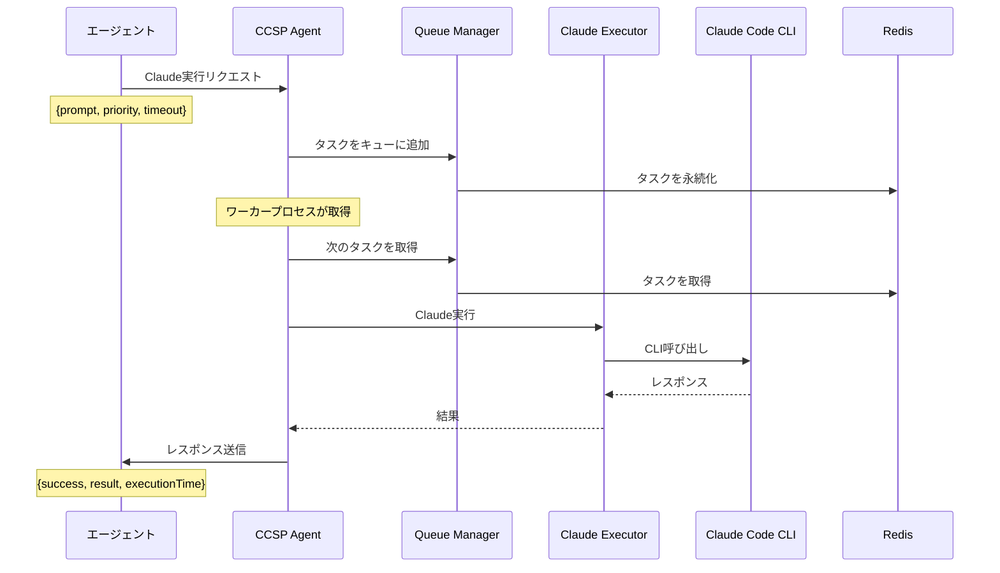
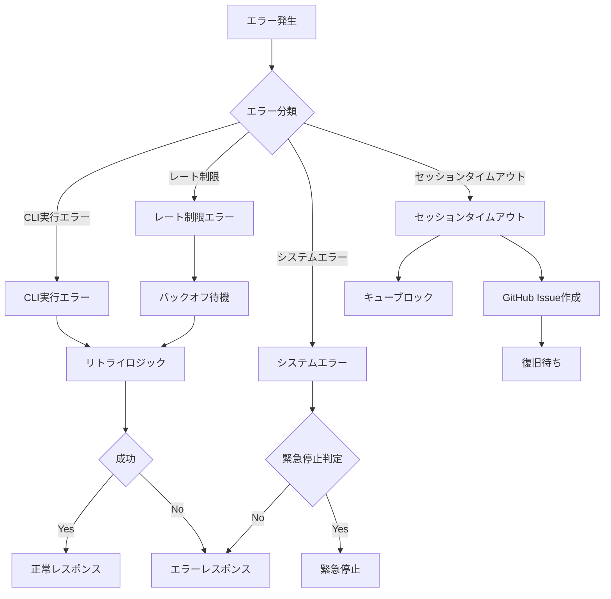
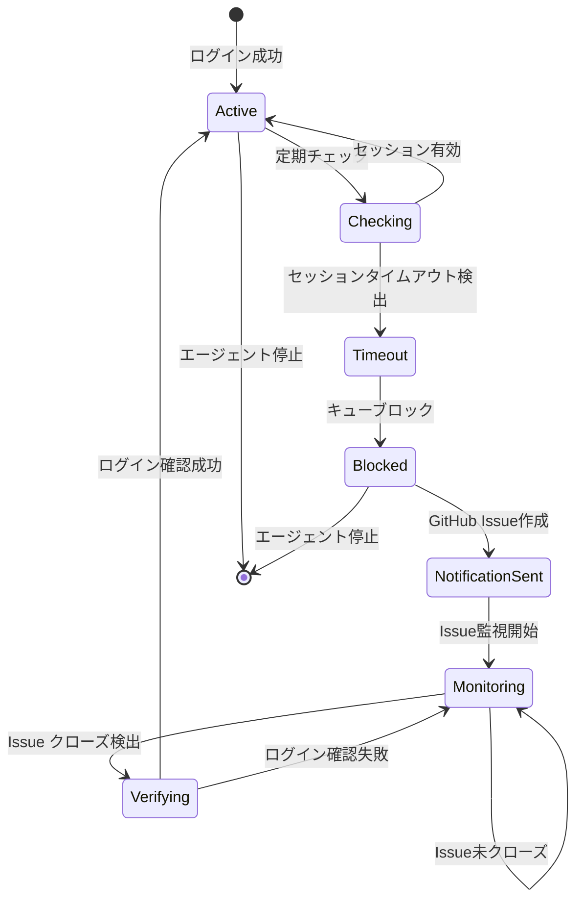
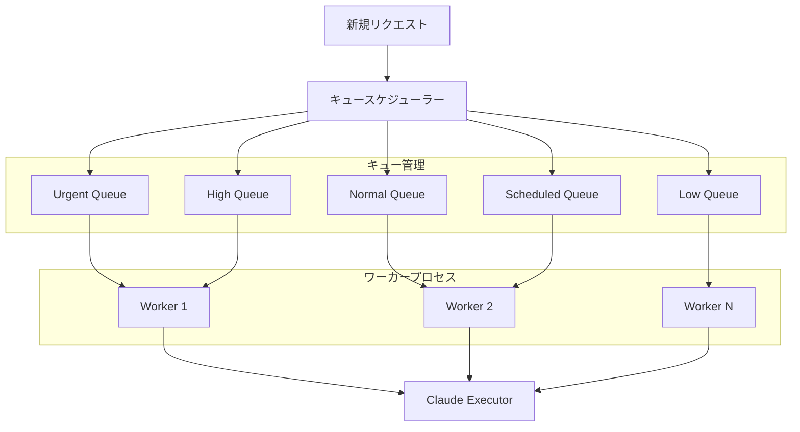
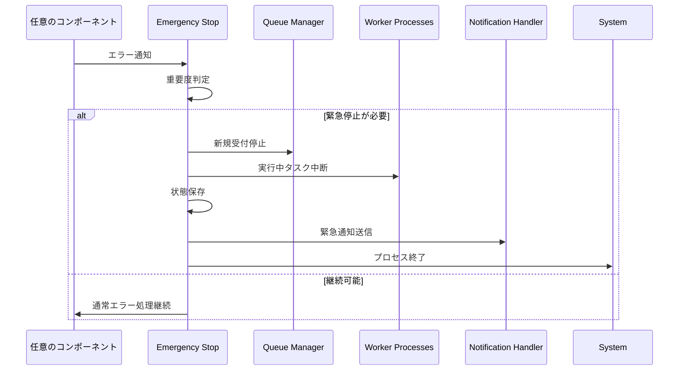
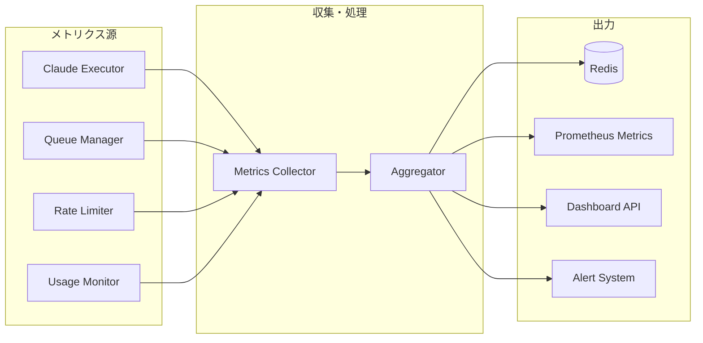
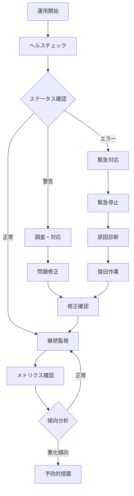

# CCSP統合フローガイド

## 📋 目次

1. [基本フロー](#基本フロー)
2. [エラーハンドリングフロー](#エラーハンドリングフロー)
3. [レート制限ハンドリング](#レート制限ハンドリング)
4. [セッション管理フロー](#セッション管理フロー)
5. [キュー管理フロー](#キュー管理フロー)
6. [緊急停止フロー](#緊急停止フロー)
7. [監視・メトリクスフロー](#監視・メトリクスフロー)
8. [運用フロー](#運用フロー)

---

## 基本フロー

### 1. 標準的なClaude実行フロー



### 2. エージェント統合パターン

```javascript
// PoppoBuilderファミリーでの使用例
class SampleAgent {
  constructor() {
    this.ccsClient = new CCSPClient({
      redisConfig: config.redis,
      agentName: 'sample-agent'
    });
  }
  
  async processTask(task) {
    try {
      // CCSPを通じてClaude実行
      const result = await this.ccsClient.executeClaude(
        task.prompt,
        {
          priority: task.priority || 'normal',
          timeout: task.timeout || 300000,
          context: task.context
        }
      );
      
      return {
        success: true,
        result: result
      };
      
    } catch (error) {
      if (error.sessionTimeout) {
        // セッションタイムアウト処理
        await this.handleSessionTimeout(error);
      }
      throw error;
    }
  }
}
```

---

## エラーハンドリングフロー

### 1. エラー分類と処理フロー



### 2. エラー重要度マッピング

| エラータイプ | 重要度 | アクション | エスカレーション |
|-------------|--------|------------|-----------------|
| **CLI実行失敗** | Medium | リトライ（最大3回） | 連続失敗時にアラート |
| **レート制限** | Low | バックオフ待機 | 長時間継続時にアラート |
| **セッションタイムアウト** | High | GitHub Issue作成 | 即座に通知 |
| **システムリソース不足** | Critical | 緊急停止検討 | 即座にエスカレーション |
| **Redis接続エラー** | Critical | 緊急停止 | 即座にエスカレーション |

---

## レート制限ハンドリング

### 1. レート制限検出・処理フロー

```mermaid
sequenceDiagram
    participant Executor as Claude Executor
    participant RateLimit as Rate Limiter
    participant Monitor as Usage Monitor
    participant Queue as Queue Manager
    
    Executor->>Claude: CLI実行
    Claude-->>Executor: レート制限エラー
    
    Executor->>RateLimit: レート制限情報更新
    Note over RateLimit: unlockTime, remainingRequests
    
    RateLimit->>Monitor: 使用量統計更新
    
    loop 待機ループ
        Executor->>RateLimit: 実行可能性チェック
        RateLimit-->>Executor: waitTime
        
        alt 待機が必要
            Executor->>Executor: バックオフ待機
        else 実行可能
            break
        end
    end
    
    Executor->>Claude: リトライ実行
```

### 2. 動的バックオフアルゴリズム

```javascript
class AdaptiveBackoffStrategy {
  calculateWaitTime(attempt, rateLimitInfo) {
    const baseDelay = 1000; // 1秒
    const maxDelay = 300000; // 5分
    
    // 指数バックオフ
    let delay = baseDelay * Math.pow(2, attempt - 1);
    
    // レート制限情報がある場合は正確な待機時間を使用
    if (rateLimitInfo && rateLimitInfo.unlockTime) {
      const exactWait = rateLimitInfo.unlockTime - Date.now();
      if (exactWait > 0) {
        delay = Math.min(exactWait, maxDelay);
      }
    }
    
    // ジッター追加（雷鳴現象防止）
    const jitter = delay * 0.1 * Math.random();
    
    return Math.min(delay + jitter, maxDelay);
  }
}
```

---

## セッション管理フロー

### 1. セッションライフサイクル



### 2. セッション復旧フロー

```javascript
class SessionRecoveryFlow {
  async handleSessionTimeout(error) {
    // 1. セッションブロック
    this.sessionMonitor.blockSession();
    
    // 2. GitHub Issue作成
    const issue = await this.notificationHandler.createSessionTimeoutIssue({
      error: error.message,
      timestamp: new Date().toISOString(),
      agentInfo: this.getAgentInfo()
    });
    
    // 3. 監視開始
    this.sessionMonitor.startIssueMonitoring(issue.number);
    
    // 4. 復旧待ち（非同期）
    this.sessionMonitor.on('session-restored', async () => {
      // ブロックされたリクエストを再キュー
      const blockedRequests = this.sessionMonitor.getBlockedRequests();
      for (const request of blockedRequests) {
        await this.queueManager.requeue(request);
      }
      
      this.logger.info('Session restored, requeued blocked requests');
    });
  }
  
  async verifySessionRestoration() {
    try {
      // claude --version で簡単な確認
      const result = await this.claudeExecutor.execute({
        prompt: 'Version check',
        timeout: 10000
      });
      
      return result.success && !result.sessionTimeout;
    } catch (error) {
      return false;
    }
  }
}
```

---

## キュー管理フロー

### 1. 優先度付きキュー処理



### 2. キュー選択アルゴリズム

```javascript
class PriorityQueueSelector {
  selectNextTask() {
    // 1. 緊急キューを最優先
    if (!this.queues.urgent.isEmpty()) {
      return this.queues.urgent.dequeue();
    }
    
    // 2. 高優先度：通常の2倍の確率
    if (!this.queues.high.isEmpty() && Math.random() < 0.67) {
      return this.queues.high.dequeue();
    }
    
    // 3. 通常優先度
    if (!this.queues.normal.isEmpty() && Math.random() < 0.5) {
      return this.queues.normal.dequeue();
    }
    
    // 4. スケジュール済みタスクの時間チェック
    const scheduledTask = this.queues.scheduled.peek();
    if (scheduledTask && scheduledTask.executeAt <= Date.now()) {
      return this.queues.scheduled.dequeue();
    }
    
    // 5. 低優先度（最後）
    if (!this.queues.low.isEmpty()) {
      return this.queues.low.dequeue();
    }
    
    return null;
  }
}
```

---

## 緊急停止フロー

### 1. 緊急停止判定・実行フロー



### 2. 緊急停止条件

```javascript
class EmergencyStopConditions {
  static CONDITIONS = {
    // システムリソース関連
    MEMORY_EXHAUSTION: {
      pattern: /out of memory|heap limit/i,
      threshold: 1,
      action: 'immediate'
    },
    
    // Redis接続関連
    REDIS_CONNECTION_FAILURE: {
      pattern: /redis.*connection.*failed/i,
      threshold: 3,
      action: 'delayed'
    },
    
    // Claude CLI関連
    CLAUDE_AUTH_FAILURE: {
      pattern: /authentication.*failed|invalid.*api.*key/i,
      threshold: 5,
      action: 'immediate'
    },
    
    // レート制限関連（長時間）
    SEVERE_RATE_LIMITING: {
      pattern: /rate.*limit.*(\d+)/,
      threshold: 1,
      action: 'conditional', // 待機時間が1時間以上の場合
      condition: (match) => {
        const waitTime = parseInt(match[1]) || 0;
        return waitTime > 3600; // 1時間
      }
    }
  };
  
  shouldEmergencyStop(errorMessage, errorCount) {
    for (const [name, condition] of Object.entries(this.CONDITIONS)) {
      const match = errorMessage.match(condition.pattern);
      if (match && errorCount >= condition.threshold) {
        if (condition.action === 'immediate') {
          return true;
        } else if (condition.action === 'conditional' && condition.condition) {
          return condition.condition(match);
        }
      }
    }
    return false;
  }
}
```

---

## 監視・メトリクスフロー

### 1. メトリクス収集フロー



### 2. リアルタイム監視ダッシュボード

```javascript
class RealTimeMetrics {
  async collectCurrentMetrics() {
    return {
      // キューメトリクス
      queue: {
        sizes: await this.queueManager.getQueueSizes(),
        throughput: await this.queueManager.getThroughput(),
        averageWaitTime: await this.queueManager.getAverageWaitTime()
      },
      
      // 使用量メトリクス
      usage: {
        requestsPerMinute: this.usageMonitor.getCurrentRPM(),
        successRate: this.usageMonitor.getSuccessRate(),
        averageResponseTime: this.usageMonitor.getAverageResponseTime(),
        errorRate: this.usageMonitor.getErrorRate()
      },
      
      // システムメトリクス
      system: {
        memoryUsage: process.memoryUsage(),
        cpuUsage: await this.getCPUUsage(),
        activeConnections: this.redis.status,
        uptime: process.uptime()
      },
      
      // 予測メトリクス
      predictions: {
        rateLimitRisk: this.usageMonitor.predictRateLimitRisk(),
        queueOverflow: this.queueManager.predictOverflow(),
        resourceUsage: this.healthMonitor.predictResourceUsage()
      }
    };
  }
}
```

---

## 運用フロー

### 1. 日常運用手順



### 2. 運用コマンドリファレンス

```bash
# === 基本操作 ===

# CCSPエージェント起動
node agents/ccsp/index.js

# ヘルスチェック
curl http://localhost:3001/api/ccsp/health

# キュー状態確認
curl http://localhost:3001/api/ccsp/queue/status

# 使用量統計確認
curl http://localhost:3001/api/ccsp/stats/usage

# === 制御操作 ===

# キュー一時停止
curl -X POST http://localhost:3001/api/ccsp/queue/pause

# キュー再開
curl -X POST http://localhost:3001/api/ccsp/queue/resume

# 緊急停止
curl -X POST http://localhost:3001/api/ccsp/control/emergency-stop

# === 監視・分析 ===

# Prometheusメトリクス取得
curl http://localhost:3001/api/ccsp/metrics

# エラー統計確認
curl http://localhost:3001/api/ccsp/stats/errors

# パフォーマンス統計確認
curl http://localhost:3001/api/ccsp/stats/performance

# === トラブルシューティング ===

# ログ確認
tail -f logs/ccsp.log

# Redis接続確認
redis-cli ping

# セッション状態確認
curl http://localhost:3001/api/ccsp/session/status
```

### 3. 運用チェックリスト

#### 日次チェック
- [ ] ヘルスステータス確認
- [ ] エラーログレビュー
- [ ] 使用量統計確認
- [ ] キュー深度チェック
- [ ] レスポンス時間監視

#### 週次チェック
- [ ] パフォーマンストレンド分析
- [ ] エラー傾向分析
- [ ] 容量計画見直し
- [ ] 設定最適化検討
- [ ] ドキュメント更新

#### 月次チェック
- [ ] SLA/SLO達成状況確認
- [ ] 改善施策の効果測定
- [ ] システム拡張計画
- [ ] 運用手順書更新
- [ ] インシデント振り返り

---

## まとめ

CCSPの統合フローは以下の特徴を持ちます：

### ✅ 堅牢性
- 多層的なエラーハンドリング
- 自動復旧機能
- 緊急停止メカニズム

### ✅ 効率性
- 優先度付きキューイング
- インテリジェントなレート制限対応
- 予測的な負荷管理

### ✅ 可視性
- リアルタイム監視
- 包括的なメトリクス
- 運用フレンドリーなAPI

### ✅ 拡張性
- モジュラー設計
- 設定ベースの動作制御
- プラグイン対応アーキテクチャ

この統合フローにより、PoppoBuilder Suiteは安定性と効率性を両立した Claude Code API 管理を実現します。

---

**文書バージョン**: 1.0  
**最終更新**: 2025年6月21日  
**関連文書**: [CCSPアーキテクチャ概要](./ccsp-architecture.md), [CCSPコンポーネント責任境界](./ccsp-component-responsibilities.md)