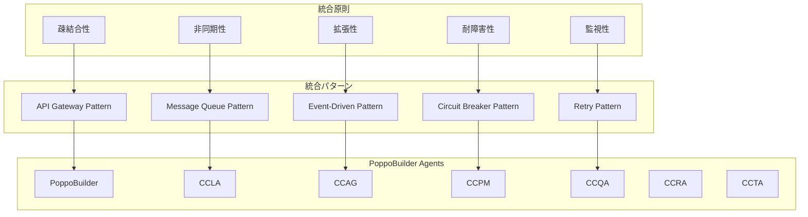

# CCSP統合パターン設計書

## 📋 目次

1. [統合パターン概要](#統合パターン概要)
2. [エージェント統合パターン](#エージェント統合パターン)
3. [メッセージング統合パターン](#メッセージング統合パターン)
4. [データ統合パターン](#データ統合パターン)
5. [エラー統合パターン](#エラー統合パターン)
6. [監視統合パターン](#監視統合パターン)
7. [セキュリティ統合パターン](#セキュリティ統合パターン)
8. [パフォーマンス統合パターン](#パフォーマンス統合パターン)
9. [運用統合パターン](#運用統合パターン)
10. [拡張統合パターン](#拡張統合パターン)

---

## 統合パターン概要

### 統合アーキテクチャの設計原則

CCSP（Claude Code Spawner）は、PoppoBuilder Suiteの各エージェントとの統合において、以下の設計原則を採用しています：



### 統合レベルの分類

| 統合レベル | 結合度 | 通信方式 | 適用場面 | 例 |
|-----------|--------|----------|----------|-----|
| **L1: 直接呼び出し** | 強結合 | 同期API | 即座レスポンス必要 | 緊急停止 |
| **L2: キュー統合** | 疎結合 | 非同期メッセージ | 通常処理 | 一般的なClaude実行 |
| **L3: イベント統合** | 弱結合 | 発行・購読 | 状態通知 | 使用量アラート |
| **L4: データ統合** | データ結合 | 共有ストレージ | 状態共有 | メトリクス集約 |

---

## エージェント統合パターン

### 1. Request-Response パターン

最も基本的な統合パターンで、エージェントからCCSPへのClaude実行要求に使用：

```javascript
/**
 * Request-Response 統合パターン
 */
class RequestResponseIntegration {
  constructor(ccsClient) {
    this.ccsp = ccsClient;
    this.requestTimeout = 300000; // 5分
    this.retryAttempts = 3;
  }
  
  // 基本的な同期実行
  async executeClaude(prompt, options = {}) {
    const request = {
      id: this.generateRequestId(),
      agent: this.agentName,
      prompt: prompt,
      timeout: options.timeout || this.requestTimeout,
      priority: options.priority || 'normal',
      metadata: {
        timestamp: new Date().toISOString(),
        source: options.source || 'agent',
        tags: options.tags || []
      }
    };
    
    try {
      const response = await this.ccsp.executeWithRetry(request);
      
      // レスポンス検証
      this.validateResponse(response);
      
      return {
        success: true,
        result: response.result,
        requestId: request.id,
        responseTime: response.responseTime,
        metadata: response.metadata
      };
      
    } catch (error) {
      return {
        success: false,
        error: error.message,
        requestId: request.id,
        retryCount: error.retryCount || 0
      };
    }
  }
  
  // バッチ実行（複数プロンプト）
  async executeBatch(prompts, options = {}) {
    const batchId = this.generateBatchId();
    const requests = prompts.map((prompt, index) => ({
      id: `${batchId}-${index}`,
      agent: this.agentName,
      prompt: prompt,
      priority: options.priority || 'normal',
      batchId: batchId
    }));
    
    // 並行実行制御
    const concurrency = options.concurrency || 3;
    const results = [];
    
    for (let i = 0; i < requests.length; i += concurrency) {
      const batch = requests.slice(i, i + concurrency);
      const batchResults = await Promise.allSettled(
        batch.map(request => this.ccsp.execute(request))
      );
      
      results.push(...batchResults.map((result, index) => ({
        requestId: batch[index].id,
        status: result.status,
        value: result.value,
        reason: result.reason
      })));
    }
    
    return {
      batchId: batchId,
      totalRequests: requests.length,
      successful: results.filter(r => r.status === 'fulfilled').length,
      failed: results.filter(r => r.status === 'rejected').length,
      results: results
    };
  }
}
```

### 2. Publisher-Subscriber パターン

状態変化の通知や監視データの配信に使用：

```javascript
/**
 * Publisher-Subscriber 統合パターン
 */
class PubSubIntegration {
  constructor(eventBus) {
    this.eventBus = eventBus;
    this.subscriptions = new Map();
    this.publishHistory = [];
  }
  
  // イベント購読
  subscribe(eventType, handler, options = {}) {
    const subscription = {
      id: this.generateSubscriptionId(),
      eventType: eventType,
      handler: handler,
      filter: options.filter,
      agent: this.agentName,
      priority: options.priority || 'normal',
      retryPolicy: options.retryPolicy || { maxRetries: 3, backoff: 'exponential' }
    };
    
    this.subscriptions.set(subscription.id, subscription);
    
    // イベントバスに登録
    this.eventBus.subscribe(eventType, async (event) => {
      await this.handleEvent(subscription, event);
    });
    
    return subscription.id;
  }
  
  // イベント発行
  async publish(eventType, data, options = {}) {
    const event = {
      id: this.generateEventId(),
      type: eventType,
      data: data,
      source: this.agentName,
      timestamp: new Date().toISOString(),
      priority: options.priority || 'normal',
      ttl: options.ttl || 3600000, // 1時間
      metadata: options.metadata || {}
    };
    
    // イベント検証
    this.validateEvent(event);
    
    // 発行履歴記録
    this.publishHistory.push({
      event: event,
      publishedAt: Date.now()
    });
    
    // イベント発行
    await this.eventBus.publish(eventType, event);
    
    return event.id;
  }
  
  // イベント処理
  async handleEvent(subscription, event) {
    try {
      // フィルター適用
      if (subscription.filter && !subscription.filter(event)) {
        return;
      }
      
      // ハンドラー実行
      await subscription.handler(event);
      
      // 成功記録
      this.recordEventHandling(subscription.id, event.id, 'success');
      
    } catch (error) {
      // エラー処理
      await this.handleEventError(subscription, event, error);
    }
  }
}

// 使用例：CCLA エージェントでのエラーアラート購読
class CCLAAgent extends PubSubIntegration {
  constructor() {
    super(globalEventBus);
    this.agentName = 'CCLA';
    this.setupEventSubscriptions();
  }
  
  setupEventSubscriptions() {
    // CCSP使用量アラート購読
    this.subscribe('ccsp.usage.alert', async (event) => {
      if (event.data.severity === 'high') {
        await this.analyzeUsageSpike(event.data);
      }
    });
    
    // セッションタイムアウト購読
    this.subscribe('ccsp.session.timeout', async (event) => {
      await this.handleSessionTimeout(event.data);
    });
    
    // システムエラー購読
    this.subscribe('ccsp.system.error', async (event) => {
      await this.performErrorAnalysis(event.data);
    });
  }
}
```

### 3. Circuit Breaker パターン

CCSPの障害時にエージェントを保護するパターン：

```javascript
/**
 * Circuit Breaker 統合パターン
 */
class CircuitBreakerIntegration {
  constructor(ccsClient, options = {}) {
    this.ccsp = ccsClient;
    this.state = 'CLOSED'; // CLOSED, OPEN, HALF_OPEN
    this.failureCount = 0;
    this.lastFailureTime = null;
    this.successCount = 0;
    
    // 設定
    this.failureThreshold = options.failureThreshold || 5;
    this.recoveryTimeout = options.recoveryTimeout || 60000; // 1分
    this.monitoringPeriod = options.monitoringPeriod || 300000; // 5分
    this.halfOpenMaxCalls = options.halfOpenMaxCalls || 3;
    
    // 統計
    this.statistics = {
      totalCalls: 0,
      totalFailures: 0,
      totalSuccesses: 0,
      circuitOpenCount: 0,
      lastStateChange: Date.now()
    };
    
    this.setupMonitoring();
  }
  
  // Circuit Breaker経由でのCCSP呼び出し
  async executeThroughCircuit(request) {
    this.statistics.totalCalls++;
    
    // 回路状態チェック
    if (this.state === 'OPEN') {
      if (this.shouldAttemptReset()) {
        this.transitionToHalfOpen();
      } else {
        throw new CircuitOpenError('Circuit breaker is OPEN');
      }
    }
    
    if (this.state === 'HALF_OPEN' && this.successCount >= this.halfOpenMaxCalls) {
      throw new CircuitOpenError('Half-open circuit at maximum attempts');
    }
    
    try {
      const result = await this.ccsp.execute(request);
      
      // 成功処理
      this.recordSuccess();
      
      if (this.state === 'HALF_OPEN') {
        this.successCount++;
        if (this.successCount >= this.halfOpenMaxCalls) {
          this.transitionToClosed();
        }
      }
      
      return result;
      
    } catch (error) {
      // 失敗処理
      this.recordFailure();
      
      if (this.state === 'HALF_OPEN') {
        this.transitionToOpen();
      } else if (this.failureCount >= this.failureThreshold) {
        this.transitionToOpen();
      }
      
      throw error;
    }
  }
  
  // フォールバック実行
  async executeWithFallback(request, fallbackHandler) {
    try {
      return await this.executeThroughCircuit(request);
    } catch (error) {
      if (error instanceof CircuitOpenError) {
        // Circuit Breakerが開いている場合のフォールバック
        const fallbackResult = await fallbackHandler(request, error);
        return {
          success: true,
          result: fallbackResult,
          fallback: true,
          reason: 'circuit_breaker_open'
        };
      }
      throw error;
    }
  }
  
  // 状態遷移
  transitionToOpen() {
    this.state = 'OPEN';
    this.lastFailureTime = Date.now();
    this.statistics.circuitOpenCount++;
    this.statistics.lastStateChange = Date.now();
    
    this.emit('circuitOpened', {
      failureCount: this.failureCount,
      threshold: this.failureThreshold
    });
  }
  
  transitionToHalfOpen() {
    this.state = 'HALF_OPEN';
    this.successCount = 0;
    this.statistics.lastStateChange = Date.now();
    
    this.emit('circuitHalfOpened');
  }
  
  transitionToClosed() {
    this.state = 'CLOSED';
    this.failureCount = 0;
    this.successCount = 0;
    this.lastFailureTime = null;
    this.statistics.lastStateChange = Date.now();
    
    this.emit('circuitClosed');
  }
}

// 使用例：CCPMエージェントでのCircuit Breaker
class CCPMAgent {
  constructor() {
    this.circuitBreaker = new CircuitBreakerIntegration(ccsClient, {
      failureThreshold: 3,
      recoveryTimeout: 30000
    });
    
    this.setupFallbackHandlers();
  }
  
  setupFallbackHandlers() {
    // コードレビュー用フォールバック
    this.reviewFallback = async (request, error) => {
      // 簡易的なローカル分析
      const basicAnalysis = await this.performBasicCodeAnalysis(request.prompt);
      return {
        type: 'fallback_analysis',
        analysis: basicAnalysis,
        disclaimer: 'Simplified analysis due to CCSP unavailability'
      };
    };
  }
  
  async performCodeReview(code) {
    const request = {
      agent: 'CCPM',
      prompt: `Please review this code:\n\n${code}`,
      priority: 'normal'
    };
    
    return await this.circuitBreaker.executeWithFallback(
      request,
      this.reviewFallback
    );
  }
}
```

---

## メッセージング統合パターン

### 1. Asynchronous Message Queue パターン

```javascript
/**
 * 非同期メッセージキュー統合
 */
class AsyncMessageQueueIntegration {
  constructor(redisClient, options = {}) {
    this.redis = redisClient;
    this.queuePrefix = options.queuePrefix || 'ccsp:queue';
    this.responseTimeout = options.responseTimeout || 300000; // 5分
    this.retryAttempts = options.retryAttempts || 3;
    this.pendingRequests = new Map();
    
    this.setupResponseHandler();
  }
  
  // 非同期リクエスト送信
  async sendAsyncRequest(request, options = {}) {
    const requestId = this.generateRequestId();
    const message = {
      id: requestId,
      agent: this.agentName,
      ...request,
      timestamp: new Date().toISOString(),
      priority: options.priority || 'normal',
      replyTo: `${this.queuePrefix}:response:${this.agentName}`
    };
    
    // リクエスト追跡
    const pendingRequest = {
      id: requestId,
      message: message,
      startTime: Date.now(),
      resolve: null,
      reject: null,
      timeout: null
    };
    
    this.pendingRequests.set(requestId, pendingRequest);
    
    // Promise作成
    const promise = new Promise((resolve, reject) => {
      pendingRequest.resolve = resolve;
      pendingRequest.reject = reject;
      
      // タイムアウト設定
      pendingRequest.timeout = setTimeout(() => {
        this.pendingRequests.delete(requestId);
        reject(new TimeoutError(`Request ${requestId} timed out`));
      }, this.responseTimeout);
    });
    
    // メッセージ送信
    const queueKey = `${this.queuePrefix}:${message.priority}`;
    await this.redis.lpush(queueKey, JSON.stringify(message));
    
    return promise;
  }
  
  // バッチリクエスト処理
  async sendBatchRequest(requests, options = {}) {
    const batchId = this.generateBatchId();
    const batchPromises = requests.map((request, index) => {
      const batchRequest = {
        ...request,
        batchId: batchId,
        batchIndex: index,
        batchSize: requests.length
      };
      
      return this.sendAsyncRequest(batchRequest, options);
    });
    
    try {
      const results = await Promise.allSettled(batchPromises);
      
      return {
        batchId: batchId,
        totalRequests: requests.length,
        results: results.map((result, index) => ({
          index: index,
          status: result.status,
          value: result.value,
          reason: result.reason
        })),
        summary: {
          successful: results.filter(r => r.status === 'fulfilled').length,
          failed: results.filter(r => r.status === 'rejected').length
        }
      };
      
    } catch (error) {
      throw new BatchProcessingError(`Batch ${batchId} failed`, error);
    }
  }
  
  // レスポンスハンドラー設定
  setupResponseHandler() {
    const responseKey = `${this.queuePrefix}:response:${this.agentName}`;
    
    // Redis リスト監視
    const pollResponses = async () => {
      try {
        const response = await this.redis.brpop(responseKey, 1);
        
        if (response) {
          const [key, data] = response;
          const responseData = JSON.parse(data);
          
          await this.handleResponse(responseData);
        }
        
        // 継続的なポーリング
        setImmediate(pollResponses);
        
      } catch (error) {
        this.logger.error('Response polling error', error);
        setTimeout(pollResponses, 5000); // 5秒後にリトライ
      }
    };
    
    pollResponses();
  }
  
  // レスポンス処理
  async handleResponse(responseData) {
    const requestId = responseData.requestId;
    const pendingRequest = this.pendingRequests.get(requestId);
    
    if (!pendingRequest) {
      this.logger.warn(`Received response for unknown request: ${requestId}`);
      return;
    }
    
    // タイムアウトクリア
    if (pendingRequest.timeout) {
      clearTimeout(pendingRequest.timeout);
    }
    
    // リクエスト削除
    this.pendingRequests.delete(requestId);
    
    // レスポンス処理
    if (responseData.success) {
      pendingRequest.resolve(responseData);
    } else {
      pendingRequest.reject(new Error(responseData.error));
    }
  }
}
```

### 2. Event Streaming パターン

```javascript
/**
 * イベントストリーミング統合
 */
class EventStreamingIntegration {
  constructor(eventStore, options = {}) {
    this.eventStore = eventStore;
    this.streamName = options.streamName || `ccsp-${this.agentName}`;
    this.consumerGroup = options.consumerGroup || this.agentName;
    this.batchSize = options.batchSize || 10;
    this.pollInterval = options.pollInterval || 1000;
    
    this.eventHandlers = new Map();
    this.isStreaming = false;
    this.streamingStats = {
      eventsProcessed: 0,
      eventsSkipped: 0,
      processingErrors: 0,
      lastEventTime: null
    };
  }
  
  // イベントハンドラー登録
  registerEventHandler(eventType, handler) {
    this.eventHandlers.set(eventType, handler);
  }
  
  // イベントストリーミング開始
  async startStreaming() {
    if (this.isStreaming) {
      return;
    }
    
    this.isStreaming = true;
    
    // コンシューマーグループ作成
    await this.createConsumerGroup();
    
    // ストリーミングループ
    this.streamingLoop();
  }
  
  // ストリーミングループ
  async streamingLoop() {
    while (this.isStreaming) {
      try {
        // イベント読み取り
        const events = await this.eventStore.readGroup(
          this.consumerGroup,
          this.agentName,
          this.batchSize,
          this.pollInterval
        );
        
        if (events.length > 0) {
          await this.processEventBatch(events);
        }
        
      } catch (error) {
        this.logger.error('Event streaming error', error);
        this.streamingStats.processingErrors++;
        
        // エラー時は少し待機
        await this.sleep(5000);
      }
    }
  }
  
  // イベントバッチ処理
  async processEventBatch(events) {
    for (const event of events) {
      try {
        await this.processEvent(event);
        
        // イベント確認
        await this.eventStore.ack(
          this.consumerGroup,
          this.agentName,
          event.id
        );
        
        this.streamingStats.eventsProcessed++;
        this.streamingStats.lastEventTime = Date.now();
        
      } catch (error) {
        this.logger.error(`Event processing failed: ${event.id}`, error);
        this.streamingStats.processingErrors++;
        
        // Dead Letter Queue に送信
        await this.sendToDeadLetterQueue(event, error);
      }
    }
  }
  
  // 個別イベント処理
  async processEvent(event) {
    const eventType = event.data.type;
    const handler = this.eventHandlers.get(eventType);
    
    if (!handler) {
      this.logger.debug(`No handler for event type: ${eventType}`);
      this.streamingStats.eventsSkipped++;
      return;
    }
    
    // イベント前処理
    const processedEvent = await this.preprocessEvent(event);
    
    // ハンドラー実行
    await handler(processedEvent);
    
    // イベント後処理
    await this.postprocessEvent(processedEvent);
  }
}

// 使用例：CCAGエージェントでのドキュメント生成イベント
class CCAGAgent extends EventStreamingIntegration {
  constructor() {
    super(eventStore, {
      streamName: 'ccsp-ccag',
      consumerGroup: 'ccag-consumers'
    });
    
    this.setupEventHandlers();
  }
  
  setupEventHandlers() {
    // コード変更イベント
    this.registerEventHandler('code.changed', async (event) => {
      const changes = event.data.changes;
      await this.generateDocumentationUpdate(changes);
    });
    
    // API変更イベント
    this.registerEventHandler('api.changed', async (event) => {
      const apiChanges = event.data.apiChanges;
      await this.updateAPIDocumentation(apiChanges);
    });
    
    // Issue解決イベント
    this.registerEventHandler('issue.resolved', async (event) => {
      const issue = event.data.issue;
      await this.generateSolutionDocumentation(issue);
    });
  }
}
```

---

## データ統合パターン

### 1. Shared State パターン

```javascript
/**
 * 共有状態統合パターン
 */
class SharedStateIntegration {
  constructor(stateStore, options = {}) {
    this.stateStore = stateStore;
    this.namespace = options.namespace || this.agentName;
    this.syncInterval = options.syncInterval || 30000; // 30秒
    this.conflictResolution = options.conflictResolution || 'last-write-wins';
    
    this.localState = new Map();
    this.stateListeners = new Map();
    this.syncInProgress = false;
    
    this.setupStateSynchronization();
  }
  
  // 状態設定
  async setState(key, value, options = {}) {
    const stateKey = `${this.namespace}:${key}`;
    const timestamp = Date.now();
    
    const stateEntry = {
      value: value,
      timestamp: timestamp,
      version: options.version || this.generateVersion(),
      agent: this.agentName,
      metadata: options.metadata || {}
    };
    
    // ローカル状態更新
    this.localState.set(stateKey, stateEntry);
    
    // リモート状態更新
    if (!options.localOnly) {
      await this.stateStore.set(stateKey, stateEntry);
    }
    
    // 状態変更通知
    this.notifyStateChange(key, value, stateEntry);
    
    return stateEntry;
  }
  
  // 状態取得
  async getState(key, options = {}) {
    const stateKey = `${this.namespace}:${key}`;
    
    // ローカルキャッシュ確認
    if (options.useCache && this.localState.has(stateKey)) {
      const localEntry = this.localState.get(stateKey);
      
      // キャッシュ有効期限チェック
      if (!this.isCacheExpired(localEntry, options.cacheTimeout)) {
        return localEntry.value;
      }
    }
    
    // リモート状態取得
    const remoteEntry = await this.stateStore.get(stateKey);
    
    if (remoteEntry) {
      // ローカルキャッシュ更新
      this.localState.set(stateKey, remoteEntry);
      return remoteEntry.value;
    }
    
    return options.defaultValue || null;
  }
  
  // 状態監視
  watchState(key, listener) {
    const stateKey = `${this.namespace}:${key}`;
    
    if (!this.stateListeners.has(stateKey)) {
      this.stateListeners.set(stateKey, []);
    }
    
    this.stateListeners.get(stateKey).push(listener);
    
    // 購読解除関数を返す
    return () => {
      const listeners = this.stateListeners.get(stateKey);
      const index = listeners.indexOf(listener);
      if (index > -1) {
        listeners.splice(index, 1);
      }
    };
  }
  
  // 状態同期
  async synchronizeState() {
    if (this.syncInProgress) {
      return;
    }
    
    this.syncInProgress = true;
    
    try {
      // ローカル状態とリモート状態の差分を検出
      const conflicts = await this.detectStateConflicts();
      
      // 競合解決
      for (const conflict of conflicts) {
        await this.resolveStateConflict(conflict);
      }
      
      // 状態マージ
      await this.mergeStates();
      
    } finally {
      this.syncInProgress = false;
    }
  }
  
  // 競合解決
  async resolveStateConflict(conflict) {
    const { key, local, remote } = conflict;
    
    let resolvedValue;
    
    switch (this.conflictResolution) {
      case 'last-write-wins':
        resolvedValue = local.timestamp > remote.timestamp ? local : remote;
        break;
        
      case 'merge':
        resolvedValue = await this.mergeValues(local, remote);
        break;
        
      case 'agent-priority':
        resolvedValue = this.resolveByAgentPriority(local, remote);
        break;
        
      default:
        resolvedValue = local; // デフォルトはローカル優先
    }
    
    // 解決された値を適用
    await this.setState(key, resolvedValue.value, { 
      version: resolvedValue.version,
      conflictResolved: true 
    });
  }
}
```

### 2. Data Pipeline パターン

```javascript
/**
 * データパイプライン統合パターン
 */
class DataPipelineIntegration {
  constructor(options = {}) {
    this.pipelines = new Map();
    this.processors = new Map();
    this.transformers = new Map();
    this.validators = new Map();
    
    this.defaultConfig = {
      batchSize: 100,
      flushInterval: 5000,
      retryAttempts: 3,
      errorThreshold: 0.1
    };
  }
  
  // パイプライン定義
  definePipeline(name, config) {
    const pipeline = {
      name: name,
      stages: config.stages,
      config: { ...this.defaultConfig, ...config },
      buffer: [],
      stats: {
        processed: 0,
        errors: 0,
        startTime: Date.now()
      }
    };
    
    this.pipelines.set(name, pipeline);
    this.startPipeline(pipeline);
    
    return pipeline;
  }
  
  // データ投入
  async feedData(pipelineName, data) {
    const pipeline = this.pipelines.get(pipelineName);
    if (!pipeline) {
      throw new Error(`Pipeline not found: ${pipelineName}`);
    }
    
    pipeline.buffer.push({
      data: data,
      timestamp: Date.now(),
      id: this.generateDataId()
    });
    
    // バッファ満杯時の即座処理
    if (pipeline.buffer.length >= pipeline.config.batchSize) {
      await this.processPipelineBatch(pipeline);
    }
  }
  
  // パイプライン処理
  async processPipelineBatch(pipeline) {
    if (pipeline.buffer.length === 0) {
      return;
    }
    
    const batch = pipeline.buffer.splice(0, pipeline.config.batchSize);
    
    for (const stage of pipeline.stages) {
      try {
        batch = await this.processStage(stage, batch);
      } catch (error) {
        pipeline.stats.errors++;
        
        // エラー率チェック
        const errorRate = pipeline.stats.errors / pipeline.stats.processed;
        if (errorRate > pipeline.config.errorThreshold) {
          await this.handlePipelineError(pipeline, error);
        }
        
        throw error;
      }
    }
    
    pipeline.stats.processed += batch.length;
  }
  
  // ステージ処理
  async processStage(stage, data) {
    switch (stage.type) {
      case 'transform':
        return await this.applyTransformation(stage, data);
        
      case 'validate':
        return await this.applyValidation(stage, data);
        
      case 'filter':
        return await this.applyFilter(stage, data);
        
      case 'aggregate':
        return await this.applyAggregation(stage, data);
        
      case 'output':
        return await this.applyOutput(stage, data);
        
      default:
        throw new Error(`Unknown stage type: ${stage.type}`);
    }
  }
}

// 使用例：CCQA品質メトリクスパイプライン
class CCQAMetricsPipeline extends DataPipelineIntegration {
  constructor() {
    super();
    this.setupQualityPipeline();
  }
  
  setupQualityPipeline() {
    // コード品質メトリクスパイプライン
    this.definePipeline('code-quality', {
      stages: [
        {
          type: 'validate',
          name: 'input-validation',
          validator: (data) => this.validateCodeData(data)
        },
        {
          type: 'transform',
          name: 'complexity-calculation',
          transformer: (data) => this.calculateComplexity(data)
        },
        {
          type: 'transform',
          name: 'quality-scoring',
          transformer: (data) => this.calculateQualityScore(data)
        },
        {
          type: 'aggregate',
          name: 'trend-analysis',
          aggregator: (data) => this.analyzeTrends(data)
        },
        {
          type: 'output',
          name: 'metrics-storage',
          outputter: (data) => this.storeMetrics(data)
        }
      ],
      batchSize: 50,
      flushInterval: 10000
    });
  }
  
  async analyzeCodeQuality(codeData) {
    await this.feedData('code-quality', codeData);
  }
}
```

---

## エラー統合パターン

### 1. Centralized Error Handling パターン

```javascript
/**
 * 中央集権的エラーハンドリング統合
 */
class CentralizedErrorHandling {
  constructor(errorBus, options = {}) {
    this.errorBus = errorBus;
    this.errorHandlers = new Map();
    this.errorPolicies = new Map();
    this.escalationRules = new Map();
    
    this.setupDefaultPolicies();
    this.setupErrorSubscription();
  }
  
  // エラーポリシー定義
  defineErrorPolicy(errorType, policy) {
    this.errorPolicies.set(errorType, {
      retryAttempts: policy.retryAttempts || 3,
      retryDelay: policy.retryDelay || 1000,
      escalationThreshold: policy.escalationThreshold || 5,
      fallbackHandler: policy.fallbackHandler,
      notificationLevel: policy.notificationLevel || 'warn'
    });
  }
  
  // エラー報告
  async reportError(error, context = {}) {
    const errorReport = {
      id: this.generateErrorId(),
      type: this.classifyError(error),
      message: error.message,
      stack: error.stack,
      timestamp: new Date().toISOString(),
      agent: this.agentName,
      context: context,
      severity: this.calculateSeverity(error, context)
    };
    
    // ローカル処理
    const handlingResult = await this.handleErrorLocally(errorReport);
    
    if (!handlingResult.handled) {
      // 中央エラーバスに送信
      await this.errorBus.reportError(errorReport);
    }
    
    return {
      errorId: errorReport.id,
      handled: handlingResult.handled,
      action: handlingResult.action
    };
  }
  
  // ローカルエラー処理
  async handleErrorLocally(errorReport) {
    const policy = this.errorPolicies.get(errorReport.type);
    
    if (!policy) {
      return { handled: false, action: 'escalate' };
    }
    
    // リトライ可能エラーの処理
    if (policy.retryAttempts > 0 && this.isRetryableError(errorReport)) {
      const retryResult = await this.attemptRetry(errorReport, policy);
      if (retryResult.success) {
        return { handled: true, action: 'retry_success' };
      }
    }
    
    // フォールバック処理
    if (policy.fallbackHandler) {
      try {
        const fallbackResult = await policy.fallbackHandler(errorReport);
        return { handled: true, action: 'fallback', result: fallbackResult };
      } catch (fallbackError) {
        // フォールバックも失敗
        errorReport.fallbackError = fallbackError.message;
      }
    }
    
    return { handled: false, action: 'escalate' };
  }
  
  // エラー相関分析
  async analyzeErrorCorrelation(timeWindow = 300000) { // 5分
    const recentErrors = await this.getRecentErrors(timeWindow);
    
    const correlations = {
      byAgent: this.groupErrorsByAgent(recentErrors),
      byType: this.groupErrorsByType(recentErrors),
      byTimePattern: this.analyzeTimePatterns(recentErrors),
      cascadingErrors: this.detectCascadingErrors(recentErrors)
    };
    
    // 相関パターンの検出
    const patterns = this.detectErrorPatterns(correlations);
    
    return {
      summary: {
        totalErrors: recentErrors.length,
        uniqueTypes: correlations.byType.size,
        affectedAgents: correlations.byAgent.size
      },
      correlations: correlations,
      patterns: patterns,
      recommendations: this.generateRecommendations(patterns)
    };
  }
}

// 使用例：CCRA レビューエージェントのエラー統合
class CCRAErrorIntegration extends CentralizedErrorHandling {
  constructor() {
    super(globalErrorBus);
    this.setupCCRAErrorPolicies();
  }
  
  setupCCRAErrorPolicies() {
    // PR解析エラー
    this.defineErrorPolicy('PR_ANALYSIS_ERROR', {
      retryAttempts: 2,
      retryDelay: 5000,
      fallbackHandler: (error) => this.generateBasicReview(error.context),
      notificationLevel: 'warn'
    });
    
    // GitHub API エラー
    this.defineErrorPolicy('GITHUB_API_ERROR', {
      retryAttempts: 3,
      retryDelay: 2000,
      escalationThreshold: 3,
      fallbackHandler: (error) => this.useLocalGitData(error.context),
      notificationLevel: 'error'
    });
    
    // CCSP接続エラー
    this.defineErrorPolicy('CCSP_CONNECTION_ERROR', {
      retryAttempts: 5,
      retryDelay: 1000,
      escalationThreshold: 2,
      fallbackHandler: (error) => this.useOfflineReview(error.context),
      notificationLevel: 'critical'
    });
  }
}
```

### 2. Error Recovery パターン

```javascript
/**
 * エラー復旧統合パターン
 */
class ErrorRecoveryIntegration {
  constructor(options = {}) {
    this.recoveryStrategies = new Map();
    this.recoveryHistory = [];
    this.autoRecoveryEnabled = options.autoRecoveryEnabled !== false;
    this.maxRecoveryAttempts = options.maxRecoveryAttempts || 3;
    
    this.setupDefaultRecoveryStrategies();
  }
  
  // 復旧戦略定義
  defineRecoveryStrategy(errorType, strategy) {
    this.recoveryStrategies.set(errorType, {
      name: strategy.name,
      steps: strategy.steps,
      conditions: strategy.conditions || {},
      timeout: strategy.timeout || 60000,
      rollback: strategy.rollback,
      verification: strategy.verification
    });
  }
  
  // 自動復旧実行
  async attemptRecovery(error, context = {}) {
    const errorType = this.classifyError(error);
    const strategy = this.recoveryStrategies.get(errorType);
    
    if (!strategy || !this.autoRecoveryEnabled) {
      return { success: false, reason: 'no_strategy' };
    }
    
    // 復旧条件チェック
    if (!this.checkRecoveryConditions(strategy.conditions, context)) {
      return { success: false, reason: 'conditions_not_met' };
    }
    
    const recoveryId = this.generateRecoveryId();
    const recovery = {
      id: recoveryId,
      errorType: errorType,
      strategy: strategy.name,
      startTime: Date.now(),
      attempts: 0,
      steps: [],
      status: 'in_progress'
    };
    
    this.recoveryHistory.push(recovery);
    
    try {
      // 復旧ステップ実行
      for (const step of strategy.steps) {
        recovery.attempts++;
        
        if (recovery.attempts > this.maxRecoveryAttempts) {
          recovery.status = 'max_attempts_exceeded';
          return { success: false, reason: 'max_attempts_exceeded' };
        }
        
        const stepResult = await this.executeRecoveryStep(step, context);
        recovery.steps.push(stepResult);
        
        if (!stepResult.success) {
          // ステップ失敗時のロールバック
          if (strategy.rollback) {
            await this.executeRollback(strategy.rollback, recovery);
          }
          
          recovery.status = 'failed';
          return { success: false, reason: stepResult.error };
        }
      }
      
      // 復旧検証
      if (strategy.verification) {
        const verification = await this.verifyRecovery(strategy.verification, context);
        if (!verification.success) {
          recovery.status = 'verification_failed';
          return { success: false, reason: 'verification_failed' };
        }
      }
      
      recovery.status = 'completed';
      recovery.endTime = Date.now();
      
      return { 
        success: true, 
        recoveryId: recoveryId,
        duration: recovery.endTime - recovery.startTime 
      };
      
    } catch (recoveryError) {
      recovery.status = 'error';
      recovery.error = recoveryError.message;
      
      // ロールバック実行
      if (strategy.rollback) {
        await this.executeRollback(strategy.rollback, recovery);
      }
      
      throw recoveryError;
    }
  }
  
  // 復旧ステップ実行
  async executeRecoveryStep(step, context) {
    const stepStartTime = Date.now();
    
    try {
      let result;
      
      switch (step.type) {
        case 'restart_component':
          result = await this.restartComponent(step.component);
          break;
          
        case 'clear_cache':
          result = await this.clearCache(step.cacheType);
          break;
          
        case 'reset_connection':
          result = await this.resetConnection(step.connection);
          break;
          
        case 'rollback_state':
          result = await this.rollbackState(step.stateKey);
          break;
          
        case 'custom':
          result = await step.handler(context);
          break;
          
        default:
          throw new Error(`Unknown recovery step type: ${step.type}`);
      }
      
      return {
        type: step.type,
        success: true,
        result: result,
        duration: Date.now() - stepStartTime
      };
      
    } catch (error) {
      return {
        type: step.type,
        success: false,
        error: error.message,
        duration: Date.now() - stepStartTime
      };
    }
  }
}

// 使用例：CCSP接続復旧
class CCSPConnectionRecovery extends ErrorRecoveryIntegration {
  constructor() {
    super();
    this.setupCCSPRecoveryStrategies();
  }
  
  setupCCSPRecoveryStrategies() {
    // CCSP接続失敗復旧
    this.defineRecoveryStrategy('CCSP_CONNECTION_TIMEOUT', {
      name: 'ccsp_connection_recovery',
      steps: [
        {
          type: 'reset_connection',
          connection: 'ccsp',
          timeout: 10000
        },
        {
          type: 'clear_cache',
          cacheType: 'ccsp_requests'
        },
        {
          type: 'custom',
          handler: async (context) => {
            // CCSP ヘルスチェック
            return await this.performCCSPHealthCheck();
          }
        }
      ],
      conditions: {
        maxDailyAttempts: 10,
        minTimeBetweenAttempts: 60000 // 1分
      },
      verification: async (context) => {
        // 簡単なテストリクエスト
        return await this.testCCSPConnection();
      }
    });
    
    // CCSP キュー満杯復旧
    this.defineRecoveryStrategy('CCSP_QUEUE_FULL', {
      name: 'ccsp_queue_recovery',
      steps: [
        {
          type: 'custom',
          handler: async (context) => {
            // 低優先度タスクの削除
            return await this.clearLowPriorityTasks();
          }
        },
        {
          type: 'custom',
          handler: async (context) => {
            // 緊急モードでの処理
            return await this.enableEmergencyMode();
          }
        }
      ],
      verification: async (context) => {
        const queueStatus = await this.getCCSPQueueStatus();
        return { success: queueStatus.available > 0 };
      }
    });
  }
}
```

---

このCCSP統合パターン設計書により、PoppoBuilder Suiteの各エージェントは効率的で信頼性の高い方法でCCSPと統合できます。各パターンは独立して使用することも、組み合わせて使用することも可能で、システム全体の堅牢性と拡張性を実現しています。

---

**文書バージョン**: 1.0  
**最終更新**: 2025年6月21日  
**関連文書**: 
- [CCSP詳細アーキテクチャ](./ccsp-detailed-architecture.md)
- [CCSP責任境界詳細仕様書](./ccsp-responsibility-boundaries.md)
- [CCSPコンポーネント責任境界](./ccsp-component-responsibilities.md)