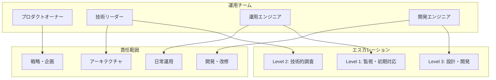

# CCSP運用ガイド

## 📋 目次

1. [運用概要](#運用概要)
2. [インストール・セットアップ](#インストール・セットアップ)
3. [起動・停止手順](#起動・停止手順)
4. [日常運用](#日常運用)
5. [監視・メトリクス](#監視・メトリクス)
6. [トラブルシューティング](#トラブルシューティング)
7. [保守・メンテナンス](#保守・メンテナンス)
8. [パフォーマンスチューニング](#パフォーマンスチューニング)
9. [災害復旧](#災害復旧)

---

## 運用概要

### CCSPの役割と重要性

CCSP（Claude Code Spawner）は PoppoBuilder Suite の心臓部として機能し、すべての Claude Code API 呼び出しを一元管理します。安定的な運用により、システム全体の信頼性とパフォーマンスが保証されます。

### 運用体制



### SLA・SLO定義

| メトリクス | SLO目標 | SLA保証 | 測定方法 |
|----------|---------|---------|----------|
| **可用性** | 99.5% | 99.0% | ヘルスチェック成功率 |
| **レスポンス時間** | 平均5秒以下 | 平均10秒以下 | API応答時間 |
| **成功率** | 95%以上 | 90%以上 | 正常終了率 |
| **復旧時間** | 30分以内 | 1時間以内 | 障害検知から復旧まで |

---

## インストール・セットアップ

### 1. システム要件

#### 最小要件
- **OS**: Ubuntu 20.04+ / CentOS 8+ / macOS 12+
- **Node.js**: v18.0.0+
- **Redis**: v6.0+
- **メモリ**: 2GB+
- **ディスク**: 10GB+
- **CPU**: 2コア+

#### 推奨要件
- **OS**: Ubuntu 22.04 LTS
- **Node.js**: v20.0.0+
- **Redis**: v7.0+
- **メモリ**: 8GB+
- **ディスク**: 50GB+ (SSD推奨)
- **CPU**: 4コア+

### 2. 依存関係のインストール

```bash
# Node.js (nvm使用推奨)
curl -o- https://raw.githubusercontent.com/nvm-sh/nvm/v0.39.0/install.sh | bash
nvm install 20
nvm use 20

# Redis
# Ubuntu/Debian
sudo apt update
sudo apt install redis-server

# CentOS/RHEL
sudo yum install redis

# macOS
brew install redis

# Claude Code CLI
npm install -g @anthropic/claude-code-cli
claude login
```

### 3. CCSPセットアップ

```bash
# 1. リポジトリクローン
git clone https://github.com/medamap/PoppoBuilderSuite.git
cd PoppoBuilderSuite

# 2. 依存関係インストール
npm install

# 3. 環境変数設定
cp .env.example .env
```

#### 必須環境変数
```bash
# .env ファイル
GITHUB_TOKEN=ghp_xxxxxxxxxxxxxxxxxxxx
REDIS_HOST=localhost
REDIS_PORT=6379
REDIS_PASSWORD=your-redis-password

# CCSP設定
CCSP_MAX_CONCURRENT=2
CCSP_QUEUE_SIZE=10000
CCSP_LOG_LEVEL=info

# ダッシュボード設定
CCSP_DASHBOARD_PORT=3001
CCSP_DASHBOARD_AUTH=true
CCSP_ADMIN_USER=admin
CCSP_ADMIN_PASS=complex-password-here
```

### 4. 初期設定

```bash
# 1. Redis起動・設定
sudo systemctl start redis
redis-cli config set requirepass "your-redis-password"

# 2. ログディレクトリ作成
mkdir -p logs
chmod 755 logs

# 3. 設定ファイル権限設定
chmod 600 .env
chmod 600 config/config.json

# 4. 動作確認
npm run ccsp:test
```

---

## 起動・停止手順

### 1. 手動起動・停止

#### 開発環境
```bash
# CCSP単体起動
node agents/ccsp/index.js

# ダッシュボード付き起動
npm run ccsp:start

# 停止
Ctrl+C
```

#### 本格運用
```bash
# サービス起動
sudo systemctl start ccsp-agent

# 状態確認
sudo systemctl status ccsp-agent

# 停止
sudo systemctl stop ccsp-agent

# 再起動
sudo systemctl restart ccsp-agent
```

### 2. systemd設定

#### サービスファイル作成
```bash
sudo tee /etc/systemd/system/ccsp-agent.service << EOF
[Unit]
Description=CCSP Agent - Claude Code Spawner
After=network.target redis.service
Requires=redis.service

[Service]
Type=simple
User=ccsp
Group=ccsp
WorkingDirectory=/opt/PoppoBuilderSuite
Environment=NODE_ENV=production
EnvironmentFile=/opt/PoppoBuilderSuite/.env
ExecStart=/usr/bin/node agents/ccsp/index.js
ExecReload=/bin/kill -HUP \$MAINPID
Restart=always
RestartSec=10
StandardOutput=append:/var/log/ccsp/ccsp.log
StandardError=append:/var/log/ccsp/ccsp-error.log

# セキュリティ設定
NoNewPrivileges=true
PrivateTmp=true
ProtectSystem=strict
ProtectHome=true
ReadWritePaths=/opt/PoppoBuilderSuite/logs
ReadWritePaths=/opt/PoppoBuilderSuite/data

[Install]
WantedBy=multi-user.target
EOF
```

#### サービス有効化
```bash
# 設定リロード
sudo systemctl daemon-reload

# 自動起動有効化
sudo systemctl enable ccsp-agent

# 起動
sudo systemctl start ccsp-agent
```

### 3. Docker運用

#### Dockerfile（本格運用用）
```dockerfile
FROM node:20-alpine

# セキュリティ強化
RUN addgroup -g 1001 -S ccsp && \
    adduser -S ccsp -u 1001 -G ccsp

# 作業ディレクトリ
WORKDIR /app

# 依存関係インストール
COPY package*.json ./
RUN npm ci --only=production && npm cache clean --force

# アプリケーションコピー
COPY --chown=ccsp:ccsp . .

# 権限設定
RUN chmod 600 .env config/config.json

# 非rootユーザーで実行
USER ccsp

# ヘルスチェック
HEALTHCHECK --interval=30s --timeout=3s --start-period=5s --retries=3 \
  CMD node scripts/health-check.js

# エントリーポイント
EXPOSE 3001
CMD ["node", "agents/ccsp/index.js"]
```

#### docker-compose.yml
```yaml
version: '3.8'
services:
  ccsp-agent:
    build: .
    restart: unless-stopped
    environment:
      - NODE_ENV=production
      - REDIS_HOST=redis
    env_file:
      - .env
    ports:
      - "3001:3001"
    depends_on:
      redis:
        condition: service_healthy
    volumes:
      - ./logs:/app/logs
      - ./data:/app/data
    healthcheck:
      test: ["CMD", "node", "scripts/health-check.js"]
      interval: 30s
      timeout: 10s
      retries: 3
      
  redis:
    image: redis:7-alpine
    restart: unless-stopped
    command: redis-server --requirepass ${REDIS_PASSWORD}
    environment:
      - REDIS_PASSWORD=${REDIS_PASSWORD}
    ports:
      - "6379:6379"
    volumes:
      - redis-data:/data
    healthcheck:
      test: ["CMD", "redis-cli", "--no-auth-warning", "auth", "${REDIS_PASSWORD}", "ping"]
      interval: 30s
      timeout: 10s
      retries: 3

volumes:
  redis-data:
```

---

## 日常運用

### 1. 運用チェックリスト

#### 毎日のチェック項目
```bash
#!/bin/bash
# daily-check.sh

echo "=== CCSP日次チェック $(date) ==="

# 1. サービス状態確認
systemctl is-active ccsp-agent || echo "❌ CCSPサービス停止中"

# 2. ヘルスチェック
curl -s http://localhost:3001/api/ccsp/health | jq '.status' || echo "❌ ヘルスチェック失敗"

# 3. キュー状態確認
QUEUE_SIZE=$(curl -s http://localhost:3001/api/ccsp/queue/status | jq '.totalSize')
if [ "$QUEUE_SIZE" -gt 1000 ]; then
  echo "⚠️ キューサイズ過大: $QUEUE_SIZE"
fi

# 4. エラーログ確認
ERROR_COUNT=$(grep -c ERROR logs/ccsp-$(date +%Y-%m-%d).log 2>/dev/null || echo 0)
if [ "$ERROR_COUNT" -gt 10 ]; then
  echo "⚠️ エラー多発: $ERROR_COUNT件"
fi

# 5. ディスク使用量確認
DISK_USAGE=$(df -h logs/ | tail -1 | awk '{print $5}' | sed 's/%//')
if [ "$DISK_USAGE" -gt 80 ]; then
  echo "⚠️ ディスク使用量: ${DISK_USAGE}%"
fi

echo "✅ 日次チェック完了"
```

#### 週次チェック項目
```bash
#!/bin/bash
# weekly-check.sh

echo "=== CCSP週次チェック $(date) ==="

# 1. パフォーマンス統計
curl -s http://localhost:3001/api/ccsp/stats/performance | jq '.'

# 2. エラー統計
curl -s http://localhost:3001/api/ccsp/stats/errors | jq '.'

# 3. 使用量トレンド
curl -s http://localhost:3001/api/ccsp/stats/usage?days=7 | jq '.'

# 4. ログローテーション確認
find logs/ -name "*.gz" -mtime +7 -exec ls -la {} \;

# 5. Redisメモリ使用量
redis-cli --no-auth-warning auth "$REDIS_PASSWORD" info memory

echo "✅ 週次チェック完了"
```

### 2. 自動化スクリプト

#### 監視スクリプト
```bash
#!/bin/bash
# monitor.sh - 継続監視スクリプト

ALERT_WEBHOOK="https://hooks.slack.com/your-webhook-url"

while true; do
  # ヘルスチェック
  if ! curl -s http://localhost:3001/api/ccsp/health | jq -e '.status == "healthy"' > /dev/null; then
    curl -X POST -H 'Content-type: application/json' \
      --data '{"text":"🚨 CCSP Health Check Failed"}' \
      "$ALERT_WEBHOOK"
  fi
  
  # リソース使用量チェック
  MEMORY_USAGE=$(free | grep Mem | awk '{printf "%.1f", $3/$2 * 100.0}')
  if (( $(echo "$MEMORY_USAGE > 90" | bc -l) )); then
    curl -X POST -H 'Content-type: application/json' \
      --data '{"text":"⚠️ Memory usage: '"$MEMORY_USAGE"'%"}' \
      "$ALERT_WEBHOOK"
  fi
  
  sleep 300 # 5分間隔
done
```

---

## 監視・メトリクス

### 1. 監視ダッシュボード

#### Grafana設定例
```json
{
  "dashboard": {
    "title": "CCSP Monitoring",
    "panels": [
      {
        "title": "Queue Status",
        "type": "stat",
        "targets": [
          {
            "expr": "ccsp_queue_size",
            "legendFormat": "{{priority}}"
          }
        ]
      },
      {
        "title": "Request Rate",
        "type": "graph",
        "targets": [
          {
            "expr": "rate(ccsp_requests_total[5m])",
            "legendFormat": "Requests/sec"
          }
        ]
      },
      {
        "title": "Success Rate",
        "type": "singlestat",
        "targets": [
          {
            "expr": "ccsp_success_rate",
            "legendFormat": "Success Rate"
          }
        ]
      }
    ]
  }
}
```

#### アラートルール
```yaml
# prometheus-alerts.yml
groups:
  - name: ccsp-alerts
    rules:
      - alert: CCSPDown
        expr: up{job="ccsp"} == 0
        for: 1m
        labels:
          severity: critical
        annotations:
          summary: "CCSP service is down"
          
      - alert: HighQueueSize
        expr: ccsp_queue_size > 1000
        for: 5m
        labels:
          severity: warning
        annotations:
          summary: "CCSP queue size is high"
          
      - alert: LowSuccessRate
        expr: ccsp_success_rate < 0.9
        for: 10m
        labels:
          severity: warning
        annotations:
          summary: "CCSP success rate is low"
```

### 2. ログ分析

#### ELK Stack設定
```yaml
# logstash.conf
input {
  file {
    path => "/opt/PoppoBuilderSuite/logs/ccsp*.log"
    start_position => "beginning"
    codec => "json"
  }
}

filter {
  if [level] == "ERROR" {
    mutate {
      add_tag => ["error"]
    }
  }
  
  if [message] =~ /rate.*limit/ {
    mutate {
      add_tag => ["rate_limit"]
    }
  }
}

output {
  elasticsearch {
    hosts => ["localhost:9200"]
    index => "ccsp-logs-%{+YYYY.MM.dd}"
  }
}
```

---

## トラブルシューティング

### 1. よくある問題と対処法

#### セッションタイムアウト
```bash
# 症状: Claude実行時に "Invalid API key" エラー
# 原因: Claude Code CLIのセッション期限切れ

# 対処法:
1. claude login
2. GitHub Issueの session-timeout ラベルのIssueをクローズ
3. CCSP自動復旧を確認

# 予防策:
- 定期的なセッション更新の自動化
- セッション監視の強化
```

#### Redis接続エラー
```bash
# 症状: Redis connection failed
# 原因: Redis停止、認証失敗、ネットワーク問題

# 診断:
redis-cli --no-auth-warning auth "$REDIS_PASSWORD" ping

# 対処法:
sudo systemctl start redis
sudo systemctl restart ccsp-agent

# 予防策:
- Redis自動起動の設定
- 接続プールの設定
```

#### キュー詰まり
```bash
# 症状: タスクが処理されない
# 原因: ワーカープロセス停止、レート制限

# 診断:
curl http://localhost:3001/api/ccsp/queue/status

# 対処法:
curl -X POST http://localhost:3001/api/ccsp/queue/resume

# 予防策:
- 定期的なキュー監視
- 自動復旧機能の強化
```

### 2. 診断ツール

#### 包括診断スクリプト
```bash
#!/bin/bash
# diagnose.sh

echo "=== CCSP診断ツール ==="

# 1. 基本情報
echo "--- 基本情報 ---"
echo "PID: $(pgrep -f ccsp)"
echo "Uptime: $(ps -o etime= -p $(pgrep -f ccsp))"
echo "Node.js: $(node --version)"

# 2. 接続テスト
echo "--- 接続テスト ---"
curl -s http://localhost:3001/api/ccsp/health | jq '.status' || echo "❌ API接続失敗"
redis-cli --no-auth-warning auth "$REDIS_PASSWORD" ping || echo "❌ Redis接続失敗"

# 3. リソース状況
echo "--- リソース状況 ---"
echo "Memory: $(free -h | grep Mem | awk '{print $3"/"$2}')"
echo "Disk: $(df -h logs/ | tail -1 | awk '{print $3"/"$2" ("$5")"}')"
echo "CPU: $(top -bn1 | grep Cpu | awk '{print $2}' | cut -d% -f1)"

# 4. ログ分析
echo "--- 最新ログ ---"
tail -10 logs/ccsp-$(date +%Y-%m-%d).log | grep ERROR || echo "エラーなし"

# 5. 設定確認
echo "--- 設定確認 ---"
echo "Max Concurrent: $CCSP_MAX_CONCURRENT"
echo "Queue Size: $CCSP_QUEUE_SIZE"
echo "Redis Host: $REDIS_HOST"

echo "✅ 診断完了"
```

---

## 保守・メンテナンス

### 1. 定期メンテナンス

#### 月次メンテナンス手順
```bash
#!/bin/bash
# monthly-maintenance.sh

echo "=== CCSP月次メンテナンス $(date) ==="

# 1. バックアップ作成
npm run backup:create monthly-$(date +%Y%m)

# 2. ログローテーション
npm run log:rotate

# 3. Redis最適化
redis-cli --no-auth-warning auth "$REDIS_PASSWORD" BGREWRITEAOF

# 4. 統計レポート生成
curl -s http://localhost:3001/api/ccsp/stats/performance > reports/monthly-$(date +%Y%m).json

# 5. 設定の最適化提案
node scripts/config-analyzer.js

# 6. 容量計画レビュー
du -sh logs/ data/ backups/

echo "✅ 月次メンテナンス完了"
```

### 2. アップデート手順

#### ローリングアップデート
```bash
#!/bin/bash
# rolling-update.sh

VERSION=$1
if [ -z "$VERSION" ]; then
  echo "Usage: $0 <version>"
  exit 1
fi

echo "=== CCSPアップデート to $VERSION ==="

# 1. 事前バックアップ
npm run backup:create pre-update-$VERSION

# 2. 新バージョンの取得
git fetch origin
git checkout $VERSION

# 3. 依存関係更新
npm ci

# 4. 設定マイグレーション
node scripts/migrate-config.js

# 5. カナリアテスト
npm run test:canary

# 6. グレースフルリスタート
curl -X POST http://localhost:3001/api/ccsp/control/graceful-restart

# 7. 動作確認
sleep 30
npm run test:smoke

echo "✅ アップデート完了"
```

---

## パフォーマンスチューニング

### 1. 設定最適化

#### ワーカー数の調整
```javascript
// config/config.json
{
  "ccsp": {
    // CPU数に基づく設定
    "maxConcurrent": Math.min(os.cpus().length, 4),
    
    // メモリに基づくキューサイズ
    "maxQueueSize": Math.floor(os.totalmem() / 1024 / 1024 / 100), // MB
    
    // レスポンス時間ベースのタイムアウト
    "timeout": {
      "base": 30000,
      "multiplier": 1.5,
      "max": 300000
    }
  }
}
```

#### Redis最適化
```bash
# redis.conf
maxmemory 2gb
maxmemory-policy allkeys-lru
save 900 1
save 300 10
save 60 10000

# TCP設定
tcp-keepalive 300
timeout 0

# 性能設定
lua-time-limit 5000
```

### 2. 監視・プロファイリング

#### Node.jsプロファイリング
```bash
# CPU プロファイル
node --prof agents/ccsp/index.js

# メモリプロファイル
node --inspect agents/ccsp/index.js

# APM ツール統合
npm install newrelic
export NEW_RELIC_LICENSE_KEY=your-key
```

---

## 災害復旧

### 1. バックアップ戦略

#### 自動バックアップ設定
```bash
# crontab -e
0 2 * * * /opt/PoppoBuilderSuite/scripts/backup.sh daily
0 2 * * 0 /opt/PoppoBuilderSuite/scripts/backup.sh weekly
0 2 1 * * /opt/PoppoBuilderSuite/scripts/backup.sh monthly
```

### 2. 復旧手順

#### 完全復旧手順
```bash
#!/bin/bash
# disaster-recovery.sh

BACKUP_FILE=$1
if [ -z "$BACKUP_FILE" ]; then
  echo "Usage: $0 <backup-file>"
  exit 1
fi

echo "=== 災害復旧開始 ==="

# 1. サービス停止
sudo systemctl stop ccsp-agent

# 2. バックアップ復元
tar -xzf "$BACKUP_FILE" -C /opt/PoppoBuilderSuite/

# 3. 権限修正
chown -R ccsp:ccsp /opt/PoppoBuilderSuite/
chmod 600 /opt/PoppoBuilderSuite/.env

# 4. Redis復旧
sudo systemctl restart redis

# 5. 整合性チェック
node scripts/integrity-check.js

# 6. サービス再開
sudo systemctl start ccsp-agent

# 7. 動作確認
sleep 30
curl http://localhost:3001/api/ccsp/health

echo "✅ 災害復旧完了"
```

---

## まとめ

この運用ガイドにより、CCSPの安定的な運用が可能になります：

### ✅ 包括的な運用手順
- インストールから災害復旧まで
- 自動化スクリプトとチェックリスト
- トラブルシューティング手順

### ✅ 監視・保守体制
- リアルタイム監視
- 定期メンテナンス
- パフォーマンス最適化

### ✅ 高可用性の実現
- 自動復旧機能
- バックアップ・災害復旧
- グレースフルな運用

このガイドに従うことで、CCSPを企業環境で安全かつ効率的に運用できます。

---

**文書バージョン**: 1.0  
**最終更新**: 2025年6月21日  
**関連文書**: [CCSPアーキテクチャ概要](./ccsp-architecture.md), [CCSPセキュリティモデル](./ccsp-security-model.md)