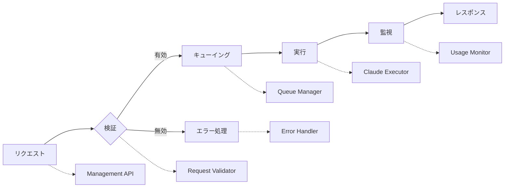
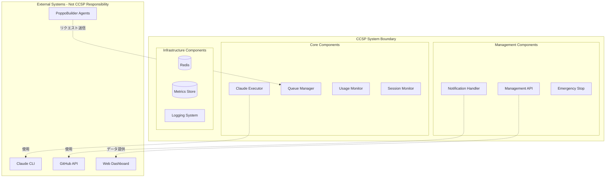
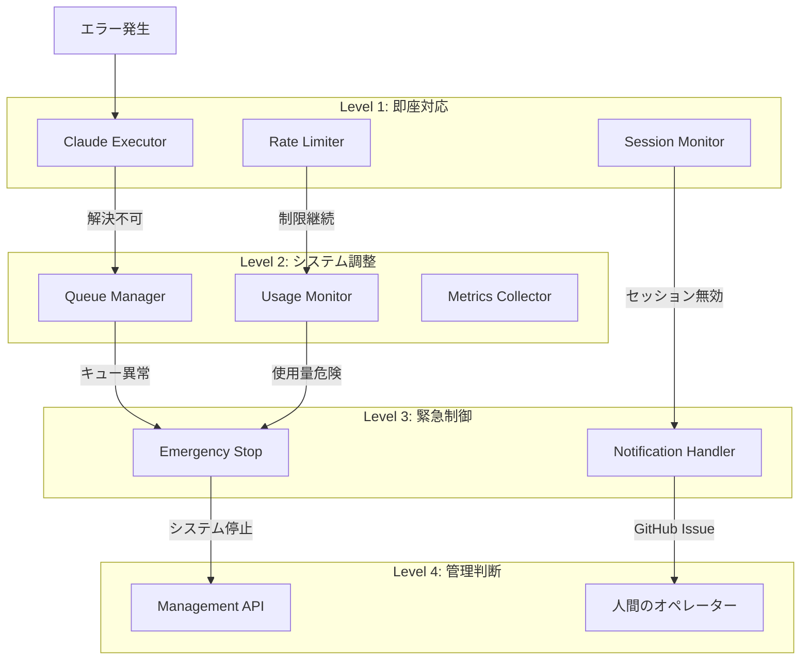

# CCSP責任境界詳細仕様書

## 📋 目次

1. [責任境界の基本原則](#責任境界の基本原則)
2. [システム境界定義](#システム境界定義)
3. [コンポーネント責任マトリックス](#コンポーネント責任マトリックス)
4. [責任移譲と委譲](#責任移譲と委譲)
5. [エラー責任の階層化](#エラー責任の階層化)
6. [データ所有権と管理責任](#データ所有権と管理責任)
7. [セキュリティ責任境界](#セキュリティ責任境界)
8. [運用責任の分担](#運用責任の分担)
9. [拡張時の責任継承](#拡張時の責任継承)
10. [責任境界の検証](#責任境界の検証)

---

## 責任境界の基本原則

### 1. 明確性の原則（Clarity Principle）

各責任は**曖昧さなく定義**され、重複や空白がないように設計されています：

```javascript
// ✅ 明確な責任定義
class ClaudeExecutor {
  /**
   * 責任：Claude CLI の実行のみ
   * - プロセス起動・管理
   * - エラー検出・分類
   * - 実行結果の標準化
   * 
   * 非責任：
   * - キューイング（QueueManagerの責任）
   * - 統計収集（UsageMonitorの責任）
   * - 通知送信（NotificationHandlerの責任）
   */
  async execute(request) {
    // Claude CLI実行のみに特化
  }
}
```

### 2. 完全性の原則（Completeness Principle）

システム全体で**責任の空白**が存在しないことを保証：



### 3. 単一責任の原則（Single Responsibility Principle）

各コンポーネントは**1つの変更理由**のみを持ちます：

| コンポーネント | 変更理由 | 例 |
|---------------|----------|-----|
| **Claude Executor** | Claude CLI仕様変更 | 新バージョン対応、API変更 |
| **Queue Manager** | キューイング戦略変更 | 優先度アルゴリズム改善 |
| **Usage Monitor** | 監視要件変更 | 新メトリクス追加、レポート形式変更 |
| **Session Monitor** | セッション管理変更 | タイムアウト検出方法変更 |

### 4. 依存関係の最小化原則（Minimal Dependency Principle）

コンポーネント間の依存関係を最小限に抑制：

```javascript
// ✅ 最小依存関係
class UsageMonitor {
  constructor(metricsCollector) {
    this.metrics = metricsCollector; // 1つの依存関係のみ
  }
}

// ❌ 過度な依存関係
class BadUsageMonitor {
  constructor(metricsCollector, queueManager, claudeExecutor, notificationHandler) {
    // 複数の依存関係 → 結合度が高い
  }
}
```

---

## システム境界定義

### 1. CCSPシステム境界



### 2. 責任境界の明文化

#### ✅ CCSPが責任を持つ範囲

1. **リクエスト処理**
   - Claude CLIの実行
   - エラーハンドリング
   - レスポンスの標準化

2. **キュー管理**
   - 優先度制御
   - スケジューリング
   - バックプレッシャー制御

3. **監視・制御**
   - 使用量追跡
   - セッション監視
   - システム制御

4. **通知**
   - アラート生成
   - GitHub Issue作成
   - ログ出力

#### ❌ CCSPが責任を持たない範囲

1. **ビジネスロジック**
   - Issue解析
   - コード生成判断
   - PR作成決定

2. **外部システム管理**
   - Claude CLI自体の管理
   - GitHubリポジトリ管理
   - ダッシュボードの実装

3. **エージェント間調整**
   - タスク分担決定
   - エージェント起動・停止
   - ワークフロー制御

---

## コンポーネント責任マトリックス

### 詳細責任マトリックス

| 機能エリア | 責任者 | 協力者 | 責任詳細 | 成果物 |
|------------|--------|--------|----------|---------|
| **Claude CLI実行** | Claude Executor | Rate Limiter | ・プロセス起動管理<br>・引数・環境変数設定<br>・タイムアウト制御<br>・エラー検出 | 実行結果、エラー情報 |
| **リクエストキューイング** | Queue Manager | Session Monitor | ・優先度判定<br>・キュー容量管理<br>・スケジューリング<br>・デッドレター処理 | タスクID、キュー状態 |
| **使用量監視** | Usage Monitor | Metrics Collector | ・API使用量記録<br>・統計計算<br>・予測実行<br>・アラート判定 | 統計レポート、予測データ |
| **セッション管理** | Session Monitor | Notification Handler | ・セッション有効性確認<br>・タイムアウト検出<br>・復旧確認<br>・状態追跡 | セッション状態、復旧指示 |
| **エラー処理** | Emergency Stop | All Components | ・エラー分析<br>・緊急停止判定<br>・システム保護<br>・復旧準備 | 停止指示、復旧手順 |
| **メトリクス収集** | Metrics Collector | Prometheus Exporter | ・システムメトリクス取得<br>・データ集約<br>・形式変換<br>・永続化 | メトリクスデータ |
| **通知送信** | Notification Handler | GitHub Client | ・通知判定<br>・メッセージ生成<br>・チャンネル選択<br>・送信実行 | 通知結果、履歴 |
| **API管理** | Management API | WebSocket Manager | ・リクエスト受付<br>・認証・認可<br>・レスポンス生成<br>・WebSocket管理 | APIレスポンス |

### 責任移譲ルール

```javascript
/**
 * 責任移譲の実装例
 */
class ResponsibilityDelegation {
  // 1. 明示的な移譲
  async executeWithDelegation(request) {
    // 前処理（自分の責任）
    const validatedRequest = this.validateRequest(request);
    
    // 実行（Claude Executorに移譲）
    const result = await this.claudeExecutor.execute(validatedRequest);
    
    // 後処理（自分の責任）
    const processedResult = this.processResult(result);
    
    // 監視（Usage Monitorに移譲）
    this.usageMonitor.recordUsage({
      requestId: request.id,
      result: processedResult
    });
    
    return processedResult;
  }
  
  // 2. 条件付き移譲
  async handleError(error) {
    const errorAnalysis = this.analyzeError(error);
    
    switch (errorAnalysis.category) {
      case 'SESSION_TIMEOUT':
        // Session Monitorに移譲
        return await this.sessionMonitor.handleTimeout(error);
        
      case 'RATE_LIMIT':
        // Rate Limiterに移譲
        return await this.rateLimiter.handleRateLimit(error);
        
      case 'SYSTEM_ERROR':
        // Emergency Stopに移譲
        return await this.emergencyStop.handleSystemError(error);
        
      default:
        // 自分で処理
        return this.handleGenericError(error);
    }
  }
}
```

---

## エラー責任の階層化

### エラー処理責任階層



### エラーカテゴリと責任者

| エラーカテゴリ | 第一責任者 | エスカレーション先 | 自動復旧 | 手動介入要 |
|---------------|------------|-------------------|----------|-----------|
| **CLI実行エラー** | Claude Executor | Rate Limiter | ✅ リトライ | セッション問題時 |
| **レート制限** | Rate Limiter | Usage Monitor | ✅ バックオフ | 長期制限時 |
| **セッションタイムアウト** | Session Monitor | Notification Handler | ❌ | GitHub Issue経由 |
| **キューオーバーフロー** | Queue Manager | Emergency Stop | ✅ 拒否・調整 | 持続的過負荷時 |
| **メモリ不足** | Metrics Collector | Emergency Stop | ✅ GC実行 | 継続的不足時 |
| **Redis接続エラー** | 各コンポーネント | Emergency Stop | ✅ 再接続 | インフラ問題時 |
| **設定エラー** | Management API | Human Operator | ❌ | 即座 |

### エラー処理フローの実装

```javascript
/**
 * 階層化エラー処理システム
 */
class HierarchicalErrorHandler {
  constructor() {
    this.handlers = new Map();
    this.escalationRules = new Map();
    this.recoverySessions = new Map();
  }
  
  // エラーハンドラー登録
  registerHandler(errorType, level, handler) {
    const key = `${errorType}:${level}`;
    this.handlers.set(key, handler);
  }
  
  // エスカレーションルール設定
  setEscalationRule(errorType, fromLevel, toLevel, condition) {
    const key = `${errorType}:${fromLevel}`;
    this.escalationRules.set(key, { toLevel, condition });
  }
  
  // エラー処理実行
  async handleError(error, context) {
    const errorType = this.classifyError(error);
    let currentLevel = 1;
    
    while (currentLevel <= 4) {
      const handlerKey = `${errorType}:${currentLevel}`;
      const handler = this.handlers.get(handlerKey);
      
      if (handler) {
        try {
          const result = await handler(error, context);
          
          if (result.resolved) {
            // 解決済み
            this.recordSuccessfulHandling(errorType, currentLevel);
            return result;
          }
          
          if (result.escalate) {
            // エスカレーション
            currentLevel = this.getNextLevel(errorType, currentLevel);
            context.escalationHistory = context.escalationHistory || [];
            context.escalationHistory.push({
              level: currentLevel - 1,
              handler: handlerKey,
              reason: result.escalationReason
            });
          }
          
        } catch (handlingError) {
          // ハンドラー自体のエラー
          this.logger.error(`Error handler failed: ${handlerKey}`, handlingError);
          currentLevel++;
        }
      } else {
        // ハンドラーなし
        currentLevel++;
      }
    }
    
    // 全レベルで処理不可
    throw new UnrecoverableError(`Cannot handle error: ${errorType}`, error);
  }
  
  // 自動復旧セッション管理
  async startRecoverySession(errorType, context) {
    const sessionId = this.generateSessionId();
    const session = {
      id: sessionId,
      errorType: errorType,
      startTime: Date.now(),
      attempts: 0,
      maxAttempts: this.getMaxAttempts(errorType),
      strategy: this.getRecoveryStrategy(errorType),
      context: context
    };
    
    this.recoverySessions.set(sessionId, session);
    
    // 復旧試行開始
    this.executeRecoveryStrategy(session);
    
    return sessionId;
  }
}
```

---

## データ所有権と管理責任

### データオーナーシップマトリックス

| データタイプ | オーナー | 読み取り権限者 | 書き込み権限者 | 削除権限者 | 保持期間 |
|-------------|---------|---------------|---------------|------------|----------|
| **実行リクエスト** | Queue Manager | Claude Executor, Management API | Queue Manager | Queue Manager | 24時間 |
| **実行結果** | Claude Executor | Usage Monitor, Management API | Claude Executor | Claude Executor | 7日間 |
| **使用量統計** | Usage Monitor | Management API, Prometheus | Usage Monitor | Usage Monitor | 30日間 |
| **セッション状態** | Session Monitor | Management API, Emergency Stop | Session Monitor | Session Monitor | 即座 |
| **エラーログ** | Emergency Stop | All Components | All Components | Emergency Stop | 90日間 |
| **設定データ** | Management API | All Components | Management API | Management API | 永続 |
| **メトリクス** | Metrics Collector | Prometheus, Management API | Metrics Collector | Metrics Collector | 90日間 |
| **通知履歴** | Notification Handler | Management API | Notification Handler | Notification Handler | 30日間 |

### データアクセス制御

```javascript
/**
 * データアクセス制御システム
 */
class DataAccessController {
  constructor() {
    this.accessRules = new Map();
    this.dataOwners = new Map();
    this.auditLogger = new AuditLogger();
  }
  
  // アクセス権限定義
  defineAccess(dataType, component, permissions) {
    const key = `${dataType}:${component}`;
    this.accessRules.set(key, permissions);
  }
  
  // データアクセス制御
  async accessData(dataType, component, operation, data) {
    const key = `${dataType}:${component}`;
    const permissions = this.accessRules.get(key);
    
    if (!permissions || !permissions.includes(operation)) {
      const error = new AccessDeniedError(
        `${component} cannot ${operation} ${dataType}`
      );
      
      // 監査ログ記録
      await this.auditLogger.logAccessViolation({
        component: component,
        dataType: dataType,
        operation: operation,
        timestamp: new Date().toISOString(),
        denied: true
      });
      
      throw error;
    }
    
    // アクセス許可
    await this.auditLogger.logDataAccess({
      component: component,
      dataType: dataType,
      operation: operation,
      timestamp: new Date().toISOString(),
      granted: true
    });
    
    return this.executeDataOperation(dataType, operation, data);
  }
}

// アクセス権限設定例
const accessController = new DataAccessController();

// Queue Managerの権限
accessController.defineAccess('execution_request', 'QueueManager', 
  ['create', 'read', 'update', 'delete']);
accessController.defineAccess('usage_stats', 'QueueManager', 
  ['read']); // 読み取りのみ

// Claude Executorの権限
accessController.defineAccess('execution_request', 'ClaudeExecutor', 
  ['read']); // 読み取りのみ
accessController.defineAccess('execution_result', 'ClaudeExecutor', 
  ['create', 'read', 'update']);

// Usage Monitorの権限
accessController.defineAccess('usage_stats', 'UsageMonitor', 
  ['create', 'read', 'update', 'delete']);
accessController.defineAccess('execution_result', 'UsageMonitor', 
  ['read']); // 読み取りのみ
```

### データライフサイクル管理

```javascript
/**
 * データライフサイクル管理
 */
class DataLifecycleManager {
  constructor() {
    this.retentionPolicies = new Map();
    this.cleanupScheduler = new CronJob('0 2 * * *', () => {
      this.executeCleanup();
    });
  }
  
  // 保持ポリシー設定
  setRetentionPolicy(dataType, policy) {
    this.retentionPolicies.set(dataType, {
      retentionDays: policy.retentionDays,
      archiveBeforeDelete: policy.archiveBeforeDelete || false,
      compressionEnabled: policy.compressionEnabled || false,
      encryptionRequired: policy.encryptionRequired || false
    });
  }
  
  // 自動クリーンアップ
  async executeCleanup() {
    for (const [dataType, policy] of this.retentionPolicies) {
      try {
        const cutoffDate = new Date();
        cutoffDate.setDate(cutoffDate.getDate() - policy.retentionDays);
        
        // アーカイブ
        if (policy.archiveBeforeDelete) {
          await this.archiveOldData(dataType, cutoffDate);
        }
        
        // 削除
        await this.deleteOldData(dataType, cutoffDate);
        
        this.logger.info(`Cleanup completed for ${dataType}`, {
          cutoffDate: cutoffDate.toISOString(),
          policy: policy
        });
        
      } catch (error) {
        this.logger.error(`Cleanup failed for ${dataType}`, error);
      }
    }
  }
}
```

---

## セキュリティ責任境界

### セキュリティ責任マトリックス

| セキュリティ領域 | 責任者 | 実装詳細 | 監査要件 |
|-----------------|--------|----------|----------|
| **API認証** | Management API | JWT検証、APIキー管理 | アクセスログ、失敗試行記録 |
| **データ暗号化** | 各データオーナー | 機密データのマスキング | 暗号化状態監査 |
| **通信セキュリティ** | 外部通信責任者 | HTTPS強制、証明書管理 | TLS監査、証明書期限監視 |
| **アクセス制御** | 各コンポーネント | 最小権限原則、RBAC | 権限変更履歴、異常アクセス検出 |
| **監査ログ** | Audit Logger | 全アクション記録、改ざん防止 | ログ整合性チェック |
| **脆弱性管理** | Security Manager | 依存関係スキャン、パッチ適用 | 脆弱性レポート、対応履歴 |

### セキュリティインシデント対応責任

```javascript
/**
 * セキュリティインシデント対応システム
 */
class SecurityIncidentResponse {
  constructor() {
    this.incidentHandlers = new Map();
    this.escalationMatrix = new Map();
    this.forensicsCollector = new ForensicsCollector();
  }
  
  // インシデント分類と責任者
  classifyAndAssign(incident) {
    const classification = this.classifyIncident(incident);
    
    const responsibilityMatrix = {
      'BRUTE_FORCE_ATTACK': {
        primary: 'ManagementAPI',
        secondary: 'AuditLogger',
        escalation: 'SecurityManager',
        timeLimit: 300 // 5分以内
      },
      'DATA_BREACH': {
        primary: 'DataOwner',
        secondary: 'AuditLogger',
        escalation: 'HumanOperator',
        timeLimit: 60 // 1分以内
      },
      'PRIVILEGE_ESCALATION': {
        primary: 'AccessController',
        secondary: 'AuditLogger', 
        escalation: 'SecurityManager',
        timeLimit: 120 // 2分以内
      },
      'MALICIOUS_REQUEST': {
        primary: 'RequestValidator',
        secondary: 'RateLimiter',
        escalation: 'EmergencyStop',
        timeLimit: 30 // 30秒以内
      }
    };
    
    return responsibilityMatrix[classification] || {
      primary: 'SecurityManager',
      escalation: 'HumanOperator',
      timeLimit: 600 // 10分以内
    };
  }
  
  // インシデント対応実行
  async handleIncident(incident) {
    const assignment = this.classifyAndAssign(incident);
    const startTime = Date.now();
    
    // フォレンジック証拠収集開始
    const evidenceId = await this.forensicsCollector.startCollection(incident);
    
    try {
      // 第一責任者による対応
      const primaryResponse = await this.executeHandler(
        assignment.primary, 
        incident
      );
      
      if (primaryResponse.contained) {
        return this.finalizeResponse(incident, primaryResponse, evidenceId);
      }
      
      // エスカレーション判定
      const elapsed = Date.now() - startTime;
      if (elapsed > assignment.timeLimit || primaryResponse.escalate) {
        return await this.escalateIncident(incident, assignment, evidenceId);
      }
      
    } catch (error) {
      // 対応失敗時の緊急エスカレーション
      return await this.emergencyEscalation(incident, error, evidenceId);
    }
  }
}
```

---

## 運用責任の分担

### 運用タスク責任マトリックス

| 運用タスク | 第一責任者 | 支援者 | 自動化レベル | 手動介入要件 |
|------------|------------|--------|--------------|--------------|
| **システム起動** | CCSP Agent | All Components | 完全自動 | 設定エラー時のみ |
| **ヘルスチェック** | Health Monitor | Metrics Collector | 完全自動 | 障害時確認 |
| **パフォーマンス監視** | Usage Monitor | Prometheus Exporter | 完全自動 | 異常値分析 |
| **ログローテーション** | Log Manager | File System | 完全自動 | 容量不足時 |
| **セッション復旧** | Session Monitor | Notification Handler | 半自動 | GitHub Issue対応 |
| **緊急停止** | Emergency Stop | Management API | 半自動 | 停止判断・復旧判断 |
| **設定変更** | Management API | Configuration Manager | 手動 | 全変更 |
| **バックアップ** | Backup Manager | File System | 完全自動 | リストア時のみ |

### 運用レベル合意（OLA: Operational Level Agreement）

```javascript
/**
 * 運用レベル合意の定義
 */
const OperationalLevelAgreements = {
  // 可用性目標
  availability: {
    target: 99.9, // %
    measurement: 'monthly',
    excludedDowntime: [
      'scheduled_maintenance',
      'external_service_outage'
    ],
    responsibilities: {
      'CCSP_Agent': 'システム安定性確保',
      'Health_Monitor': 'ダウンタイム検出',
      'Management_API': 'ダウンタイム報告'
    }
  },
  
  // パフォーマンス目標
  performance: {
    response_time: {
      target: 200, // ms
      percentile: 95,
      measurement: 'hourly',
      responsibilities: {
        'Claude_Executor': 'CLI実行最適化',
        'Queue_Manager': 'キュー遅延最小化',
        'Rate_Limiter': 'スロットリング調整'
      }
    },
    throughput: {
      target: 1000, // requests/hour
      measurement: 'hourly',
      responsibilities: {
        'Queue_Manager': 'キュー効率最適化',
        'Usage_Monitor': 'スループット監視'
      }
    }
  },
  
  // 復旧時間目標
  recovery: {
    rto: 300, // 5分
    rpo: 60,  // 1分
    responsibilities: {
      'Emergency_Stop': '障害検出・初期対応',
      'Session_Monitor': 'セッション復旧',
      'Backup_Manager': 'データ復旧'
    }
  }
};
```

### 運用手順の責任分担

```javascript
/**
 * 運用手順実行システム
 */
class OperationalProcedureManager {
  constructor() {
    this.procedures = new Map();
    this.executionHistory = new Map();
    this.approvalRequired = new Set();
  }
  
  // 手順定義
  defineProcedure(name, procedure) {
    this.procedures.set(name, {
      steps: procedure.steps,
      responsibilities: procedure.responsibilities,
      approvals: procedure.approvals || [],
      rollback: procedure.rollback,
      monitoring: procedure.monitoring
    });
  }
  
  // 手順実行
  async executeProcedure(procedureName, context) {
    const procedure = this.procedures.get(procedureName);
    if (!procedure) {
      throw new Error(`Unknown procedure: ${procedureName}`);
    }
    
    const executionId = this.generateExecutionId();
    const execution = {
      id: executionId,
      procedure: procedureName,
      startTime: Date.now(),
      steps: [],
      status: 'running',
      context: context
    };
    
    this.executionHistory.set(executionId, execution);
    
    try {
      for (const [index, step] of procedure.steps.entries()) {
        const stepExecution = await this.executeStep(
          step, 
          procedure.responsibilities[index],
          context
        );
        
        execution.steps.push(stepExecution);
        
        if (!stepExecution.success) {
          // ステップ失敗時のロールバック
          await this.rollbackProcedure(execution, procedure);
          execution.status = 'failed';
          return execution;
        }
      }
      
      execution.status = 'completed';
      execution.endTime = Date.now();
      return execution;
      
    } catch (error) {
      execution.status = 'error';
      execution.error = error.message;
      await this.rollbackProcedure(execution, procedure);
      throw error;
    }
  }
}

// 手順定義例：システム再起動
operationalManager.defineProcedure('system_restart', {
  steps: [
    'drain_current_requests',      // 現在のリクエスト完了待ち
    'pause_new_requests',          // 新規リクエスト停止
    'save_application_state',      // アプリケーション状態保存
    'stop_components',             // コンポーネント停止
    'perform_maintenance',         // メンテナンス実行
    'start_components',            // コンポーネント開始
    'restore_application_state',   // アプリケーション状態復元
    'resume_request_processing',   // リクエスト処理再開
    'verify_system_health'         // システム健全性確認
  ],
  responsibilities: [
    'Queue_Manager',
    'Queue_Manager', 
    'CCSP_Agent',
    'CCSP_Agent',
    'Human_Operator',
    'CCSP_Agent',
    'CCSP_Agent',
    'Queue_Manager',
    'Health_Monitor'
  ],
  approvals: [4], // メンテナンス実行時に承認必要
  rollback: 'restore_previous_state',
  monitoring: ['Health_Monitor', 'Usage_Monitor']
});
```

---

## 拡張時の責任継承

### 新コンポーネント追加時の責任継承

```javascript
/**
 * 責任継承フレームワーク
 */
class ResponsibilityInheritance {
  constructor() {
    this.inheritanceRules = new Map();
    this.newComponentTemplates = new Map();
  }
  
  // 継承ルール定義
  defineInheritanceRule(parentComponent, inheritableResponsibilities) {
    this.inheritanceRules.set(parentComponent, inheritableResponsibilities);
  }
  
  // 新コンポーネントの責任設計
  designComponentResponsibilities(newComponent, parentComponent) {
    const baseResponsibilities = this.inheritanceRules.get(parentComponent) || [];
    
    const componentResponsibilities = {
      // 継承された責任
      inherited: baseResponsibilities.map(resp => ({
        ...resp,
        source: parentComponent,
        inheritable: true
      })),
      
      // 新しい責任
      new: this.analyzeNewResponsibilities(newComponent),
      
      // 移譲される責任
      delegated: this.identifyDelegatedResponsibilities(newComponent, parentComponent)
    };
    
    return componentResponsibilities;
  }
}

// 継承ルール設定例
const inheritanceManager = new ResponsibilityInheritance();

// Claude Executorからの継承ルール
inheritanceManager.defineInheritanceRule('ClaudeExecutor', [
  {
    responsibility: 'process_execution',
    description: 'コマンドライン実行',
    inheritable: true,
    customizable: ['command_format', 'argument_parsing', 'output_processing']
  },
  {
    responsibility: 'error_handling',
    description: 'エラー検出・分類',
    inheritable: true,
    customizable: ['error_patterns', 'retry_logic', 'escalation_rules']
  },
  {
    responsibility: 'timeout_management',
    description: 'タイムアウト制御',
    inheritable: true,
    customizable: ['timeout_duration', 'timeout_handling']
  }
]);

// 新しいOpenCode Executorの責任設計
const openCodeResponsibilities = inheritanceManager.designComponentResponsibilities(
  'OpenCodeExecutor',
  'ClaudeExecutor'
);
```

### プラグインアーキテクチャでの責任管理

```javascript
/**
 * プラグイン責任管理システム
 */
class PluginResponsibilityManager {
  constructor() {
    this.pluginContracts = new Map();
    this.responsibilityValidators = new Map();
  }
  
  // プラグイン契約定義
  definePluginContract(pluginType, contract) {
    this.pluginContracts.set(pluginType, {
      requiredInterfaces: contract.requiredInterfaces,
      providedServices: contract.providedServices,
      dataAccess: contract.dataAccess,
      securityRequirements: contract.securityRequirements,
      performanceRequirements: contract.performanceRequirements,
      errorHandling: contract.errorHandling
    });
  }
  
  // プラグイン責任検証
  async validatePluginResponsibilities(plugin) {
    const contract = this.pluginContracts.get(plugin.type);
    if (!contract) {
      throw new Error(`No contract defined for plugin type: ${plugin.type}`);
    }
    
    const validationResults = {
      interfaces: await this.validateInterfaces(plugin, contract.requiredInterfaces),
      services: await this.validateServices(plugin, contract.providedServices),
      security: await this.validateSecurity(plugin, contract.securityRequirements),
      performance: await this.validatePerformance(plugin, contract.performanceRequirements)
    };
    
    const isValid = Object.values(validationResults).every(result => result.valid);
    
    return {
      valid: isValid,
      details: validationResults,
      recommendations: this.generateRecommendations(validationResults)
    };
  }
}

// AI Executor プラグイン契約例
pluginResponsibilityManager.definePluginContract('AIExecutor', {
  requiredInterfaces: [
    'Executable',      // execute() メソッド必須
    'Configurable',    // configure() メソッド必須
    'Monitorable'      // getMetrics() メソッド必須
  ],
  providedServices: [
    'ai_code_execution',
    'error_analysis',
    'result_formatting'
  ],
  dataAccess: {
    read: ['execution_requests'],
    write: ['execution_results', 'metrics'],
    forbidden: ['user_credentials', 'system_secrets']
  },
  securityRequirements: {
    authentication: 'required',
    authorization: 'role_based',
    dataEncryption: 'sensitive_data_only',
    auditLogging: 'all_operations'
  },
  performanceRequirements: {
    maxResponseTime: 30000, // 30秒
    maxMemoryUsage: 256,    // 256MB
    maxCpuUsage: 50         // 50%
  },
  errorHandling: {
    retryable: ['network_errors', 'temporary_failures'],
    nonRetryable: ['authentication_errors', 'invalid_requests'],
    escalation: ['system_errors', 'security_violations']
  }
});
```

---

## 責任境界の検証

### 責任境界検証フレームワーク

```javascript
/**
 * 責任境界検証システム
 */
class ResponsibilityBoundaryValidator {
  constructor() {
    this.boundaryRules = new Map();
    this.violationHistory = [];
    this.validationScheduler = new CronJob('0 */6 * * *', () => {
      this.performPeriodicValidation();
    });
  }
  
  // 境界ルール定義
  defineBoundaryRule(component, rule) {
    this.boundaryRules.set(component, {
      allowedOperations: rule.allowedOperations,
      forbiddenOperations: rule.forbiddenOperations,
      dataAccessLimits: rule.dataAccessLimits,
      interactionPatterns: rule.interactionPatterns,
      performanceLimits: rule.performanceLimits
    });
  }
  
  // リアルタイム境界検証
  async validateOperation(component, operation, context) {
    const rule = this.boundaryRules.get(component);
    if (!rule) {
      return { valid: true, reason: 'No rules defined' };
    }
    
    // 操作許可チェック
    if (rule.forbiddenOperations.includes(operation.type)) {
      return this.recordViolation(component, operation, 'FORBIDDEN_OPERATION');
    }
    
    if (rule.allowedOperations.length > 0 && 
        !rule.allowedOperations.includes(operation.type)) {
      return this.recordViolation(component, operation, 'UNAUTHORIZED_OPERATION');
    }
    
    // データアクセス制限チェック
    const dataViolation = this.validateDataAccess(
      component, 
      operation.dataAccess, 
      rule.dataAccessLimits
    );
    
    if (dataViolation) {
      return this.recordViolation(component, operation, 'DATA_ACCESS_VIOLATION');
    }
    
    // パフォーマンス制限チェック
    const performanceViolation = await this.validatePerformance(
      component,
      operation,
      rule.performanceLimits
    );
    
    if (performanceViolation) {
      return this.recordViolation(component, operation, 'PERFORMANCE_VIOLATION');
    }
    
    return { valid: true };
  }
  
  // 定期的な境界整合性検証
  async performPeriodicValidation() {
    const results = {
      timestamp: new Date().toISOString(),
      components: new Map(),
      violations: [],
      recommendations: []
    };
    
    for (const [component, rule] of this.boundaryRules) {
      try {
        const componentValidation = await this.validateComponent(component, rule);
        results.components.set(component, componentValidation);
        
        if (!componentValidation.compliant) {
          results.violations.push(...componentValidation.violations);
        }
        
      } catch (error) {
        this.logger.error(`Validation failed for component: ${component}`, error);
      }
    }
    
    // 改善提案生成
    results.recommendations = this.generateRecommendations(results.violations);
    
    // 結果保存
    await this.saveValidationResults(results);
    
    // 重大な違反時のアラート
    const criticalViolations = results.violations.filter(v => v.severity === 'critical');
    if (criticalViolations.length > 0) {
      await this.sendCriticalViolationAlert(criticalViolations);
    }
    
    return results;
  }
}

// 境界ルール設定例
const validator = new ResponsibilityBoundaryValidator();

// Claude Executor の境界ルール
validator.defineBoundaryRule('ClaudeExecutor', {
  allowedOperations: [
    'execute_claude_cli',
    'validate_request',
    'format_response',
    'handle_execution_error'
  ],
  forbiddenOperations: [
    'manage_queue',
    'send_notifications',
    'modify_user_data',
    'change_system_config'
  ],
  dataAccessLimits: {
    read: ['execution_requests', 'system_config'],
    write: ['execution_results', 'execution_logs'],
    forbidden: ['user_credentials', 'queue_management', 'notification_config']
  },
  interactionPatterns: {
    allowedCallers: ['QueueManager', 'ManagementAPI'],
    allowedCallees: ['Claude CLI', 'FileSystem', 'Logger'],
    forbiddenInteractions: ['DirectDatabaseAccess', 'DirectNotificationSending']
  },
  performanceLimits: {
    maxExecutionTime: 120000,  // 2分
    maxMemoryUsage: 256,       // 256MB
    maxConcurrentExecutions: 5
  }
});
```

### 境界違反の自動修復

```javascript
/**
 * 境界違反自動修復システム
 */
class BoundaryViolationRemediation {
  constructor() {
    this.remediationStrategies = new Map();
    this.autoRepairEnabled = true;
    this.repairHistory = [];
  }
  
  // 修復戦略定義
  defineRemediationStrategy(violationType, strategy) {
    this.remediationStrategies.set(violationType, {
      automatic: strategy.automatic,
      steps: strategy.steps,
      rollback: strategy.rollback,
      verification: strategy.verification,
      escalation: strategy.escalation
    });
  }
  
  // 違反自動修復
  async remediateViolation(violation) {
    const strategy = this.remediationStrategies.get(violation.type);
    if (!strategy) {
      return await this.escalateViolation(violation);
    }
    
    if (!strategy.automatic || !this.autoRepairEnabled) {
      return await this.requestManualRemediation(violation);
    }
    
    const remediationId = this.generateRemediationId();
    const remediation = {
      id: remediationId,
      violation: violation,
      strategy: strategy,
      startTime: Date.now(),
      steps: [],
      status: 'in_progress'
    };
    
    this.repairHistory.push(remediation);
    
    try {
      // 修復ステップ実行
      for (const [index, step] of strategy.steps.entries()) {
        const stepResult = await this.executeRemediationStep(step, violation);
        remediation.steps.push(stepResult);
        
        if (!stepResult.success) {
          // ステップ失敗時のロールバック
          await this.rollbackRemediation(remediation, strategy);
          remediation.status = 'failed';
          return remediation;
        }
      }
      
      // 修復結果検証
      const verification = await this.verifyRemediation(violation, strategy);
      if (verification.success) {
        remediation.status = 'completed';
        remediation.endTime = Date.now();
      } else {
        remediation.status = 'verification_failed';
        await this.escalateViolation(violation);
      }
      
      return remediation;
      
    } catch (error) {
      remediation.status = 'error';
      remediation.error = error.message;
      await this.rollbackRemediation(remediation, strategy);
      throw error;
    }
  }
}

// 修復戦略定義例
const remediationManager = new BoundaryViolationRemediation();

// データアクセス違反の修復戦略
remediationManager.defineRemediationStrategy('DATA_ACCESS_VIOLATION', {
  automatic: true,
  steps: [
    'revoke_unauthorized_access',    // 不正アクセス停止
    'audit_access_history',          // アクセス履歴監査
    'repair_access_controls',        // アクセス制御修復
    'notify_security_team'           // セキュリティチーム通知
  ],
  rollback: 'restore_previous_access_state',
  verification: 'test_access_controls',
  escalation: 'security_manager'
});

// パフォーマンス違反の修復戦略
remediationManager.defineRemediationStrategy('PERFORMANCE_VIOLATION', {
  automatic: true,
  steps: [
    'throttle_component_requests',   // コンポーネントリクエスト調整
    'optimize_resource_usage',       // リソース使用量最適化
    'scale_resources_if_needed',     // 必要に応じたリソース拡張
    'monitor_performance_recovery'   // パフォーマンス回復監視
  ],
  rollback: 'restore_previous_performance_config',
  verification: 'performance_benchmark',
  escalation: 'operations_team'
});
```

---

## まとめ

このCCSP責任境界詳細仕様書では、以下の重要な設計原則を確立しました：

### ✅ 明確な責任分離

1. **単一責任**: 各コンポーネントが1つの明確な責任を持つ
2. **完全性**: 責任の空白や重複がない
3. **可視性**: 責任の境界が明文化されている
4. **検証可能性**: 責任遵守を自動検証できる

### ✅ エラー処理の階層化

1. **レベル別対応**: エラーの重要度に応じた階層的処理
2. **エスカレーション**: 自動的な上位レベルへの移譲
3. **自動復旧**: 可能な限りの自動回復機能
4. **人間介入**: 必要な場合の人間オペレーター呼び出し

### ✅ データガバナンス

1. **所有権管理**: 明確なデータオーナーシップ
2. **アクセス制御**: 最小権限の原則
3. **ライフサイクル**: データの適切な保持・削除
4. **監査**: 全データアクセスの記録

### ✅ セキュリティ責任

1. **多層防御**: 複数レベルでのセキュリティ制御
2. **インシデント対応**: 体系的なセキュリティ事故対応
3. **監査**: 包括的なセキュリティログ
4. **継続改善**: 定期的なセキュリティ見直し

### ✅ 運用責任

1. **自動化**: 可能な限りの運用自動化
2. **監視**: 継続的なシステム監視
3. **手順化**: 標準化された運用手順
4. **改善**: 継続的な運用改善

### ✅ 拡張性

1. **責任継承**: 新コンポーネントの責任設計支援
2. **プラグイン**: 外部プラグインの責任管理
3. **契約**: 明確なインターフェース契約
4. **検証**: 拡張時の責任境界検証

この設計により、CCSPシステムは明確な責任境界を持ち、保守性・拡張性・信頼性の高いアーキテクチャを実現しています。

---

**文書バージョン**: 1.0  
**最終更新**: 2025年6月21日  
**関連文書**: 
- [CCSP詳細アーキテクチャ](./ccsp-detailed-architecture.md)
- [CCSPコンポーネント責任境界](./ccsp-component-responsibilities.md)
- [CCSPアーキテクチャ概要](./ccsp-architecture.md)