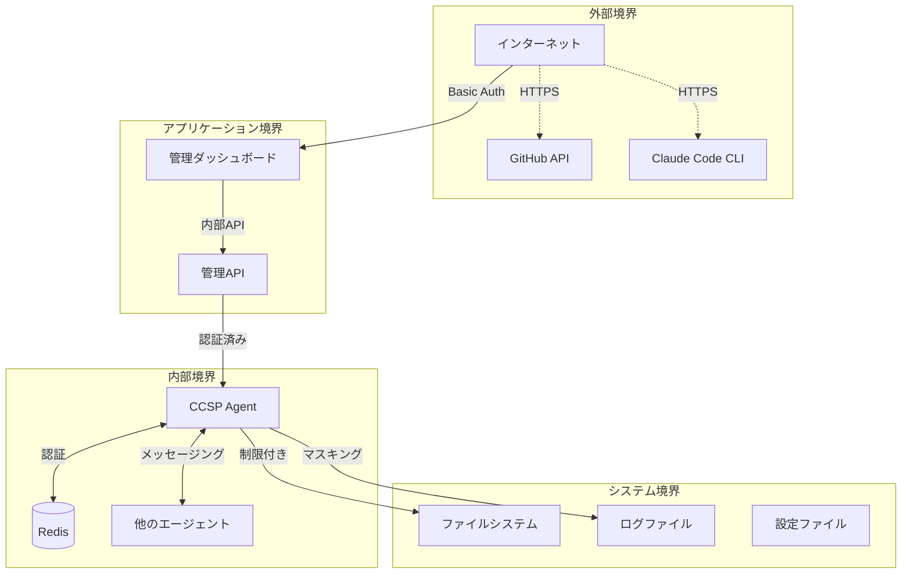
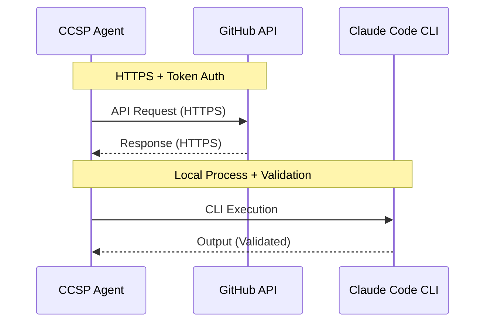
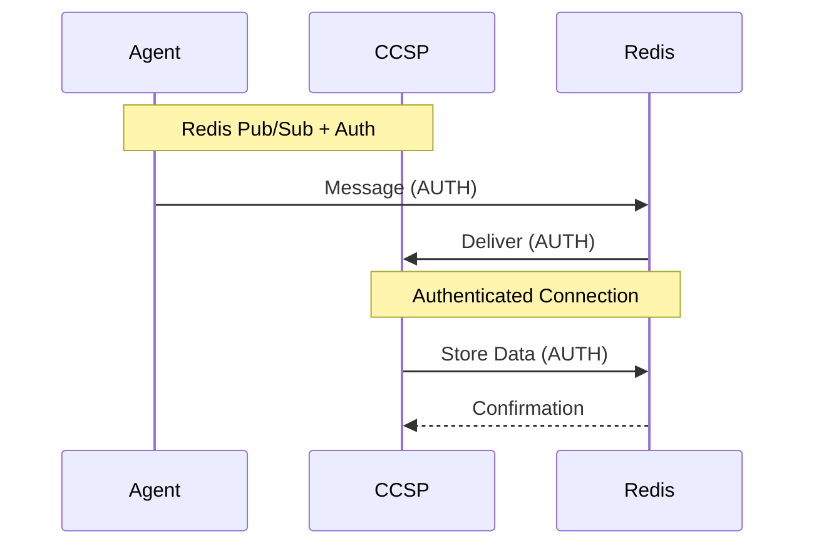

# CCSPセキュリティモデル

## 📋 目次

1. [セキュリティ概要](#セキュリティ概要)
2. [脅威モデル](#脅威モデル)
3. [認証・認可](#認証・認可)
4. [データ保護](#データ保護)
5. [通信セキュリティ](#通信セキュリティ)
6. [アクセス制御](#アクセス制御)
7. [監査・ログ](#監査・ログ)
8. [インシデント対応](#インシデント対応)
9. [セキュリティベストプラクティス](#セキュリティベストプラクティス)

---

## セキュリティ概要

### セキュリティ設計原則

CCSPのセキュリティモデルは以下の原則に基づいて設計されています：

1. **多層防御（Defense in Depth）**
   - 複数のセキュリティレイヤーによる保護
   - 単一障害点の排除

2. **最小権限の原則（Principle of Least Privilege）**
   - 必要最小限のアクセス権限
   - ロールベースアクセス制御

3. **ゼロトラストモデル**
   - すべての通信を検証
   - 内部ネットワークも信頼しない

4. **セキュリティバイデザイン**
   - 設計段階からセキュリティを考慮
   - デフォルトで安全な設定

### セキュリティ境界



---

## 脅威モデル

### 1. 脅威の分類

| 脅威カテゴリ | 説明 | 影響度 | 対策優先度 |
|-------------|------|--------|-----------|
| **認証情報の漏洩** | APIキー、トークンの不正取得 | Critical | High |
| **権限昇格** | 権限外のAPI呼び出し | High | High |
| **サービス拒否攻撃** | 大量リクエストによる機能停止 | Medium | Medium |
| **データ漏洩** | 機密データの不正アクセス | High | High |
| **中間者攻撃** | 通信の盗聴・改ざん | Medium | Medium |
| **内部脅威** | 内部関係者による不正アクセス | High | Medium |

### 2. 攻撃シナリオと対策

#### シナリオ1: GitHub Token漏洩
**攻撃**: GitHubトークンが環境変数やログから漏洩
```
対策:
✓ 環境変数の暗号化
✓ ログの機密情報マスキング
✓ トークンローテーション
✓ 最小権限スコープ設定
```

#### シナリオ2: Redis不正アクセス
**攻撃**: Redis接続情報を使った不正アクセス
```
対策:
✓ Redis認証の有効化
✓ ネットワーク分離
✓ 接続暗号化（Redis 6.0+）
✓ IPアドレス制限
```

#### シナリオ3: 大量リクエスト攻撃
**攻撃**: Claude APIの大量呼び出しによる制限到達
```
対策:
✓ レート制限機能
✓ 緊急停止機能
✓ 異常検知・アラート
✓ IP/エージェント別制限
```

---

## 認証・認可

### 1. 認証方式

#### ダッシュボード認証
```javascript
// Basic認証（開発・内部利用）
const basicAuth = {
  username: process.env.CCSP_ADMIN_USER || 'admin',
  password: process.env.CCSP_ADMIN_PASS || 'complex-password'
};

// JWT認証（本格運用）
const jwtAuth = {
  secret: process.env.JWT_SECRET,
  algorithm: 'HS256',
  expiresIn: '1h',
  issuer: 'ccsp-agent'
};
```

#### Redis認証
```javascript
const redisConfig = {
  host: process.env.REDIS_HOST,
  port: process.env.REDIS_PORT,
  password: process.env.REDIS_PASSWORD, // 必須
  username: process.env.REDIS_USER,     // Redis 6.0+
  tls: process.env.REDIS_TLS === 'true' // 暗号化接続
};
```

### 2. 認可レベル

#### アクセスレベル定義
```javascript
const ACCESS_LEVELS = {
  // 読み取り専用
  READ_ONLY: {
    permissions: ['health:read', 'queue:read', 'stats:read'],
    endpoints: ['/api/ccsp/health', '/api/ccsp/queue/status']
  },
  
  // 操作権限
  OPERATOR: {
    permissions: ['queue:control', 'config:update'],
    endpoints: ['/api/ccsp/queue/pause', '/api/ccsp/queue/resume']
  },
  
  // 管理者権限
  ADMIN: {
    permissions: ['emergency:stop', 'config:full', 'system:control'],
    endpoints: ['/api/ccsp/control/emergency-stop']
  }
};
```

---

## データ保護

### 1. 機密データの分類

| データタイプ | 分類 | 保護レベル | 暗号化 |
|-------------|------|-----------|--------|
| **GitHub Token** | Secret | Critical | Required |
| **Redis Password** | Secret | Critical | Required |
| **APIキー** | Secret | Critical | Required |
| **プロンプト内容** | Confidential | High | Recommended |
| **実行結果** | Confidential | High | Recommended |
| **使用量統計** | Internal | Medium | Optional |
| **ログデータ** | Internal | Medium | Optional |

### 2. データ暗号化

#### 保存時暗号化
```javascript
const crypto = require('crypto');

class SecureStorage {
  constructor(encryptionKey) {
    this.algorithm = 'aes-256-gcm';
    this.key = crypto.scryptSync(encryptionKey, 'salt', 32);
  }
  
  encrypt(data) {
    const iv = crypto.randomBytes(16);
    const cipher = crypto.createCipher(this.algorithm, this.key, iv);
    
    let encrypted = cipher.update(JSON.stringify(data), 'utf8', 'hex');
    encrypted += cipher.final('hex');
    
    const authTag = cipher.getAuthTag();
    
    return {
      encrypted,
      iv: iv.toString('hex'),
      authTag: authTag.toString('hex')
    };
  }
  
  decrypt(encryptedData) {
    const decipher = crypto.createDecipher(
      this.algorithm, 
      this.key, 
      Buffer.from(encryptedData.iv, 'hex')
    );
    
    decipher.setAuthTag(Buffer.from(encryptedData.authTag, 'hex'));
    
    let decrypted = decipher.update(encryptedData.encrypted, 'hex', 'utf8');
    decrypted += decipher.final('utf8');
    
    return JSON.parse(decrypted);
  }
}
```

#### ログマスキング
```javascript
class SecureLogger {
  static SENSITIVE_PATTERNS = [
    /token["\s]*[:=]["\s]*([a-zA-Z0-9_-]+)/gi,
    /password["\s]*[:=]["\s]*([a-zA-Z0-9_!@#$%^&*()-]+)/gi,
    /api[_-]?key["\s]*[:=]["\s]*([a-zA-Z0-9_-]+)/gi,
    /github[_-]?token["\s]*[:=]["\s]*([a-zA-Z0-9_-]+)/gi
  ];
  
  static maskSensitiveData(message) {
    let masked = message;
    
    for (const pattern of this.SENSITIVE_PATTERNS) {
      masked = masked.replace(pattern, (match, sensitive) => {
        const visible = sensitive.substring(0, 4);
        const masked = '*'.repeat(Math.max(sensitive.length - 4, 0));
        return match.replace(sensitive, visible + masked);
      });
    }
    
    return masked;
  }
}
```

---

## 通信セキュリティ

### 1. 通信経路の保護

#### 外部通信


#### 内部通信


### 2. TLS設定

#### HTTPS設定（本格運用時）
```javascript
const https = require('https');
const fs = require('fs');

const tlsOptions = {
  key: fs.readFileSync(process.env.TLS_KEY_PATH),
  cert: fs.readFileSync(process.env.TLS_CERT_PATH),
  ca: fs.readFileSync(process.env.TLS_CA_PATH), // オプション
  
  // セキュリティ設定
  minVersion: 'TLSv1.2',
  ciphers: 'ECDHE-RSA-AES128-GCM-SHA256:ECDHE-RSA-AES256-GCM-SHA384',
  honorCipherOrder: true
};

const server = https.createServer(tlsOptions, app);
```

---

## アクセス制御

### 1. エンドポイント保護

```javascript
class EndpointSecurity {
  static ENDPOINT_PERMISSIONS = {
    // 公開エンドポイント
    'GET /api/ccsp/health': { auth: false, level: 'public' },
    
    // 読み取り専用
    'GET /api/ccsp/queue/status': { auth: true, level: 'read' },
    'GET /api/ccsp/stats/*': { auth: true, level: 'read' },
    
    // 操作権限
    'POST /api/ccsp/queue/pause': { auth: true, level: 'operator' },
    'POST /api/ccsp/queue/resume': { auth: true, level: 'operator' },
    
    // 管理者権限
    'POST /api/ccsp/control/emergency-stop': { auth: true, level: 'admin' },
    'POST /api/ccsp/config/update': { auth: true, level: 'admin' }
  };
  
  static authorize(req, requiredLevel) {
    const userLevel = this.getUserLevel(req);
    const levelHierarchy = ['public', 'read', 'operator', 'admin'];
    
    const userIndex = levelHierarchy.indexOf(userLevel);
    const requiredIndex = levelHierarchy.indexOf(requiredLevel);
    
    return userIndex >= requiredIndex;
  }
}
```

### 2. レート制限保護

```javascript
class SecurityRateLimit {
  constructor() {
    this.attempts = new Map(); // IP/User -> attempts
    this.blacklist = new Set(); // Blocked IPs
  }
  
  checkRateLimit(identifier, endpoint) {
    const key = `${identifier}:${endpoint}`;
    const now = Date.now();
    const window = 60000; // 1分
    const maxAttempts = this.getMaxAttempts(endpoint);
    
    // 現在のウィンドウでの試行回数を取得
    const attempts = this.attempts.get(key) || [];
    const windowAttempts = attempts.filter(time => now - time < window);
    
    if (windowAttempts.length >= maxAttempts) {
      // ブラックリストに追加（重要なエンドポイントの場合）
      if (this.isCriticalEndpoint(endpoint)) {
        this.blacklist.add(identifier);
      }
      
      return {
        allowed: false,
        retryAfter: window - (now - windowAttempts[0])
      };
    }
    
    // 試行を記録
    windowAttempts.push(now);
    this.attempts.set(key, windowAttempts);
    
    return { allowed: true };
  }
  
  getMaxAttempts(endpoint) {
    const limits = {
      '/api/ccsp/control/emergency-stop': 3,
      '/api/ccsp/queue/pause': 10,
      'default': 60
    };
    
    return limits[endpoint] || limits.default;
  }
}
```

---

## 監査・ログ

### 1. セキュリティログ

```javascript
class SecurityLogger {
  static logSecurityEvent(event) {
    const logEntry = {
      timestamp: new Date().toISOString(),
      eventType: event.type,
      source: event.source,
      user: event.user,
      endpoint: event.endpoint,
      success: event.success,
      reason: event.reason,
      metadata: event.metadata
    };
    
    // セキュリティ専用ログファイル
    this.writeToSecurityLog(logEntry);
    
    // 重要度に応じてアラート
    if (event.severity === 'critical') {
      this.sendSecurityAlert(logEntry);
    }
  }
  
  static auditAccessAttempt(req, result) {
    this.logSecurityEvent({
      type: 'access_attempt',
      source: req.ip,
      user: req.user?.id,
      endpoint: `${req.method} ${req.path}`,
      success: result.success,
      reason: result.reason,
      severity: result.success ? 'info' : 'warning'
    });
  }
}
```

### 2. 監査データの保護

```javascript
class AuditProtection {
  static readonly = true; // 監査ログは読み取り専用
  
  static integrityCheck(logFile) {
    // ハッシュチェーンによる改ざん検出
    const logs = this.readLogFile(logFile);
    let expectedHash = '';
    
    for (const log of logs) {
      const currentHash = crypto
        .createHash('sha256')
        .update(expectedHash + JSON.stringify(log))
        .digest('hex');
      
      if (log.hash && log.hash !== currentHash) {
        throw new Error(`Log integrity violation at ${log.timestamp}`);
      }
      
      expectedHash = currentHash;
    }
    
    return true;
  }
}
```

---

## インシデント対応

### 1. インシデント分類

| インシデントタイプ | 重要度 | 対応時間 | エスカレーション |
|------------------|--------|----------|-----------------|
| **不正アクセス** | Critical | 即座 | CISO + 開発チーム |
| **データ漏洩疑い** | Critical | 30分以内 | 法務 + CISO |
| **サービス停止** | High | 1時間以内 | 運用チーム |
| **権限昇格** | High | 2時間以内 | セキュリティチーム |
| **異常なAPI使用** | Medium | 4時間以内 | 開発チーム |

### 2. 自動対応フロー

```javascript
class IncidentResponse {
  static async handleSecurityIncident(incident) {
    // 1. インシデントの分類
    const classification = this.classifyIncident(incident);
    
    // 2. 自動的な初期対応
    switch (classification.type) {
      case 'unauthorized_access':
        await this.blockSuspiciousIP(incident.source);
        await this.rotateTokens();
        break;
        
      case 'rate_limit_abuse':
        await this.enhanceRateLimit(incident.source);
        break;
        
      case 'data_exfiltration':
        await this.emergencyShutdown();
        await this.alertSecurityTeam(incident);
        break;
    }
    
    // 3. 証跡保全
    await this.preserveEvidence(incident);
    
    // 4. 通知・エスカレーション
    await this.notifyStakeholders(classification);
  }
  
  static async emergencyShutdown() {
    // 緊急停止プロトコル
    await this.stopAllProcessing();
    await this.secureCredentials();
    await this.createForensicSnapshot();
  }
}
```

---

## セキュリティベストプラクティス

### 1. 開発者向けガイドライン

#### 機密情報の取り扱い
```javascript
// ❌ 悪い例
console.log('GitHub token:', process.env.GITHUB_TOKEN);
const config = { token: 'ghp_xxxxxxxxxxxx' };

// ✅ 良い例
console.log('GitHub token configured:', !!process.env.GITHUB_TOKEN);
const config = { token: process.env.GITHUB_TOKEN };
```

#### 入力値検証
```javascript
// ✅ 入力値の検証
function validateApiRequest(req) {
  const schema = {
    prompt: { type: 'string', maxLength: 10000 },
    priority: { type: 'string', enum: ['urgent', 'high', 'normal', 'low'] },
    timeout: { type: 'number', min: 1000, max: 3600000 }
  };
  
  return joi.validate(req.body, schema);
}
```

### 2. 運用者向けガイドライン

#### 定期的なセキュリティチェック
```bash
#!/bin/bash
# セキュリティチェックスクリプト

echo "=== CCSPセキュリティチェック ==="

# 1. 認証情報の確認
if [ -z "$GITHUB_TOKEN" ]; then
  echo "❌ GITHUB_TOKEN が設定されていません"
fi

# 2. Redis認証の確認
redis-cli --no-auth-warning auth "$REDIS_PASSWORD" ping || echo "❌ Redis認証失敗"

# 3. ログファイルの権限確認
find logs/ -type f ! -perm 600 -exec echo "❌ 不適切なログ権限: {}" \;

# 4. 設定ファイルの権限確認
find config/ -type f ! -perm 600 -exec echo "❌ 不適切な設定権限: {}" \;

echo "✅ セキュリティチェック完了"
```

#### トークンローテーション
```bash
#!/bin/bash
# トークンローテーションスクリプト

# 1. 新しいトークンの生成（手動で GitHub で実行）
echo "新しいGitHubトークンを生成してください"
read -s NEW_TOKEN

# 2. 設定の更新
export GITHUB_TOKEN_NEW="$NEW_TOKEN"

# 3. CCSPの再起動
systemctl restart ccsp-agent

# 4. 動作確認
curl -H "Authorization: token $NEW_TOKEN" \
  https://api.github.com/user

# 5. 古いトークンの無効化
echo "GitHubで古いトークンを無効化してください"
```

### 3. セキュリティ設定チェックリスト

#### 初期設定
- [ ] すべての認証情報を環境変数で管理
- [ ] デフォルトパスワードの変更
- [ ] 不要なエンドポイントの無効化
- [ ] ログファイルの権限設定（600）
- [ ] Redis認証の有効化

#### 定期チェック
- [ ] 認証ログの確認
- [ ] 異常なAPI使用量の監視
- [ ] エラーログの定期レビュー
- [ ] アクセスパターンの分析
- [ ] 脆弱性スキャンの実行

#### インシデント対応準備
- [ ] インシデント対応手順書の準備
- [ ] 緊急連絡先の整備
- [ ] バックアップ・復旧手順の確認
- [ ] フォレンジック用ツールの準備
- [ ] 法的対応の準備

---

## まとめ

CCSPのセキュリティモデルは以下を実現します：

### ✅ 包括的な保護
- 多層防御による堅牢なセキュリティ
- 機密データの適切な暗号化
- 通信経路の保護

### ✅ 実用的な運用
- 自動化されたセキュリティ機能
- 運用フレンドリーな監視・アラート
- 明確なインシデント対応手順

### ✅ 継続的な改善
- 定期的なセキュリティレビュー
- 脅威環境の変化への対応
- ベストプラクティスの更新

このセキュリティモデルにより、CCSPは企業環境での安全な運用を可能にします。

---

**文書バージョン**: 1.0  
**最終更新**: 2025年6月21日  
**関連文書**: [CCSPアーキテクチャ概要](./ccsp-architecture.md), [CCSP運用ガイド](./ccsp-operational-guide.md)