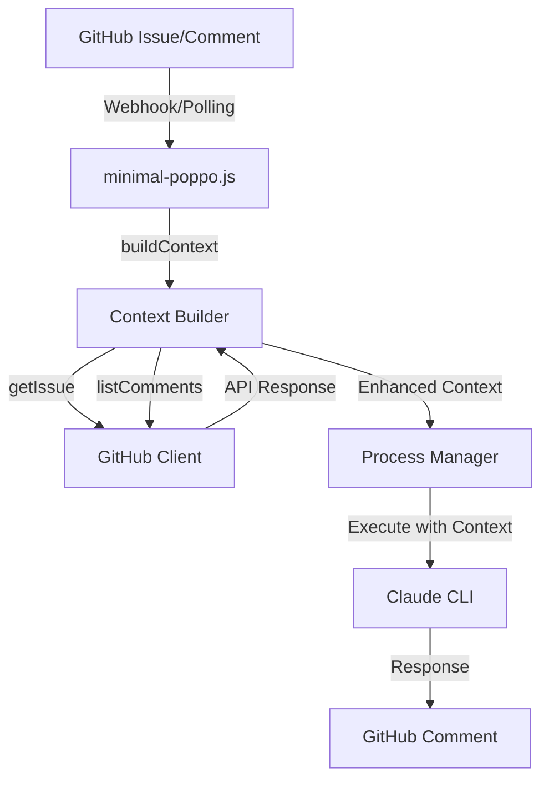

# コメントコンテキスト拡張概要設計書

## 1. システム概要

PoppoBuilderのコメント処理機能を拡張し、より豊富なコンテキスト情報を提供することで、Claudeがより適切な応答を生成できるようにする。

## 2. アーキテクチャ



## 3. コンポーネント設計

### 3.1 Context Builder（buildContext関数）
**責務**: Issueとコメントから構造化されたコンテキストを構築

**入力**: 
- Issue番号

**出力**:
- 拡張されたコンテキストオブジェクト（Issue情報、会話履歴、メタデータ）

### 3.2 データフロー

1. **Issue情報取得**
   - GitHub APIからIssue詳細を取得
   - タイトル、本文、ラベル、日時情報を抽出

2. **コメント履歴取得**
   - すべてのコメントを時系列で取得
   - 設定に基づいて最新N件に制限

3. **コンテキスト構築**
   - 会話形式（user/assistant）に構造化
   - 各エントリにメタデータを付与

4. **サマリー情報生成**
   - 総コメント数、切り捨て有無、最古コメント日時

## 4. インターフェース設計

### 4.1 拡張コンテキスト構造
```typescript
interface EnhancedContext {
  issue: {
    number: number;
    title: string;
    description: string;
    labels: string[];
    created_at: string;
    updated_at: string;
  };
  conversation: ConversationEntry[];
  context_summary: {
    total_comments: number;
    truncated: boolean;
    oldest_included: string | null;
  };
}

interface ConversationEntry {
  role: 'user' | 'assistant';
  content: string;
  metadata: {
    author: string;
    created_at: string;
    id: number;
    is_completion: boolean;
  };
}
```

## 5. 設計上の考慮事項

### 5.1 パフォーマンス
- コメント数が多い場合の制限機能
- 必要最小限のAPI呼び出し

### 5.2 拡張性
- メタデータフィールドの追加が容易
- 将来的な要約機能の追加を考慮

### 5.3 後方互換性
- 既存のconversation配列構造を維持
- 追加情報はオプショナルフィールドとして実装

## 6. エラーハンドリング
- GitHub API失敗時は従来のシンプルなコンテキストにフォールバック
- メタデータ取得失敗時は該当フィールドをnullに設定