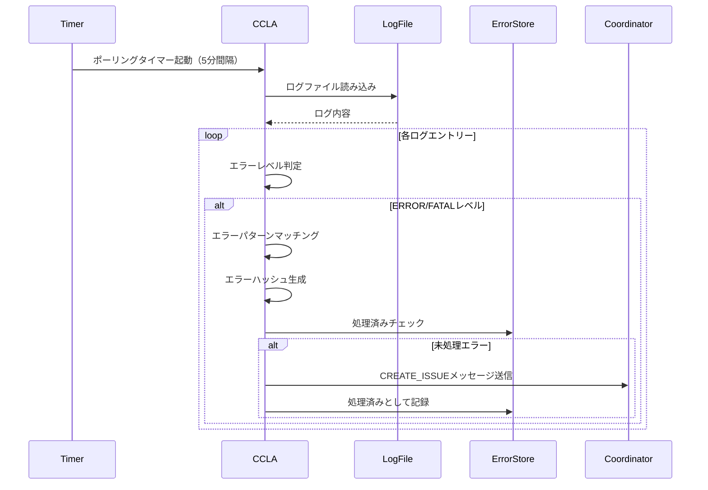

# エラーログ収集機能 詳細設計書

## 1. 概要

本書では、PoppoBuilderシステムにおけるエラーログ収集機能（CCLA: Code Change Log Analyzer）の詳細設計を定義する。この機能は、システム実行中に発生するエラーを自動的に検出・分析し、GitHub Issueとして登録することで、自己修復サイクルを実現する。

## 2. アーキテクチャ概要

### 2.1 システム構成

```
┌─────────────────────────────────────────────────────────────┐
│                    PoppoBuilder System                       │
├─────────────────────────────────────────────────────────────┤
│                                                             │
│  ┌─────────────┐    ┌──────────────┐    ┌──────────────┐ │
│  │   Minimal   │    │    Agent     │    │   GitHub     │ │
│  │   Poppo     │───▶│ Coordinator  │───▶│   Client     │ │
│  └─────────────┘    └──────┬───────┘    └──────────────┘ │
│                            │                               │
│                      ┌─────▼────┐                         │
│                      │   CCLA    │                         │
│                      │  Agent    │                         │
│                      └─────┬────┘                         │
│                            │                               │
│  ┌─────────────────────────▼────────────────────────────┐ │
│  │                    File System                        │ │
│  │  ┌──────────┐  ┌──────────────┐  ┌───────────────┐ │ │
│  │  │   Logs   │  │   Messages   │  │  Processed    │ │ │
│  │  │Directory │  │  Directory   │  │ Errors File   │ │ │
│  │  └──────────┘  └──────────────┘  └───────────────┘ │ │
│  └──────────────────────────────────────────────────────┘ │
└─────────────────────────────────────────────────────────────┘
```

### 2.2 コンポーネント概要

1. **CCLA Agent** - ログファイルの監視、エラー検出、分析を行う専門エージェント
2. **Agent Coordinator** - CCLAからのメッセージを受信し、適切な処理を実行
3. **Agent Integration** - GitHub Issue作成などの実際の処理を担当
4. **File System** - ログファイル、メッセージ、処理済みエラー情報を管理

## 3. Phase 1: 基本機能の詳細設計

### 3.1 CCLAエージェントクラス設計

```javascript
class CCLAAgent extends AgentBase {
  // コンストラクタ
  constructor(config) {
    // 設定の初期化
    this.errorLogConfig = {
      pollingInterval: 300000,      // 5分
      logSources: ['poppo-*.log'],  // 監視対象
      errorLevels: ['ERROR', 'FATAL'],
      labels: {
        bug: 'task:bug',
        defect: 'task:defect',
        specIssue: 'task:spec-issue'
      }
    };
    
    // エラーパターン定義（次節参照）
    this.errorPatterns = [...];
    
    // 処理済みエラー管理
    this.processedErrors = new Map();
  }
}
```

### 3.2 エラーパターン定義

```javascript
const errorPatterns = [
  {
    id: 'EP001',
    name: 'Type Error - Property Access',
    pattern: /TypeError.*cannot read property/i,
    type: 'bug',
    severity: 'high',
    category: 'Type Error',
    suggestedAction: 'プロパティアクセス前のnullチェックを追加'
  },
  {
    id: 'EP002',
    name: 'Reference Error - Undefined Variable',
    pattern: /ReferenceError.*is not defined/i,
    type: 'bug',
    severity: 'high',
    category: 'Reference Error',
    suggestedAction: '変数の定義を確認、またはimport文の追加'
  },
  {
    id: 'EP003',
    name: 'Syntax Error',
    pattern: /SyntaxError/i,
    type: 'bug',
    severity: 'critical',
    category: 'Syntax Error',
    suggestedAction: '構文エラーの修正が必要'
  },
  {
    id: 'EP004',
    name: 'File Not Found',
    pattern: /ENOENT.*no such file or directory/i,
    type: 'defect',
    severity: 'medium',
    category: 'File Not Found',
    suggestedAction: 'ファイルパスの確認、またはファイルの作成'
  },
  {
    id: 'EP005',
    name: 'API Rate Limit',
    pattern: /GitHub API.*rate limit|API rate limit exceeded/i,
    type: 'defect',
    severity: 'low',
    category: 'Rate Limit',
    suggestedAction: 'レート制限の待機、またはAPI呼び出しの最適化'
  },
  {
    id: 'EP006',
    name: 'Timeout Error',
    pattern: /timeout|ETIMEDOUT|ESOCKETTIMEDOUT/i,
    type: 'defect',
    severity: 'medium',
    category: 'Timeout',
    suggestedAction: 'タイムアウト値の増加、またはネットワーク状態の確認'
  },
  {
    id: 'EP007',
    name: 'Specification Conflict',
    pattern: /spec.*conflict|specification.*mismatch|requirement.*conflict/i,
    type: 'specIssue',
    severity: 'medium',
    category: 'Specification Issue',
    suggestedAction: '仕様の確認と修正が必要'
  },
  {
    id: 'EP008',
    name: 'Memory Error',
    pattern: /ENOMEM|out of memory|JavaScript heap out of memory/i,
    type: 'defect',
    severity: 'critical',
    category: 'Memory Error',
    suggestedAction: 'メモリリークの調査、またはメモリ制限の増加'
  },
  {
    id: 'EP009',
    name: 'Permission Denied',
    pattern: /EACCES|Permission denied|access denied/i,
    type: 'defect',
    severity: 'high',
    category: 'Permission Error',
    suggestedAction: 'ファイル/ディレクトリの権限設定を確認'
  },
  {
    id: 'EP010',
    name: 'JSON Parse Error',
    pattern: /JSON.*parse.*error|Unexpected.*JSON|Invalid JSON/i,
    type: 'bug',
    severity: 'medium',
    category: 'Parse Error',
    suggestedAction: 'JSONフォーマットの検証とエラーハンドリングの追加'
  }
];
```

### 3.3 エラー検出・分析フロー



### 3.4 エラーハッシュ生成アルゴリズム

```javascript
generateErrorHash(error) {
  // ハッシュ生成のキー要素
  const components = [
    error.level,                    // ERROR/FATAL
    error.message,                  // エラーメッセージ
    error.stackTrace.slice(0, 3)    // スタックトレースの上位3行
      .map(line => line.trim())
      .join(':')
  ];
  
  const key = components.join(':');
  return crypto.createHash('md5')
    .update(key)
    .digest('hex')
    .substring(0, 8);  // 8文字に短縮
}
```

### 3.5 処理済みエラー記録フォーマット

```json
{
  "e605f04d": {
    "timestamp": "2025-06-16T10:00:00.000Z",
    "issueUrl": "https://github.com/medamap/PoppoBuilderSuite/issues/123",
    "errorInfo": {
      "level": "ERROR",
      "category": "Type Error",
      "firstOccurrence": "2025-06-16T09:55:00.000Z",
      "occurrenceCount": 3
    }
  }
}
```

### 3.6 メッセージングプロトコル

#### CREATE_ISSUEメッセージフォーマット

```json
{
  "id": "msg-uuid",
  "timestamp": "2025-06-16T10:00:00.000Z",
  "from": "CCLA",
  "to": "core",
  "type": "CREATE_ISSUE",
  "errorInfo": {
    "timestamp": "2025-06-16T09:55:00.000Z",
    "level": "ERROR",
    "message": "TypeError: Cannot read property 'name' of undefined",
    "stackTrace": [
      "    at processIssue (/src/minimal-poppo.js:123:45)",
      "    at async main (/src/minimal-poppo.js:456:5)"
    ],
    "hash": "e605f04d",
    "analysis": {
      "type": "bug",
      "severity": "high",
      "category": "Type Error",
      "matched": true,
      "patternId": "EP001",
      "suggestedAction": "プロパティアクセス前のnullチェックを追加"
    }
  },
  "priority": "high",
  "labels": ["task:bug"]
}
```

### 3.7 GitHub Issue生成テンプレート

```markdown
## エラー概要

- **カテゴリ**: ${analysis.category}
- **タイプ**: ${analysis.type}
- **重要度**: ${analysis.severity}
- **エラーハッシュ**: ${hash}
- **発生日時**: ${timestamp}
- **ログレベル**: ${level}
- **パターンID**: ${analysis.patternId}

## エラーメッセージ

```
${message}
```

## スタックトレース

```
${stackTrace.join('\n')}
```

## 自動分析結果

このエラーは自動的に検出・分類されました。
- パターンマッチング: ${analysis.matched ? '成功' : '失敗'}
- 推奨される対処法: ${analysis.suggestedAction}

## 対処方法

このエラーの調査と修正が必要です。

---
*このIssueはCCLAエージェントによって自動的に作成されました*
*エラーハッシュ: ${hash}*
```

## 4. Phase 2: 高度な分析機能の詳細設計

### 4.1 Claudeによる詳細分析

#### 分析リクエスト構造

```javascript
class AdvancedAnalyzer {
  async analyzeWithClaude(errorInfo, context) {
    const prompt = this.buildAnalysisPrompt(errorInfo, context);
    
    const analysis = await processManager.executeWithContext(
      `エラー分析: ${errorInfo.category}`,
      prompt,
      {
        systemPrompt: this.getAnalysisSystemPrompt(),
        maxTokens: 2000
      }
    );
    
    return this.parseAnalysisResult(analysis);
  }
  
  buildAnalysisPrompt(errorInfo, context) {
    return `
以下のエラーを分析してください：

エラー情報：
- メッセージ: ${errorInfo.message}
- スタックトレース: ${errorInfo.stackTrace.join('\n')}
- 発生コンテキスト: ${context.description}

分析項目：
1. 根本原因の推定
2. 影響範囲の評価
3. 修正方法の提案
4. 再発防止策

回答は以下の形式でお願いします：
{
  "rootCause": "根本原因の説明",
  "impact": "影響範囲（高/中/低）と理由",
  "fixSuggestion": "具体的な修正方法",
  "prevention": "再発防止策"
}
    `;
  }
}
```

### 4.2 類似エラーグループ化

#### グループ化アルゴリズム

```javascript
class ErrorGrouper {
  constructor() {
    this.groups = new Map();
    this.similarityThreshold = 0.8;
  }
  
  groupErrors(errors) {
    for (const error of errors) {
      let bestGroup = null;
      let bestSimilarity = 0;
      
      // 既存グループとの類似度計算
      for (const [groupId, group] of this.groups) {
        const similarity = this.calculateSimilarity(error, group.representative);
        if (similarity > this.similarityThreshold && similarity > bestSimilarity) {
          bestGroup = groupId;
          bestSimilarity = similarity;
        }
      }
      
      if (bestGroup) {
        // 既存グループに追加
        this.groups.get(bestGroup).members.push(error);
      } else {
        // 新規グループ作成
        const newGroupId = this.generateGroupId();
        this.groups.set(newGroupId, {
          representative: error,
          members: [error],
          commonPattern: this.extractCommonPattern([error])
        });
      }
    }
    
    return this.groups;
  }
  
  calculateSimilarity(error1, error2) {
    // 類似度計算ロジック
    const factors = {
      category: error1.category === error2.category ? 0.3 : 0,
      messageSimiliarity: this.textSimilarity(error1.message, error2.message) * 0.4,
      stackTraceSimilarity: this.stackTraceSimilarity(error1.stackTrace, error2.stackTrace) * 0.3
    };
    
    return Object.values(factors).reduce((a, b) => a + b, 0);
  }
}
```

### 4.3 統計分析機能

```javascript
class ErrorStatistics {
  constructor() {
    this.stats = {
      byCategory: new Map(),
      bySeverity: new Map(),
      byTimeRange: new Map(),
      trends: []
    };
  }
  
  updateStatistics(error) {
    // カテゴリ別統計
    const categoryStats = this.stats.byCategory.get(error.category) || {
      count: 0,
      firstOccurrence: null,
      lastOccurrence: null
    };
    categoryStats.count++;
    categoryStats.lastOccurrence = error.timestamp;
    if (!categoryStats.firstOccurrence) {
      categoryStats.firstOccurrence = error.timestamp;
    }
    this.stats.byCategory.set(error.category, categoryStats);
    
    // 時間帯別統計
    const hour = new Date(error.timestamp).getHours();
    const hourStats = this.stats.byTimeRange.get(hour) || 0;
    this.stats.byTimeRange.set(hour, hourStats + 1);
  }
  
  generateReport() {
    return {
      summary: {
        totalErrors: this.getTotalCount(),
        uniqueErrors: this.getUniqueCount(),
        mostFrequentCategory: this.getMostFrequent('category'),
        peakHour: this.getPeakHour()
      },
      details: {
        byCategory: Array.from(this.stats.byCategory.entries()),
        bySeverity: Array.from(this.stats.bySeverity.entries()),
        byTimeRange: Array.from(this.stats.byTimeRange.entries())
      },
      trends: this.analyzeTrends()
    };
  }
}
```

## 5. Phase 3: 自動修復機能の詳細設計

### 5.1 自動修復エンジン

```javascript
class AutoRepairEngine {
  constructor() {
    this.repairStrategies = new Map();
    this.registerDefaultStrategies();
  }
  
  registerDefaultStrategies() {
    // ファイル未検出エラーの修復戦略
    this.repairStrategies.set('EP004', {
      name: 'CreateMissingFile',
      canAutoRepair: (error) => {
        return error.message.includes('ENOENT') && 
               this.isConfigFile(error.message);
      },
      repair: async (error) => {
        const filePath = this.extractFilePath(error.message);
        const defaultContent = this.getDefaultContent(filePath);
        await fs.writeFile(filePath, defaultContent);
        return {
          success: true,
          action: `Created missing file: ${filePath}`
        };
      }
    });
    
    // nullチェック不足の修復戦略
    this.repairStrategies.set('EP001', {
      name: 'AddNullCheck',
      canAutoRepair: (error) => {
        return error.category === 'Type Error' && 
               this.canIdentifyLocation(error.stackTrace);
      },
      repair: async (error) => {
        const location = this.extractLocation(error.stackTrace);
        const code = await this.readSourceCode(location);
        const fixedCode = this.addNullCheck(code, location);
        await this.writeSourceCode(location, fixedCode);
        return {
          success: true,
          action: `Added null check at ${location.file}:${location.line}`
        };
      }
    });
  }
  
  async attemptAutoRepair(error) {
    const strategy = this.repairStrategies.get(error.analysis.patternId);
    
    if (!strategy || !strategy.canAutoRepair(error)) {
      return {
        success: false,
        reason: 'No automatic repair strategy available'
      };
    }
    
    try {
      const result = await strategy.repair(error);
      
      // 修復後のテスト実行
      const testResult = await this.runTests(result);
      
      if (!testResult.success) {
        // ロールバック
        await this.rollback(result);
        return {
          success: false,
          reason: 'Tests failed after repair',
          testOutput: testResult.output
        };
      }
      
      return result;
      
    } catch (repairError) {
      return {
        success: false,
        reason: `Repair failed: ${repairError.message}`
      };
    }
  }
}
```

### 5.2 修復結果の検証

```javascript
class RepairValidator {
  async validateRepair(repairResult, originalError) {
    const validations = [];
    
    // 1. 構文検証
    validations.push(await this.validateSyntax(repairResult.modifiedFiles));
    
    // 2. 単体テスト実行
    validations.push(await this.runUnitTests(repairResult.affectedTests));
    
    // 3. エラー再現テスト
    validations.push(await this.verifyErrorFixed(originalError));
    
    // 4. 回帰テスト
    validations.push(await this.runRegressionTests());
    
    const allPassed = validations.every(v => v.passed);
    
    return {
      passed: allPassed,
      validations,
      recommendation: allPassed ? 'COMMIT' : 'ROLLBACK'
    };
  }
}
```

### 5.3 学習型エラーパターン認識

```javascript
class LearningErrorRecognizer {
  constructor() {
    this.learnedPatterns = new Map();
    this.minOccurrences = 3;
  }
  
  async learnFromError(error, repairResult) {
    const patternKey = this.generatePatternKey(error);
    
    const pattern = this.learnedPatterns.get(patternKey) || {
      occurrences: 0,
      successfulRepairs: 0,
      failedRepairs: 0,
      averageRepairTime: 0,
      commonFactors: []
    };
    
    pattern.occurrences++;
    
    if (repairResult.success) {
      pattern.successfulRepairs++;
    } else {
      pattern.failedRepairs++;
    }
    
    // パターンの信頼度計算
    pattern.confidence = pattern.successfulRepairs / pattern.occurrences;
    
    // 十分な信頼度があれば新しいエラーパターンとして登録
    if (pattern.occurrences >= this.minOccurrences && pattern.confidence > 0.8) {
      await this.registerNewPattern(patternKey, pattern);
    }
    
    this.learnedPatterns.set(patternKey, pattern);
  }
}
```

## 6. データ構造定義

### 6.1 エラー情報データ構造

```typescript
interface ErrorInfo {
  id: string;           // 一意のエラーID
  hash: string;         // エラーハッシュ（重複検出用）
  timestamp: string;    // 発生日時（ISO 8601）
  level: 'ERROR' | 'FATAL' | 'WARN';
  message: string;      // エラーメッセージ
  stackTrace: string[]; // スタックトレース行の配列
  file?: string;        // エラーが発生したファイル
  line?: number;        // エラーが発生した行番号
  context?: {
    issueNumber?: number;
    taskType?: string;
    agentName?: string;
  };
  analysis?: ErrorAnalysis;
}

interface ErrorAnalysis {
  patternId: string;
  type: 'bug' | 'defect' | 'specIssue';
  severity: 'critical' | 'high' | 'medium' | 'low';
  category: string;
  matched: boolean;
  suggestedAction?: string;
  rootCause?: string;
  impact?: string;
}
```

### 6.2 処理済みエラー記録

```typescript
interface ProcessedError {
  hash: string;
  timestamp: string;
  issueUrl?: string;
  issueNumber?: number;
  errorInfo: {
    level: string;
    category: string;
    firstOccurrence: string;
    lastOccurrence: string;
    occurrenceCount: number;
  };
  repairAttempts?: RepairAttempt[];
}

interface RepairAttempt {
  timestamp: string;
  strategy: string;
  success: boolean;
  result?: any;
  rollbackRequired?: boolean;
}
```

### 6.3 エラーグループ

```typescript
interface ErrorGroup {
  id: string;
  representative: ErrorInfo;
  members: ErrorInfo[];
  commonPattern: string;
  statistics: {
    totalOccurrences: number;
    uniqueErrors: number;
    averageInterval: number;
    trend: 'increasing' | 'stable' | 'decreasing';
  };
}
```

## 7. 設定ファイル仕様

### 7.1 config.json拡張

```json
{
  "errorLogCollection": {
    "enabled": true,
    "pollingInterval": 300000,
    "logSources": [
      "poppo-*.log",
      "error-*.log",
      "process-*.log"
    ],
    "errorLevels": ["ERROR", "FATAL"],
    "ignorePatterns": [
      ".*test.*",
      ".*debug.*"
    ],
    "labels": {
      "bug": "task:bug",
      "defect": "task:defect",
      "specIssue": "task:spec-issue"
    },
    "advanced": {
      "claudeAnalysis": true,
      "groupSimilarErrors": true,
      "statisticsEnabled": true,
      "autoRepair": false
    },
    "thresholds": {
      "minOccurrencesForIssue": 1,
      "groupingSimilarity": 0.8,
      "autoRepairConfidence": 0.9
    },
    "logRotation": {
      "enabled": true,
      "maxFileSize": "100MB",
      "maxFiles": 4,
      "compress": true
    }
  }
}
```

## 8. API仕様

### 8.1 CCLAエージェントAPI

```javascript
// エラー分析リクエスト
POST /agents/ccla/analyze
{
  "taskType": "analyze-error-logs",
  "options": {
    "forceCheck": true,
    "includeWarnings": false
  }
}

// エラー統計取得
GET /agents/ccla/statistics
Response: {
  "summary": {...},
  "byCategory": [...],
  "trends": [...]
}

// 処理済みエラー一覧
GET /agents/ccla/processed-errors
Response: {
  "errors": [...],
  "total": 123
}
```

### 8.2 メッセージングAPI

```javascript
// Issue作成要求
{
  "type": "CREATE_ISSUE",
  "errorInfo": ErrorInfo,
  "priority": "high" | "medium" | "low",
  "labels": string[]
}

// Issue更新通知
{
  "type": "UPDATE_ISSUE_REFERENCE",
  "data": {
    "errorHash": string,
    "issueUrl": string,
    "issueNumber": number
  }
}

// 修復要求（Phase 3）
{
  "type": "REPAIR_ERROR",
  "errorInfo": ErrorInfo,
  "strategy": string,
  "options": {...}
}
```

## 9. エラー処理とリカバリー

### 9.1 エラー処理方針

1. **ログ読み込みエラー**: スキップして次のファイルを処理
2. **パターンマッチングエラー**: デフォルトカテゴリで処理継続
3. **Issue作成エラー**: リトライキューに追加
4. **メッセージ送信エラー**: ローカルキューに保存

### 9.2 リカバリー戦略

```javascript
class ErrorRecovery {
  async handleProcessingError(error, context) {
    const strategy = this.selectStrategy(error);
    
    switch (strategy) {
      case 'RETRY':
        return await this.retryWithBackoff(context);
      
      case 'SKIP':
        this.logger.warn(`Skipping due to error: ${error.message}`);
        return { skipped: true };
      
      case 'QUEUE':
        await this.addToRetryQueue(context);
        return { queued: true };
      
      case 'FALLBACK':
        return await this.executeFallback(context);
      
      default:
        throw error;
    }
  }
}
```

## 10. 性能最適化

### 10.1 ログ読み込み最適化

- ストリーミング読み込みによるメモリ使用量削減
- 最終読み込み位置の記録による差分読み込み
- 並列処理による複数ファイル同時処理

### 10.2 パターンマッチング最適化

- 正規表現のプリコンパイル
- 頻度順によるパターン順序最適化
- 早期終了条件の実装

### 10.3 メモリ管理

```javascript
class MemoryManager {
  constructor() {
    this.maxCacheSize = 100; // エラー情報のキャッシュ上限
    this.cache = new LRUCache(this.maxCacheSize);
  }
  
  async processLargeLog(filePath) {
    const stream = fs.createReadStream(filePath);
    const rl = readline.createInterface({ input: stream });
    
    for await (const line of rl) {
      await this.processLine(line);
      
      // メモリ使用量チェック
      if (process.memoryUsage().heapUsed > 80 * 1024 * 1024) {
        await this.flushCache();
      }
    }
  }
}
```

## 11. セキュリティ考慮事項

### 11.1 機密情報の除去

```javascript
class SensitiveDataFilter {
  constructor() {
    this.patterns = [
      /token["\s:=]+["']?[\w-]{20,}["']?/gi,
      /password["\s:=]+["']?[^"'\s]+["']?/gi,
      /api[_-]?key["\s:=]+["']?[\w-]+["']?/gi,
      /secret["\s:=]+["']?[\w-]+["']?/gi
    ];
  }
  
  sanitize(text) {
    let sanitized = text;
    for (const pattern of this.patterns) {
      sanitized = sanitized.replace(pattern, '[REDACTED]');
    }
    return sanitized;
  }
}
```

### 11.2 アクセス制御

- ログファイルへの読み取り専用アクセス
- 処理済みエラー記録の適切な権限設定
- APIエンドポイントの認証（将来実装）

## 12. テスト戦略

### 12.1 単体テスト

```javascript
describe('CCLAAgent', () => {
  describe('Error Pattern Matching', () => {
    it('should correctly identify TypeError', () => {
      const error = {
        message: "TypeError: Cannot read property 'name' of undefined"
      };
      const pattern = agent.analyzeErrorPattern(error);
      expect(pattern.category).toBe('Type Error');
      expect(pattern.type).toBe('bug');
    });
  });
  
  describe('Error Hash Generation', () => {
    it('should generate consistent hash for same error', () => {
      const error1 = createMockError();
      const error2 = createMockError();
      const hash1 = agent.generateErrorHash(error1);
      const hash2 = agent.generateErrorHash(error2);
      expect(hash1).toBe(hash2);
    });
  });
});
```

### 12.2 統合テスト

- エンドツーエンドのエラー検出からIssue作成までのフロー
- エージェント間通信の正常性
- エラー処理とリカバリーの動作確認

### 12.3 性能テスト

- 大容量ログファイル（1GB）の処理時間
- メモリ使用量の監視
- 並行処理時の安定性

## 13. 監視とメトリクス

### 13.1 収集メトリクス

```javascript
const metrics = {
  // 処理統計
  errorsDetected: Counter,
  errorsByCategory: CounterByLabel,
  issuesCreated: Counter,
  processingTime: Histogram,
  
  // パフォーマンス
  logFileSizeProcessed: Gauge,
  memoryUsage: Gauge,
  cpuUsage: Gauge,
  
  // エラー率
  detectionFailures: Counter,
  issueCreationFailures: Counter,
  
  // 自動修復（Phase 3）
  repairAttempts: Counter,
  repairSuccesses: Counter,
  repairRollbacks: Counter
};
```

### 13.2 アラート条件

- エラー検出率の急激な上昇
- 処理時間の異常増加
- メモリ使用量の閾値超過
- 連続的なIssue作成失敗

## 14. 今後の拡張ポイント

### 14.1 機械学習の導入

- エラーパターンの自動学習
- 根本原因の推定精度向上
- 修復戦略の最適化

### 14.2 外部システム連携

- Slack/Discord通知
- 監視ダッシュボードとの統合
- CI/CDパイプラインとの連携

### 14.3 高度な分析機能

- エラーの相関分析
- 予防的アラート
- コード品質メトリクスとの統合

## 15. 実装スケジュール

### Phase 1（基本機能）
- 実装期間: 2週間
- 主要マイルストーン:
  1. CCLAエージェント基本実装
  2. エラーパターンマッチング
  3. Issue自動作成
  4. 重複防止機構

### Phase 2（高度な分析）
- 実装期間: 3週間
- 主要マイルストーン:
  1. Claude統合
  2. エラーグループ化
  3. 統計分析機能
  4. 詳細レポート生成

### Phase 3（自動修復）
- 実装期間: 4週間
- 主要マイルストーン:
  1. 修復エンジン実装
  2. テスト自動化
  3. ロールバック機能
  4. 学習機能実装

## 16. リスクと対策

### 16.1 技術的リスク

| リスク | 影響度 | 対策 |
|--------|--------|------|
| 大量エラーによるIssue過多 | 高 | レート制限とグループ化 |
| 誤検出による不要なIssue | 中 | パターン精度向上と手動確認 |
| 自動修復の失敗 | 高 | 段階的導入とロールバック |
| メモリ不足 | 中 | ストリーミング処理 |

### 16.2 運用リスク

- GitHub APIレート制限への対処
- ログファイルの肥大化対策
- 機密情報漏洩の防止

## 17. 成功指標

### 17.1 定量的指標

- エラー検出率: 95%以上
- 誤検出率: 5%以下
- 平均処理時間: 5分以内
- メモリ使用量: 100MB以下

### 17.2 定性的指標

- エラー対応時間の短縮
- システム品質の向上
- 開発者の負担軽減
- 自己修復能力の実現

## 18. 参考資料

- [エラーログ収集機能要求定義](../requirements/error-log-collection.md)
- [エージェント分離アーキテクチャ設計](../architecture/agent-separation.md)
- [GitHub API Documentation](https://docs.github.com/en/rest)
- [Node.js Stream API](https://nodejs.org/api/stream.html)

---

作成日: 2025-06-16
作成者: Claude (PoppoBuilder CCLA設計)
バージョン: 1.0