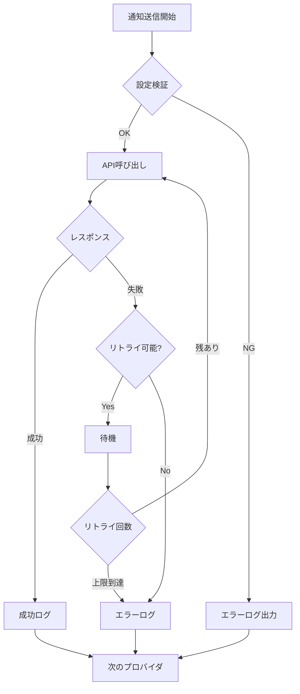

# スマホ通知機能 詳細設計書

## 1. クラス詳細設計

### 1.1 NotificationManager クラス

```javascript
/**
 * 通知システムの中核を担うマネージャークラス
 */
class NotificationManager {
  /**
   * @param {Object} config - 通知設定
   * @param {Logger} logger - ロガーインスタンス
   */
  constructor(config, logger) {
    this.config = config
    this.logger = logger
    this.providers = new Map()
    this.initialized = false
  }

  /**
   * 初期化処理
   * @returns {Promise<void>}
   */
  async initialize() {
    if (!this.config.notifications?.enabled) {
      this.logger.info('[NotificationManager] 通知機能は無効です')
      return
    }

    // 各プロバイダの初期化
    const providers = this.config.notifications.providers || {}
    
    if (providers.discord?.enabled) {
      const DiscordProvider = require('./providers/discord-provider')
      this.registerProvider(new DiscordProvider(providers.discord, this.logger))
    }
    
    if (providers.pushover?.enabled) {
      const PushoverProvider = require('./providers/pushover-provider')
      this.registerProvider(new PushoverProvider(providers.pushover, this.logger))
    }
    
    if (providers.telegram?.enabled) {
      const TelegramProvider = require('./providers/telegram-provider')
      this.registerProvider(new TelegramProvider(providers.telegram, this.logger))
    }

    // 各プロバイダの検証
    await this.validateProviders()
    
    this.initialized = true
    this.logger.info(`[NotificationManager] 初期化完了: ${this.providers.size}個のプロバイダが有効`)
  }

  /**
   * プロバイダの登録
   * @param {NotificationProvider} provider
   */
  registerProvider(provider) {
    this.providers.set(provider.getName(), provider)
  }

  /**
   * 通知送信
   * @param {string} eventType - イベントタイプ
   * @param {Object} data - 通知データ
   * @returns {Promise<Object>} 送信結果
   */
  async notify(eventType, data) {
    if (!this.initialized || this.providers.size === 0) {
      return { sent: 0, failed: 0, errors: [] }
    }

    const template = this.getTemplate(eventType)
    const message = this.formatMessage(template, data)
    
    const results = await this.sendToAllProviders({
      eventType,
      message,
      data,
      timestamp: new Date().toISOString()
    })

    return this.summarizeResults(results)
  }

  /**
   * 全プロバイダへの送信
   * @private
   */
  async sendToAllProviders(notification) {
    const timeout = this.config.notifications.options?.timeout || 5000
    
    const promises = Array.from(this.providers.values()).map(provider => 
      this.sendWithTimeout(provider, notification, timeout)
        .catch(error => ({
          provider: provider.getName(),
          success: false,
          error: error.message
        }))
    )

    return Promise.allSettled(promises)
  }

  /**
   * タイムアウト付き送信
   * @private
   */
  async sendWithTimeout(provider, notification, timeout) {
    const timeoutPromise = new Promise((_, reject) => 
      setTimeout(() => reject(new Error('Timeout')), timeout)
    )

    try {
      const result = await Promise.race([
        provider.send(notification),
        timeoutPromise
      ])
      
      this.logger.info(`[${provider.getName()}] 通知送信成功`)
      return { provider: provider.getName(), success: true }
    } catch (error) {
      this.logger.error(`[${provider.getName()}] 通知送信失敗: ${error.message}`)
      throw error
    }
  }

  /**
   * メッセージフォーマット
   * @private
   */
  formatMessage(template, data) {
    let message = template
    
    // 基本的な置換
    message = message.replace(/{{issueNumber}}/g, data.issueNumber || '')
    message = message.replace(/{{title}}/g, data.title || '')
    message = message.replace(/{{error}}/g, data.error || '')
    
    // 実行時間の整形
    if (data.executionTime && this.config.notifications.options?.includeExecutionTime) {
      const time = this.formatExecutionTime(data.executionTime)
      message = message.replace(/{{executionTime}}/g, time)
    }
    
    // ラベルの整形
    if (data.labels && this.config.notifications.options?.includeLabels) {
      const labels = data.labels.join(', ')
      message = message.replace(/{{labels}}/g, labels)
    }
    
    return message
  }

  /**
   * 実行時間のフォーマット
   * @private
   */
  formatExecutionTime(milliseconds) {
    const seconds = Math.floor(milliseconds / 1000)
    const minutes = Math.floor(seconds / 60)
    const hours = Math.floor(minutes / 60)
    
    if (hours > 0) {
      return `${hours}時間${minutes % 60}分${seconds % 60}秒`
    } else if (minutes > 0) {
      return `${minutes}分${seconds % 60}秒`
    } else {
      return `${seconds}秒`
    }
  }
}
```

### 1.2 NotificationProvider 基底クラス

```javascript
/**
 * 通知プロバイダの基底クラス
 */
class NotificationProvider {
  constructor(name, config, logger) {
    this.name = name
    this.config = config
    this.logger = logger
    this.maxRetries = config.maxRetries || 3
    this.retryDelay = config.retryDelay || 1000
  }

  /**
   * 通知送信（サブクラスで実装必須）
   * @abstract
   * @param {Object} notification
   * @returns {Promise<void>}
   */
  async send(notification) {
    throw new Error('send() must be implemented by subclass')
  }

  /**
   * 設定の検証（サブクラスで実装必須）
   * @abstract
   * @returns {Promise<void>}
   */
  async validate() {
    throw new Error('validate() must be implemented by subclass')
  }

  /**
   * プロバイダ名の取得
   */
  getName() {
    return this.name
  }

  /**
   * 有効状態の確認
   */
  isEnabled() {
    return this.config.enabled === true
  }

  /**
   * リトライ付き実行
   * @protected
   */
  async retry(fn, retries = this.maxRetries) {
    let lastError
    
    for (let i = 0; i <= retries; i++) {
      try {
        return await fn()
      } catch (error) {
        lastError = error
        
        if (i < retries) {
          const delay = this.retryDelay * Math.pow(2, i) // 指数バックオフ
          this.logger.warn(`[${this.name}] リトライ ${i + 1}/${retries} (${delay}ms待機)`)
          await new Promise(resolve => setTimeout(resolve, delay))
        }
      }
    }
    
    throw lastError
  }

  /**
   * 環境変数の解決
   * @protected
   */
  resolveEnvVar(value) {
    if (typeof value !== 'string') return value
    
    const envPattern = /\${([^}]+)}/g
    return value.replace(envPattern, (match, envName) => {
      const envValue = process.env[envName]
      if (!envValue) {
        throw new Error(`環境変数 ${envName} が設定されていません`)
      }
      return envValue
    })
  }
}
```

### 1.3 DiscordProvider クラス

```javascript
const axios = require('axios')

class DiscordProvider extends NotificationProvider {
  constructor(config, logger) {
    super('Discord', config, logger)
    this.webhookUrl = this.resolveEnvVar(config.webhookUrl)
    this.username = config.username || 'PoppoBuilder'
    this.avatarUrl = config.avatarUrl
    this.mentions = config.mentions || {}
  }

  async validate() {
    if (!this.webhookUrl) {
      throw new Error('Discord Webhook URLが設定されていません')
    }
    
    if (!this.webhookUrl.startsWith('https://discord.com/api/webhooks/')) {
      throw new Error('無効なDiscord Webhook URLです')
    }
  }

  async send(notification) {
    const embed = this.buildEmbed(notification)
    const content = this.buildContent(notification)
    
    const payload = {
      username: this.username,
      avatar_url: this.avatarUrl,
      content: content,
      embeds: [embed]
    }

    await this.retry(() => 
      axios.post(this.webhookUrl, payload, {
        headers: { 'Content-Type': 'application/json' },
        timeout: 5000
      })
    )
  }

  buildContent(notification) {
    const { eventType } = notification
    
    // メンション設定に基づいてコンテンツを構築
    if (eventType === 'issue.error' && this.mentions.error) {
      return '@everyone エラーが発生しました'
    } else if (eventType === 'issue.completed' && this.mentions.success) {
      return '@here 処理が完了しました'
    }
    
    return null
  }

  buildEmbed(notification) {
    const { eventType, data, timestamp } = notification
    const color = this.getColorByEventType(eventType)
    
    const embed = {
      title: this.getEmbedTitle(eventType, data),
      description: notification.message,
      color: color,
      timestamp: timestamp,
      fields: []
    }

    // 実行時間フィールド
    if (data.executionTime) {
      embed.fields.push({
        name: '実行時間',
        value: this.formatTime(data.executionTime),
        inline: true
      })
    }

    // ラベルフィールド
    if (data.labels && data.labels.length > 0) {
      embed.fields.push({
        name: 'ラベル',
        value: data.labels.join(', '),
        inline: true
      })
    }

    // URLフィールド
    if (data.issueUrl) {
      embed.fields.push({
        name: 'Issue',
        value: `[#${data.issueNumber}](${data.issueUrl})`,
        inline: true
      })
    }

    return embed
  }

  getColorByEventType(eventType) {
    const colors = {
      'issue.completed': 0x57F287,  // 緑
      'issue.error': 0xED4245,      // 赤
      'issue.timeout': 0xFEE75C,    // 黄
      'dogfooding.restart': 0x5865F2 // 紫
    }
    return colors[eventType] || 0x99AAB5 // デフォルト: グレー
  }

  getEmbedTitle(eventType, data) {
    const titles = {
      'issue.completed': `✅ Issue #${data.issueNumber} 処理完了`,
      'issue.error': `❌ Issue #${data.issueNumber} エラー`,
      'issue.timeout': `⏱️ Issue #${data.issueNumber} タイムアウト`,
      'dogfooding.restart': '🔄 PoppoBuilder 再起動'
    }
    return titles[eventType] || `Issue #${data.issueNumber}`
  }

  formatTime(milliseconds) {
    const seconds = Math.floor(milliseconds / 1000)
    const minutes = Math.floor(seconds / 60)
    
    if (minutes > 0) {
      return `${minutes}分${seconds % 60}秒`
    }
    return `${seconds}秒`
  }
}
```

### 1.4 PushoverProvider クラス

```javascript
const axios = require('axios')

class PushoverProvider extends NotificationProvider {
  constructor(config, logger) {
    super('Pushover', config, logger)
    this.appToken = this.resolveEnvVar(config.appToken)
    this.userKey = this.resolveEnvVar(config.userKey)
    this.priority = config.priority || 0
    this.sound = config.sound || 'pushover'
    this.apiUrl = 'https://api.pushover.net/1/messages.json'
  }

  async validate() {
    if (!this.appToken) {
      throw new Error('Pushover App Tokenが設定されていません')
    }
    
    if (!this.userKey) {
      throw new Error('Pushover User Keyが設定されていません')
    }
    
    if (this.priority < -2 || this.priority > 2) {
      throw new Error('Pushover priorityは-2から2の範囲で設定してください')
    }
  }

  async send(notification) {
    const { eventType, message, data } = notification
    
    const payload = {
      token: this.appToken,
      user: this.userKey,
      message: this.truncateMessage(message, 1024),
      title: this.getTitle(eventType),
      priority: this.getPriority(eventType),
      sound: this.getSound(eventType),
      timestamp: Math.floor(Date.now() / 1000)
    }

    // Issue URLを追加
    if (data.issueUrl) {
      payload.url = data.issueUrl
      payload.url_title = `Issue #${data.issueNumber}を開く`
    }

    // 高優先度メッセージの追加設定
    if (payload.priority === 2) {
      payload.retry = 60  // 1分ごとに再通知
      payload.expire = 3600  // 1時間後に期限切れ
    }

    const response = await this.retry(() => 
      axios.post(this.apiUrl, payload, {
        headers: { 'Content-Type': 'application/json' },
        timeout: 5000
      })
    )

    if (response.data.status !== 1) {
      throw new Error(`Pushover API error: ${JSON.stringify(response.data.errors)}`)
    }
  }

  getTitle(eventType) {
    const titles = {
      'issue.completed': 'PoppoBuilder - 処理完了',
      'issue.error': 'PoppoBuilder - エラー発生',
      'issue.timeout': 'PoppoBuilder - タイムアウト',
      'dogfooding.restart': 'PoppoBuilder - 再起動'
    }
    return titles[eventType] || 'PoppoBuilder'
  }

  getPriority(eventType) {
    // エラー時は高優先度、それ以外は設定値を使用
    if (eventType === 'issue.error') {
      return Math.max(this.priority, 1)
    }
    return this.priority
  }

  getSound(eventType) {
    // エラー時は特別な音
    if (eventType === 'issue.error') {
      return 'siren'
    }
    return this.sound
  }

  truncateMessage(message, maxLength) {
    if (message.length <= maxLength) {
      return message
    }
    return message.substring(0, maxLength - 3) + '...'
  }
}
```

### 1.5 TelegramProvider クラス

```javascript
const axios = require('axios')

class TelegramProvider extends NotificationProvider {
  constructor(config, logger) {
    super('Telegram', config, logger)
    this.botToken = this.resolveEnvVar(config.botToken)
    this.chatId = this.resolveEnvVar(config.chatId)
    this.parseMode = config.parseMode || 'Markdown'
    this.disableNotification = config.disableNotification || false
    this.apiBaseUrl = `https://api.telegram.org/bot${this.botToken}`
  }

  async validate() {
    if (!this.botToken) {
      throw new Error('Telegram Bot Tokenが設定されていません')
    }
    
    if (!this.chatId) {
      throw new Error('Telegram Chat IDが設定されていません')
    }

    // Bot情報の取得でトークンの有効性を確認
    try {
      const response = await axios.get(`${this.apiBaseUrl}/getMe`)
      if (!response.data.ok) {
        throw new Error('無効なBot Tokenです')
      }
      this.logger.info(`[Telegram] Bot名: ${response.data.result.username}`)
    } catch (error) {
      throw new Error(`Telegram Bot Token検証エラー: ${error.message}`)
    }
  }

  async send(notification) {
    const { eventType, message, data } = notification
    
    const text = this.formatMessage(eventType, message, data)
    const keyboard = this.buildKeyboard(data)
    
    const payload = {
      chat_id: this.chatId,
      text: this.truncateMessage(text, 4096),
      parse_mode: this.parseMode,
      disable_notification: this.disableNotification
    }

    if (keyboard) {
      payload.reply_markup = keyboard
    }

    const response = await this.retry(() => 
      axios.post(`${this.apiBaseUrl}/sendMessage`, payload, {
        headers: { 'Content-Type': 'application/json' },
        timeout: 5000
      })
    )

    if (!response.data.ok) {
      throw new Error(`Telegram API error: ${response.data.description}`)
    }
  }

  formatMessage(eventType, message, data) {
    const icon = this.getIcon(eventType)
    let formatted = `${icon} *${this.getTitle(eventType, data)}*\n\n`
    
    // メッセージ本文
    formatted += message + '\n'
    
    // 追加情報
    if (data.executionTime) {
      formatted += `\n⏱ 実行時間: ${this.formatTime(data.executionTime)}`
    }
    
    if (data.labels && data.labels.length > 0) {
      formatted += `\n🏷 ラベル: ${data.labels.map(l => `\`${l}\``).join(', ')}`
    }
    
    return formatted
  }

  buildKeyboard(data) {
    if (!data.issueUrl) return null
    
    return {
      inline_keyboard: [[
        {
          text: `📋 Issue #${data.issueNumber}を開く`,
          url: data.issueUrl
        }
      ]]
    }
  }

  getIcon(eventType) {
    const icons = {
      'issue.completed': '✅',
      'issue.error': '❌',
      'issue.timeout': '⏱️',
      'dogfooding.restart': '🔄'
    }
    return icons[eventType] || '📌'
  }

  getTitle(eventType, data) {
    const titles = {
      'issue.completed': `Issue #${data.issueNumber} 処理完了`,
      'issue.error': `Issue #${data.issueNumber} エラー発生`,
      'issue.timeout': `Issue #${data.issueNumber} タイムアウト`,
      'dogfooding.restart': 'PoppoBuilder 再起動'
    }
    return titles[eventType] || `Issue #${data.issueNumber}`
  }

  formatTime(milliseconds) {
    const seconds = Math.floor(milliseconds / 1000)
    const minutes = Math.floor(seconds / 60)
    const hours = Math.floor(minutes / 60)
    
    if (hours > 0) {
      return `${hours}時間${minutes % 60}分`
    } else if (minutes > 0) {
      return `${minutes}分${seconds % 60}秒`
    }
    return `${seconds}秒`
  }

  truncateMessage(message, maxLength) {
    if (message.length <= maxLength) {
      return message
    }
    return message.substring(0, maxLength - 3) + '...'
  }
}
```

## 2. 統合設計

### 2.1 minimal-poppo.jsへの統合

```javascript
// minimal-poppo.js の修正箇所

const NotificationManager = require('./notifications/notification-manager')

class PoppoBuilder {
  constructor() {
    // ... 既存のコード ...
    this.notificationManager = null
  }

  async initialize() {
    // ... 既存の初期化コード ...
    
    // 通知マネージャーの初期化
    this.notificationManager = new NotificationManager(this.config, this.logger)
    await this.notificationManager.initialize()
  }

  async processIssue(issue) {
    const startTime = Date.now()
    
    try {
      // ... 既存の処理コード ...
      
      // 処理完了通知
      if (this.notificationManager) {
        await this.notificationManager.notify('issue.completed', {
          issueNumber: issue.number,
          title: issue.title,
          labels: issue.labels.map(l => l.name),
          executionTime: Date.now() - startTime,
          issueUrl: issue.html_url
        })
      }
      
    } catch (error) {
      // エラー通知
      if (this.notificationManager) {
        await this.notificationManager.notify('issue.error', {
          issueNumber: issue.number,
          title: issue.title,
          error: error.message,
          issueUrl: issue.html_url
        })
      }
      throw error
    }
  }
}
```

### 2.2 設定ファイルの統合

`.poppo/config.json` への追加:

```json
{
  "language": "ja",
  "notifications": {
    "enabled": true,
    "providers": {
      "discord": {
        "enabled": false,
        "webhookUrl": "${DISCORD_WEBHOOK_URL}",
        "username": "PoppoBuilder",
        "avatarUrl": null,
        "mentions": {
          "success": false,
          "error": true
        }
      },
      "pushover": {
        "enabled": false,
        "appToken": "${PUSHOVER_APP_TOKEN}",
        "userKey": "${PUSHOVER_USER_KEY}",
        "priority": 0,
        "sound": "pushover"
      },
      "telegram": {
        "enabled": false,
        "botToken": "${TELEGRAM_BOT_TOKEN}",
        "chatId": "${TELEGRAM_CHAT_ID}",
        "parseMode": "Markdown",
        "disableNotification": false
      }
    },
    "templates": {
      "success": "✅ Issue #{{issueNumber}} 「{{title}}」の処理が完了しました",
      "error": "❌ Issue #{{issueNumber}} 「{{title}}」の処理中にエラーが発生しました: {{error}}",
      "timeout": "⏱️ Issue #{{issueNumber}} 「{{title}}」の処理がタイムアウトしました"
    },
    "options": {
      "includeExecutionTime": true,
      "includeLabels": true,
      "maxRetries": 3,
      "retryDelay": 1000,
      "timeout": 5000
    }
  }
}
```

## 3. エラーハンドリング詳細

### 3.1 エラー分類と対応

| エラー種別 | 例 | 対応 | ログレベル |
|-----------|-----|-----|-----------|
| 設定エラー | 必須項目未設定 | 起動時に検証、警告表示 | ERROR |
| 認証エラー | 無効なトークン | リトライなし、ログ記録 | ERROR |
| ネットワークエラー | 接続タイムアウト | 最大3回リトライ | WARN→ERROR |
| APIエラー | レート制限 | 指数バックオフでリトライ | WARN |
| 形式エラー | メッセージ長超過 | 自動トリミング | INFO |

### 3.2 エラー処理フロー



## 4. テスト仕様詳細

### 4.1 単体テストケース

```javascript
// test/notifications/notification-manager.test.js

describe('NotificationManager', () => {
  describe('formatMessage', () => {
    it('should replace placeholders correctly', () => {
      const template = 'Issue #{{issueNumber}} {{title}}'
      const data = { issueNumber: 123, title: 'Test' }
      const result = manager.formatMessage(template, data)
      expect(result).toBe('Issue #123 Test')
    })
    
    it('should format execution time', () => {
      const template = '実行時間: {{executionTime}}'
      const data = { executionTime: 125000 } // 2分5秒
      const result = manager.formatMessage(template, data)
      expect(result).toBe('実行時間: 2分5秒')
    })
  })
  
  describe('sendWithTimeout', () => {
    it('should timeout after specified duration', async () => {
      const slowProvider = {
        getName: () => 'Slow',
        send: () => new Promise(resolve => setTimeout(resolve, 10000))
      }
      
      await expect(
        manager.sendWithTimeout(slowProvider, {}, 1000)
      ).rejects.toThrow('Timeout')
    })
  })
})
```

### 4.2 統合テストケース

```javascript
// test/notifications/integration.test.js

describe('Notification Integration', () => {
  it('should send to multiple providers in parallel', async () => {
    const manager = new NotificationManager(testConfig, logger)
    await manager.initialize()
    
    const startTime = Date.now()
    const result = await manager.notify('issue.completed', testData)
    const duration = Date.now() - startTime
    
    expect(result.sent).toBe(3)
    expect(duration).toBeLessThan(6000) // 並列実行の確認
  })
})
```

### 4.3 テストコマンド実装

```javascript
// scripts/test-notification.js

const { program } = require('commander')
const NotificationManager = require('../src/notifications/notification-manager')

program
  .option('-p, --provider <type>', '特定のプロバイダをテスト')
  .option('-a, --all', 'すべてのプロバイダをテスト')
  .option('-d, --dry-run', 'ドライラン（実際には送信しない）')
  .option('-r, --real', '実際に送信')
  .parse(process.argv)

async function testNotification() {
  const config = await loadConfig()
  const logger = createLogger()
  
  // テスト用の設定で上書き
  if (program.provider) {
    // 指定されたプロバイダのみ有効化
    Object.keys(config.notifications.providers).forEach(p => {
      config.notifications.providers[p].enabled = (p === program.provider)
    })
  }
  
  const manager = new NotificationManager(config, logger)
  await manager.initialize()
  
  const testData = {
    issueNumber: 999,
    title: 'テスト通知',
    labels: ['test', 'notification'],
    executionTime: 12345,
    issueUrl: 'https://github.com/medamap/PoppoBuilderSuite/issues/999'
  }
  
  if (program.dryRun) {
    console.log('ドライラン: 以下の内容で送信されます')
    console.log(JSON.stringify(testData, null, 2))
  } else {
    const result = await manager.notify('issue.completed', testData)
    console.log('送信結果:', result)
  }
}

testNotification().catch(console.error)
```

## 5. 実装チェックリスト

### Phase 1: Discord実装
- [ ] DiscordProviderクラスの実装
- [ ] Embed形式のメッセージ構築
- [ ] Webhook URL検証
- [ ] メンション機能の実装
- [ ] 単体テストの作成
- [ ] 統合テストの実施

### Phase 2: Pushover実装  
- [ ] PushoverProviderクラスの実装
- [ ] 優先度管理の実装
- [ ] サウンド設定の実装
- [ ] URLリンク機能
- [ ] 単体テストの作成
- [ ] 統合テストの実施

### Phase 3: Telegram実装
- [ ] TelegramProviderクラスの実装
- [ ] Markdownフォーマット対応
- [ ] インラインキーボード実装
- [ ] Bot検証機能
- [ ] 単体テストの作成
- [ ] 統合テストの実施

---
作成日: 2025/06/16
作成者: PoppoBuilder Dogfooding Task