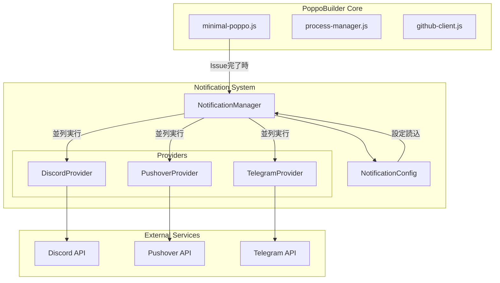
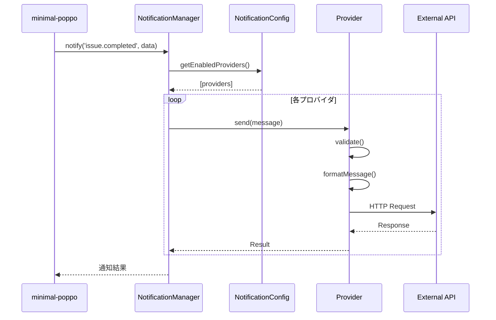
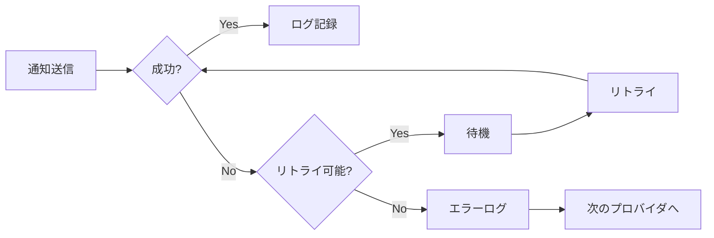

# スマホ通知機能 概要設計書

## 1. アーキテクチャ概要

### 1.1 システム構成図



### 1.2 レイヤー構造

```
┌─────────────────────────────────────┐
│     Application Layer               │
│  (minimal-poppo.js)                │
├─────────────────────────────────────┤
│     Notification Layer              │
│  (NotificationManager)              │
├─────────────────────────────────────┤
│     Provider Layer                  │
│  (Discord/Pushover/Telegram)        │
├─────────────────────────────────────┤
│     External Service Layer          │
│  (各種API)                         │
└─────────────────────────────────────┘
```

## 2. コンポーネント設計

### 2.1 NotificationManager

#### 責務
- 通知送信の統括管理
- プロバイダの初期化と管理
- 非同期処理の制御
- エラーハンドリングとログ記録

#### 主要メソッド
```javascript
class NotificationManager {
  constructor(config, logger)
  async initialize()
  async notify(eventType, data)
  registerProvider(provider)
  async sendToAllProviders(message)
  formatMessage(template, data)
}
```

#### 通知イベントタイプ
- `issue.completed` - Issue処理完了
- `issue.error` - Issue処理エラー
- `issue.timeout` - Issue処理タイムアウト
- `dogfooding.restart` - 自動再起動通知

### 2.2 NotificationProvider (基底クラス)

#### インターフェース定義
```javascript
class NotificationProvider {
  constructor(name, config, logger)
  async send(message)      // 実装必須
  async validate()         // 実装必須
  isEnabled()             // 共通実装
  getName()               // 共通実装
  async retry(fn, retries) // 共通実装
}
```

### 2.3 各プロバイダの設計

#### DiscordProvider
```javascript
class DiscordProvider extends NotificationProvider {
  async send(message) {
    // Embed形式でリッチな通知を構築
    const embed = this.buildEmbed(message)
    // Webhook APIを呼び出し
    return this.postWebhook(embed)
  }
  
  buildEmbed(message) {
    // Discord Embed形式の構築
  }
}
```

#### PushoverProvider
```javascript
class PushoverProvider extends NotificationProvider {
  async send(message) {
    // Pushover API形式にデータ変換
    const data = this.buildPushoverData(message)
    // API呼び出し
    return this.postAPI(data)
  }
  
  validatePriority(priority) {
    // 優先度の検証（-2〜2）
  }
}
```

#### TelegramProvider
```javascript
class TelegramProvider extends NotificationProvider {
  async send(message) {
    // Markdown形式でメッセージ整形
    const text = this.formatMarkdown(message)
    // Bot APIを呼び出し
    return this.sendMessage(text)
  }
  
  buildInlineKeyboard(buttons) {
    // インラインキーボードの構築
  }
}
```

## 3. データフロー

### 3.1 通知送信フロー



### 3.2 エラーハンドリングフロー



## 4. 設定管理設計

### 4.1 設定ファイル構造

```yaml
notifications:
  enabled: true                    # 全体の有効/無効
  providers:                       # プロバイダ別設定
    discord:
      enabled: false
      webhookUrl: ${ENV_VAR}       # 環境変数参照
      # プロバイダ固有設定
    pushover:
      enabled: false
      appToken: ${ENV_VAR}
      userKey: ${ENV_VAR}
      # プロバイダ固有設定
    telegram:
      enabled: false
      botToken: ${ENV_VAR}
      chatId: ${ENV_VAR}
      # プロバイダ固有設定
  templates:                       # メッセージテンプレート
    success: "..."
    error: "..."
  options:                         # 共通オプション
    maxRetries: 3
    timeout: 5000
```

### 4.2 環境変数の解決

```javascript
class NotificationConfig {
  resolveEnvironmentVariables(config) {
    // ${VAR_NAME} 形式を実際の値に置換
    // 環境変数が未設定の場合は警告
  }
}
```

## 5. 非機能設計

### 5.1 パフォーマンス設計

#### 並列処理
- 全プロバイダへの送信を`Promise.allSettled()`で並列実行
- 一つの失敗が他に影響しない設計

#### タイムアウト制御
```javascript
async sendWithTimeout(provider, message, timeout = 5000) {
  return Promise.race([
    provider.send(message),
    new Promise((_, reject) => 
      setTimeout(() => reject(new Error('Timeout')), timeout)
    )
  ])
}
```

### 5.2 エラーハンドリング設計

#### エラー分類と対処

| エラー種別 | 対処方法 | リトライ |
|----------|---------|---------|
| ネットワークエラー | リトライ | ✓ |
| 認証エラー | ログ記録のみ | ✗ |
| レート制限 | バックオフ付きリトライ | ✓ |
| 設定エラー | 起動時検証で防止 | - |

### 5.3 ログ設計

#### ログレベルと内容

```javascript
// 成功時
logger.info(`[${provider.getName()}] 通知送信成功: Issue #${issueNumber}`)

// リトライ時  
logger.warn(`[${provider.getName()}] 通知送信リトライ (${attempt}/${maxRetries})`)

// 失敗時
logger.error(`[${provider.getName()}] 通知送信失敗: ${error.message}`)
```

## 6. セキュリティ設計

### 6.1 認証情報の管理

- 環境変数での管理を推奨
- 設定ファイルには`${VAR_NAME}`形式で記載
- 起動時に環境変数の存在を検証

### 6.2 通信のセキュリティ

- すべてHTTPS通信
- TLS 1.2以上を使用
- 証明書検証を有効化

## 7. テスト設計

### 7.1 テスト戦略

#### 単体テスト
- 各プロバイダのメッセージ整形ロジック
- 設定の検証ロジック
- エラーハンドリング

#### 統合テスト
- モックAPIを使用した送信テスト
- 複数プロバイダの並列処理
- タイムアウトとリトライ

#### E2Eテスト
- 実際のAPIへのテスト送信（手動）
- 各種エラーケースの確認

### 7.2 テストコマンド

```bash
# 設定検証
npm run validate-notification-config

# 単体テスト
npm test notifications/

# テスト送信
npm run test-notification -- --provider=discord --dry-run
npm run test-notification -- --provider=discord --real
```

## 8. 拡張性設計

### 8.1 新規プロバイダの追加

1. `NotificationProvider`を継承
2. `send()`と`validate()`を実装
3. `providers/`ディレクトリに配置
4. `NotificationManager`に登録

### 8.2 プラグインアーキテクチャ

```javascript
// 将来的な拡張例
class EmailProvider extends NotificationProvider { }
class SlackProvider extends NotificationProvider { }
class WebhookProvider extends NotificationProvider { }
```

## 9. 運用設計

### 9.1 モニタリング

- 通知送信成功率
- プロバイダ別のエラー率
- 平均送信時間

### 9.2 トラブルシューティング

#### 通知が届かない場合
1. ログで送信状況を確認
2. 環境変数の設定を確認
3. 各サービスのダッシュボードを確認
4. テストコマンドで個別テスト

---
作成日: 2025/06/16
作成者: PoppoBuilder Dogfooding Task