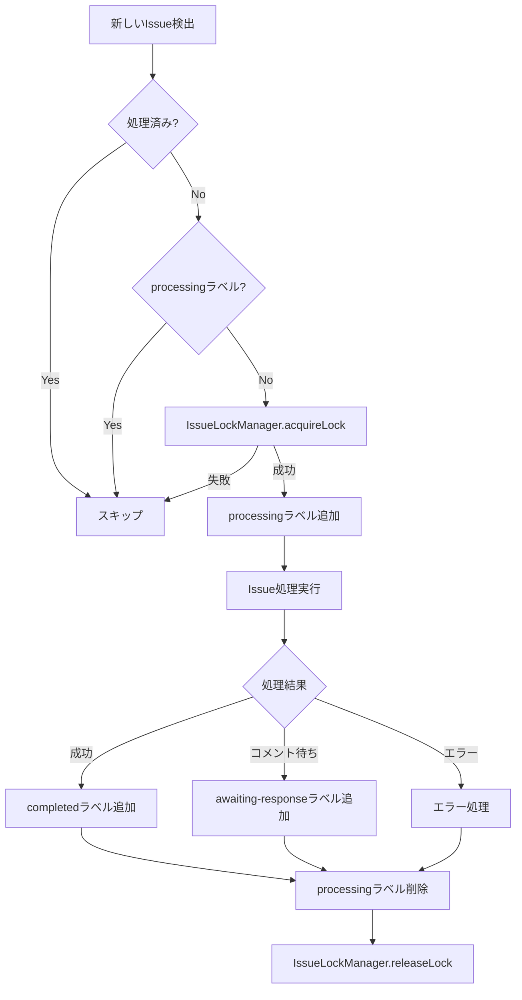

# PoppoBuilder 重複処理抑制機能 - 実装ドキュメント

## 概要

PoppoBuilderにおいて、同一のGitHub Issueに対して複数のプロセスが同時に起動されることを防ぐ重複処理抑制機能の実装と検証結果をまとめたドキュメントです。

## 実装背景

- **Issue #70**: 同一Issueに対する重複処理の抑制機能実装（実装済み）
- **Issue #72**: Issue #70の重複処理抑制機能の検証と文書化（本ドキュメント）
- **Issue #73**: 同一Issueに対する重複処理の抑制機能実装（Issue #70と重複のためクローズ）

## 実装内容

### 1. IssueLockManager（ファイルベースロック機構）

`src/issue-lock-manager.js`にて実装された、ファイルベースのロック管理システム。

#### 主な機能

- **ロックファイル管理**: `.poppo/locks/`ディレクトリにIssue番号ごとのロックファイルを作成
- **TTL（Time To Live）**: デフォルト1時間でロックを自動解放
- **プロセス監視**: PIDベースでプロセスの生存確認
- **メモリキャッシュ**: 高速化のためのインメモリキャッシュ
- **自動クリーンアップ**: 5分ごとに期限切れロックを削除

#### ロックデータ構造

```json
{
  "issueNumber": 123,
  "lockedAt": "2025-06-20T08:00:00.000Z",
  "lockedBy": {
    "pid": 12345,
    "sessionId": "session_1750404234567",
    "taskId": "issue-123",
    "hostname": "hostname"
  },
  "type": "issue_processing",
  "ttl": 3600000,
  "expiresAt": "2025-06-20T09:00:00.000Z"
}
```

### 2. 重複チェックメカニズム

#### 2.1 shouldProcessIssue関数（`src/minimal-poppo.js`）

```javascript
async function shouldProcessIssue(issue) {
  // すでに処理済み
  const isProcessed = await fileStateManager.isIssueProcessed(issue.number);
  if (isProcessed) {
    return false;
  }

  // ラベルチェック
  const labels = issue.labels.map(l => l.name);
  
  // completed, processing, awaiting-responseラベルがあればスキップ
  if (labels.includes('completed') || labels.includes('processing') || labels.includes('awaiting-response')) {
    return false;
  }

  return true;
}
```

#### 2.2 processingラベルによる制御

1. **処理開始時**: `processing`ラベルを追加
2. **処理中**: 他のプロセスは`processing`ラベルを検出してスキップ
3. **処理完了時**: `processing`ラベルを削除、`completed`または`awaiting-response`ラベルを追加

#### 2.3 FileStateManagerによる永続化

- `state/processed-issues.json`: 処理済みIssue番号のリスト
- `state/processed-comments.json`: 処理済みコメント情報
- `state/running-tasks.json`: 実行中タスク情報

### 3. TaskQueueによる管理

`src/task-queue.js`による優先度付きタスクキュー管理：

- **優先度レベル**: DOGFOODING(100) > HIGH(75) > NORMAL(50) > LOW(25)
- **実行中タスク管理**: `runningTasks` Mapで管理
- **最大同時実行数**: デフォルト2タスク

## 検証結果

### テスト実行結果

`test/test-duplicate-prevention.js`の実行結果：

```
📊 テスト結果サマリー
  成功: 6件
  失敗: 0件
  合計: 6件

✨ すべてのテストが成功しました！
```

### テストケース

1. **shouldProcessIssue関数の動作確認**
   - ✅ processingラベルがある場合はスキップされる

2. **processedIssues Setによる重複防止**
   - ✅ 同じIssue番号は一度しか処理されない

3. **ラベルによる重複処理防止フロー**
   - ✅ Issue処理開始時にprocessingラベルが追加される
   - ✅ 処理完了時にprocessingラベルが削除される

4. **実行中タスクの管理**
   - ✅ 実行中タスクリストへの追加と削除

5. **並行処理シミュレーション**
   - ✅ 30秒間隔のポーリングで重複処理が発生しない

## 動作フロー



## 実際の使用例

### 1. 通常のIssue処理

```javascript
// minimal-poppo.js の mainLoop 内
for (const issue of openIssues) {
  if (await shouldProcessIssue(issue)) {
    // タスクキューに追加（重複チェック済み）
    const task = {
      type: 'issue',
      issueNumber: issue.number,
      title: issue.title,
      priority: getPriority(issue.labels)
    };
    
    taskQueue.enqueue(task);
  }
}
```

### 2. 独立プロセスでの処理

```javascript
// independent-process-manager.js
async startIssueProcess(task) {
  const { issueNumber } = task;
  
  // ロック取得
  const lockManager = new IssueLockManager();
  const lockAcquired = await lockManager.acquireLock(issueNumber, {
    pid: process.pid,
    taskId: task.id
  });
  
  if (!lockAcquired) {
    console.log(`Issue #${issueNumber} is already being processed`);
    return;
  }
  
  try {
    // 処理実行
    await processIssue(issueNumber);
  } finally {
    // ロック解放
    await lockManager.releaseLock(issueNumber);
  }
}
```

## エラー処理と復旧

### 1. プロセス異常終了時の対応

- IssueLockManagerが5分ごとにPID存在確認
- 存在しないPIDのロックは自動削除
- TTL（1時間）経過後も自動削除

### 2. 孤児Issueの検出と修復

- MirinOrphanManagerが定期的に孤児Issue検出
- `processing`ラベルが残っているが実行中でないIssueを修復
- StatusManagerによるハートビート監視

## パフォーマンスへの影響

- **メモリ使用量**: 最小限（ロックファイルとメモリキャッシュのみ）
- **ディスクI/O**: ロックファイルの読み書きのみ
- **処理速度**: ミリ秒単位のオーバーヘッド

## まとめ

PoppoBuilderの重複処理抑制機能は、以下の多層防御により確実に重複処理を防止しています：

1. **GitHubラベル**: `processing`ラベルによる視覚的な状態管理
2. **FileStateManager**: 処理済みIssueの永続的な記録
3. **IssueLockManager**: ファイルベースの排他制御
4. **TaskQueue**: メモリ内での実行中タスク管理

これらの仕組みにより、システム障害やプロセス異常終了時でも、データの整合性を保ちながら安全に処理を継続できます。

---

作成日: 2025年6月20日  
検証実施者: Claude Code  
Issue: #72