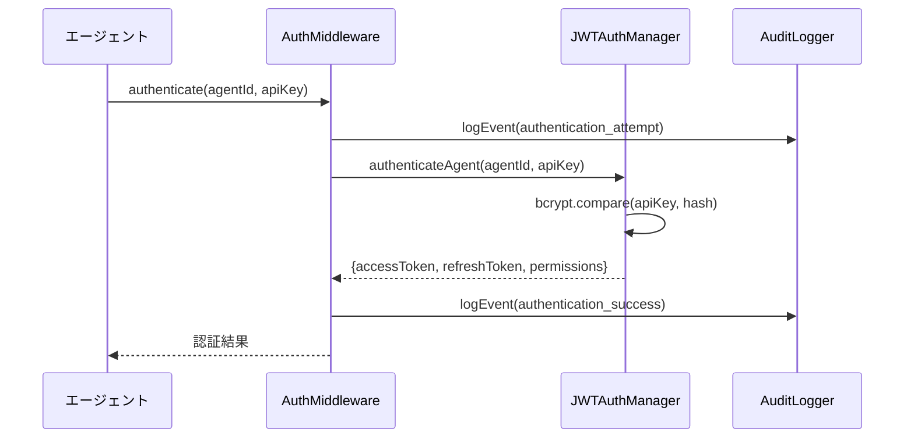
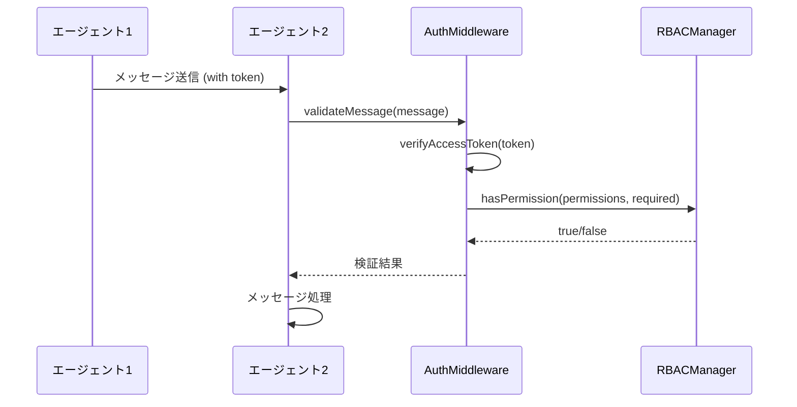

# エージェント間認証機能

## 概要

PoppoBuilder Suiteのエージェント間通信にセキュリティ層を追加し、JWT（JSON Web Token）ベースの認証・認可機能を実装しました。これにより、不正なアクセスや成りすましを防止し、システム全体のセキュリティを強化します。

## アーキテクチャ

### 主要コンポーネント

1. **JWTAuthManager** (`src/security/jwt-auth.js`)
   - JWT トークンの生成・検証
   - エージェント認証情報の管理
   - APIキーの管理とローテーション

2. **RBACManager** (`src/security/rbac.js`)
   - ロールベースアクセス制御
   - 権限の定義と管理
   - 動的な権限チェック

3. **AuditLogger** (`src/security/audit-logger.js`)
   - 監査ログの記録
   - セキュリティアラートの生成
   - ログの整合性チェック

4. **AuthMiddleware** (`src/security/auth-middleware.js`)
   - 認証・認可の統合ミドルウェア
   - Express.js用ミドルウェア
   - ファイルベースメッセージ用ミドルウェア

5. **SecureAgentBase** (`agents/shared/secure-agent-base.js`)
   - セキュリティ強化されたエージェント基盤クラス
   - 自動トークン更新
   - 権限チェック機能

## 認証フロー

### 1. 初期認証



### 2. メッセージ通信



## 設定

### エージェント認証情報

エージェント認証情報は `config/security/agent-credentials.json` に保存されます：

```json
{
  "poppo-builder": {
    "id": "poppo-builder",
    "name": "PoppoBuilder",
    "role": "coordinator",
    "permissions": ["*"],
    "apiKeyHash": "$2b$10$...",
    "active": true,
    "createdAt": "2025-06-18T00:00:00.000Z",
    "lastUsed": "2025-06-18T12:00:00.000Z"
  }
}
```

### ロールと権限

デフォルトで以下のロールが定義されています：

| ロール | 説明 | 主な権限 |
|--------|------|----------|
| coordinator | システム全体の調整・管理 | `*` (すべての権限) |
| monitor | システム監視と復旧 | `system.monitor`, `process.*` |
| error-handler | エラーの分析と修復 | `error.*`, `code.read` |
| documentation | ドキュメント生成・管理 | `doc.*`, `issue.read` |
| reviewer | コードレビュー | `code.read`, `code.review` |
| cleaner | システムクリーンアップ | `system.clean`, `log.clean` |
| orphan-manager | 孤児Issue管理 | `issue.*` |
| guest | 読み取り専用 | `*.read` |

### セキュリティポリシー

セキュリティポリシーは `config/security/security-policy.json` で管理されます：

```json
{
  "authentication": {
    "enabled": true,
    "tokenExpiry": {
      "access": "15m",
      "refresh": "7d"
    },
    "maxLoginAttempts": 5,
    "apiKeyRotationDays": 90
  },
  "rateLimit": {
    "enabled": true,
    "perAgent": {
      "windowMs": 900000,
      "max": 100
    }
  }
}
```

## 使用方法

### 1. エージェントの実装

```javascript
const SecureAgentBase = require('./agents/shared/secure-agent-base');

class MySecureAgent extends SecureAgentBase {
  constructor() {
    super('MyAgent', {
      apiKey: process.env.MYAGENT_API_KEY,
      agentCredentialId: 'my-agent'
    });
  }

  // タスクに必要な権限を定義
  getRequiredPermissionForTask(message) {
    switch (message.taskType) {
      case 'read_logs':
        return 'log.read';
      case 'clean_system':
        return 'system.clean';
      default:
        return null;
    }
  }

  async processTask(message) {
    // 権限チェックは親クラスで自動的に実行される
    // タスク処理の実装
  }
}
```

### 2. Express APIでの使用

```javascript
const express = require('express');
const AuthMiddleware = require('./src/security/auth-middleware');

const app = express();
const auth = new AuthMiddleware();

// 認証が必要なエンドポイント
app.get('/api/logs', 
  auth.createExpressMiddleware('log.read'),
  async (req, res) => {
    // req.auth.agentId で認証されたエージェントIDを取得
    // req.auth.permissions で権限リストを取得
    res.json({ logs: [] });
  }
);

// 管理者権限が必要なエンドポイント
app.post('/api/config',
  auth.createExpressMiddleware('system.config'),
  async (req, res) => {
    // 設定更新処理
  }
);
```

### 3. APIキーの管理

#### 初回セットアップ

```bash
# エージェントを初期化（APIキーが自動生成され表示される）
node scripts/init-agent-security.js

# APIキーを環境変数に設定
export POPPO_BUILDER_API_KEY="生成されたAPIキー"
```

#### APIキーのローテーション

```javascript
const authMiddleware = new AuthMiddleware();
await authMiddleware.initialize();

// 新しいAPIキーを生成
const newApiKey = await authMiddleware.generateNewApiKey('poppo-builder');
console.log('新しいAPIキー:', newApiKey);

// config/security/keys/poppo-builder.key に自動保存される
```

## 監査とモニタリング

### 監査ログの確認

```javascript
const auditLogger = new AuditLogger();
await auditLogger.initialize();

// 最近の認証失敗を確認
const failures = await auditLogger.getAuditLogs({
  eventType: 'authentication_failure',
  startDate: new Date(Date.now() - 24*60*60*1000).toISOString(),
  limit: 100
});

// セキュリティアラートを確認
const alerts = await auditLogger.getSecurityAlerts({
  resolved: false,
  severity: 'high'
});
```

### セキュリティレポートの生成

```javascript
// 日次セキュリティレポート
const report = await auditLogger.generateSecurityReport(
  startDate,
  endDate
);

console.log('認証統計:', report.summary);
console.log('失敗分析:', report.failureAnalysis);
console.log('アクティブアラート:', report.alerts);
```

## トラブルシューティング

### よくある問題

1. **認証エラー: "エージェントが見つからないか無効です"**
   - エージェントIDが正しいか確認
   - エージェントがアクティブか確認
   - `config/security/agent-credentials.json` を確認

2. **権限エラー: "権限が不足しています"**
   - エージェントのロールと権限を確認
   - 必要な権限が正しく設定されているか確認
   - `config/security/roles.json` を確認

3. **トークンエラー: "トークンが無効です"**
   - トークンの有効期限を確認
   - リフレッシュトークンで更新を試行
   - 時刻同期の問題がないか確認

### デバッグモード

```bash
# 詳細なセキュリティログを有効化
export DEBUG_SECURITY=true
npm start
```

## セキュリティベストプラクティス

1. **APIキーの管理**
   - APIキーは環境変数または安全なキーストアに保存
   - 定期的なローテーション（90日ごと）
   - Git リポジトリにコミットしない

2. **権限の最小化**
   - 各エージェントに必要最小限の権限のみ付与
   - ワイルドカード権限（`*`）の使用は最小限に
   - 定期的な権限レビュー

3. **監査ログの活用**
   - 異常なアクセスパターンの監視
   - セキュリティアラートへの迅速な対応
   - ログの定期的なバックアップ

4. **ネットワークセキュリティ**
   - 可能な限りHTTPS/TLSを使用
   - ファイアウォールでアクセス制限
   - VPNやプライベートネットワークの活用

## 今後の拡張計画

1. **Phase 2: 暗号化通信**
   - エンドツーエンド暗号化
   - 証明書ベースの認証
   - 量子耐性暗号の検討

2. **Phase 3: 高度な脅威検知**
   - 機械学習による異常検知
   - リアルタイム脅威インテリジェンス
   - 自動レスポンス機能

3. **Phase 4: コンプライアンス対応**
   - GDPR/CCPA対応
   - SOC2準拠
   - 監査証跡の長期保存